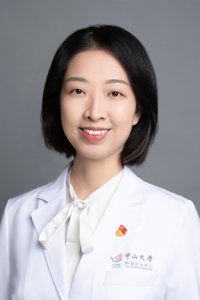

<!-- AUTO-GENERATED-BY: work/generate_obsidian_profiles.py -->

<!-- TEMPLATE: D:\workspace\信息收集整理\医生画像仓库\模板\医生画像模板.md -->

# 郭琤琤

## 基础信息

| 字段 | 内容 |
|---|---|
| 姓名 | 郭琤琤 |
| 医院 | 中山大学肿瘤防治中心 |
| 科室 | 神经外科 |
| 职称/身份 | 主任医师，博士生导师 |
| 来源链接 | [官网原文](https://www.sysucc.org.cn/node/3714) |
| 采集日期 | 2026-08-10 |

## 简介/擅长

擅长神经肿瘤化疗、靶向治疗及免疫治疗，包括脑转移瘤、胶质瘤、生殖细胞肿瘤、淋巴瘤、髓母细胞瘤、中枢罕见恶性肿瘤的个体化治疗及精准治疗 职称： 主任医师，博士生导师

## 教育与进修经历

- 从事实体瘤及血液系统肿瘤的临床工作10余年，2010年至2012年于美国德克萨斯州MD Anderson癌症中心进行博士后研究，并师从神经肿瘤创始人Dr Wai-Kwan Alfred Yung学习中枢神经系统肿瘤的化疗及靶向治疗。
- 以第一作者发表英文论著10余篇，多个研究在国内外神经肿瘤大会上（SNO/ASNO/ASCO）口头报告及论文演示，参与及负责多个胶质瘤国际多中心临床试验，主持国家自然科学基金，广东省科技计划项目、广东省自然基金项目、广东省卫生厅科研项目、广州市科技计划项目、中山大学肿瘤防治中心留学回国人员启动基金等多个科研项目。
- 加载更多 职称： 主任医师，博士生导师 门诊时间： 周一上午、周四上午 专业特长： 擅长神经肿瘤化疗、靶向治疗及免疫治疗，包括脑转移瘤、胶质瘤、生殖细胞肿瘤、淋巴瘤、髓母细胞瘤、中枢罕见恶性肿瘤的个体化治疗及精准治疗 联系方式： guochch@sysucc.org.cn, https://guochengchengdr.haodf.com/ 学习及工作经历 中山大学肿瘤防治中心神经肿瘤科化疗医师，为国内最早从事神经肿瘤事业的专职医师之一，毕业于中山大学临床医学系，2012年获中山大学肿瘤化疗博士。

## 科研项目与成果

- 以第一作者发表英文论著10余篇，多个研究在国内外神经肿瘤大会上（SNO/ASNO/ASCO）口头报告及论文演示，参与及负责多个胶质瘤国际多中心临床试验，主持国家自然科学基金，广东省科技计划项目、广东省自然基金项目、广东省卫生厅科研项目、广州市科技计划项目、中山大学肿瘤防治中心留学回国人员启动基金等多个科研项目。

## 论文与学术产出

- 以第一作者发表英文论著10余篇，多个研究在国内外神经肿瘤大会上（SNO/ASNO/ASCO）口头报告及论文演示，参与及负责多个胶质瘤国际多中心临床试验，主持国家自然科学基金，广东省科技计划项目、广东省自然基金项目、广东省卫生厅科研项目、广州市科技计划项目、中山大学肿瘤防治中心留学回国人员启动基金等多个科研项目。

## 可包装亮点

- 主任医师，博士生导师 擅长神经肿瘤化疗、靶向治疗及免疫治疗，包括脑转移瘤、胶质瘤、生殖细胞肿瘤、淋巴瘤、髓母细胞瘤、中枢罕见恶性肿瘤的个体化治疗及精准治疗 职称： 主任医师，博士生导师 郭琤琤 职称：主任医师，博士生导师 专长 擅长神经肿瘤化疗、靶向治疗及免疫治疗，包括脑转移瘤、胶质瘤、生殖细胞肿瘤、淋巴瘤、髓母细胞瘤、中枢罕见恶性肿瘤的个体化治疗及精准治…

## 重点疾病/人群标签

- 慢性病：
- 肿瘤：肿瘤、癌、瘤、淋巴瘤、化疗、靶向、生殖、免疫、罕见
- 生殖疾病：肿瘤、癌、瘤、淋巴瘤、化疗、靶向、生殖、免疫、罕见
- 免疫/风湿：肿瘤、癌、瘤、淋巴瘤、化疗、靶向、生殖、免疫、罕见
- 术后恢复/康复：
- 疑难重症：肿瘤、癌、瘤、淋巴瘤、化疗、靶向、生殖、免疫、罕见

## 证据摘录

> 只摘录官网公开信息中的短句或关键字段，不复制大段原文。

- 官网身份字段：主任医师，博士生导师
- 官网简介/擅长：擅长神经肿瘤化疗、靶向治疗及免疫治疗，包括脑转移瘤、胶质瘤、生殖细胞肿瘤、淋巴瘤、髓母细胞瘤、中枢罕见恶性肿瘤的个体化治疗及精准治疗 职称： 主任医师，博士生导师
- 官网亮眼经历线索：主任医师，博士生导师 擅长神经肿瘤化疗、靶向治疗及免疫治疗，包括脑转移瘤、胶质瘤、生殖细胞肿瘤、淋巴瘤、髓母细胞瘤、中枢罕见恶性肿瘤的个体化治疗及精准治疗 职称： 主任医师，博士生导师 郭琤琤 职称：主任医师，博士生导师 专长 擅长神经肿瘤化疗、靶向治疗及免疫治疗，包括脑转移瘤、胶质瘤、生殖细胞肿瘤、淋巴瘤、髓母细胞瘤、中枢罕见恶性肿瘤的个体化治疗及精准治疗 职称： 主任医师，博士生导师 门诊时间： 周一上午、周四上午 专业特长： 擅…
- 异常提示：亮眼经历含导航文本，已清洗
- 来源链接：https://www.sysucc.org.cn/node/3714

## BD 画像摘要

郭琤琤医生可作为肿瘤、生殖疾病、免疫/风湿/感染、疑难重症方向的基础画像候选。后续 BD 使用应继续以官网来源和人工复核为准，不添加疗效承诺或无来源包装。

## 合规边界

- 仅使用医院官网、官方公众号、官方小程序等公开渠道。
- 不采集私人电话、私人微信、家庭住址、患者隐私或非公开排班信息。
- 不写“保证治愈”“疗效第一”“包治疑难杂症”等无法由官网证明的表述。
