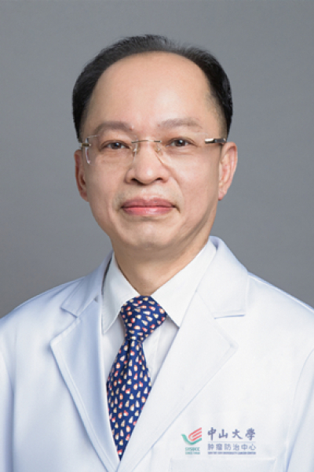

<!-- AUTO-GENERATED-BY: work/generate_obsidian_profiles.py -->

# 郭荣平

## 基础信息

| 字段 | 内容 |
|---|---|
| 医院 | 中山大学肿瘤防治中心 |
| 姓名 | 郭荣平 |
| 科室 | 肝脏外科 |
| 职称/身份 | 教授、主任医师、博士生导师、肝癌综合治疗临床大PI |
| 重点优先级 | 高 |
| 来源类型 | 医院官网 |
| 来源链接 | [官网原文](https://www.sysucc.org.cn/node/3634) |
| 采集日期 | 2026-08-10 |
| 复核状态 | 待人工复核 |
| 异常提示 |  |

## 简介/擅长

肝脏肿瘤的诊断与治疗，尤擅长肝癌的手术切除、局部消融、血管性介入等多学科综合治疗。在早期肝癌的精细化手术治疗、肝癌合并门静脉癌栓和中晚期肝癌的多学科综合治疗积累了丰富的临床经验。 工作单位： 中山大学肿瘤防治中心肝脏外科 通信地址： 广州市东风东路651号 510060 E-mail: guorongp@mail.sysu.edu.cn guorp@sysucc.org.cn 联系电话： 020-87342266 社会与学术兼职： 1.广东省抗癌协会肝癌专业委员会 主任委员 2.广东省医学会肝胆胰外科分会 副主任委员 3.广东省医疗行业协会肝胆胰外科管理分会 副主任委员 4.广东省临床医学学会肝胆胰外科专业委员会 副主任委员 5.广东省肝脏病学会外科手术专业委员会 常务委员 6.中国抗癌协会肝癌专业委员会 委员 7.中国医师协会肝癌专业委员会 委员兼副总干事 8.中国门静脉癌栓联盟理事 9.中山大学教学督导团督导 10.《岭南现代临床外科》 杂志编委 11.《中华临床医师杂志》 审稿专家 12.《中华普通外科学文献（电子版）》 审稿专家 临床专业特长： 1988年中山医科大学临床医学专业毕业后一直中山大学肿瘤防治中心工...

## 详情正文摘录

临床专家 面包屑 首页 / 临床科室 / 外科系列 / 肝脏外科 / 临床专家 郭荣平 职称：教授、主任医师、博士生导师、肝癌综合治疗临床大PI 专长 肝脏肿瘤的诊断与治疗，尤擅长肝癌的手术切除、局部消融、血管性介入等多学科综合治疗。在早期肝癌的精细化手术治疗、肝癌合并门静脉癌栓和中晚期肝癌的多学科综合治疗积累了丰富的临床经验。 职务： 肝脏外科副主任 职称： 教授、主任医师、博士生导师、肝癌综合治疗临床大PI 专家门诊时间： 每周一上午；每周四上午（特需） 专长： 肝脏肿瘤的诊断与治疗，尤擅长肝癌的手术切除、局部消融、血管性介入等多学科综合治疗。在早期肝癌的精细化手术治疗、肝癌合并门静脉癌栓和中晚期肝癌的多学科综合治疗积累了丰富的临床经验。 工作单位： 中山大学肿瘤防治中心肝脏外科 通信地址： 广州市东风东路651号 510060 E-mail: guorongp@mail.sysu.edu.cn guorp@sysucc.org.cn 联系电话： 020-87342266 社会与学术兼职： 1.广东省抗癌协会肝癌专业委员会 主任委员 2.广东省医学会肝胆胰外科分会 副主任委员 3.广东省医疗行业协会肝胆胰外科管理分会 副主任委员 4.广东省临床医学学会肝胆胰外科专业委员会 副主任委员 5.广东省肝脏病学会外科手术专业委员会 常务委员 6.中国抗癌协会肝癌专业委员会 委员 7.中国医师协会肝癌专业委员会 委员兼副总干事 8.中国门静脉癌栓联盟理事 9.中山大学教学督导团督导 10.《岭南现代临床外科》 杂志编委 11.《中华临床医师杂志》 审稿专家 12.《中华普通外科学文献（电子版）》 审稿专家 临床专业特长： 1988年中山医科大学临床医学专业毕业后一直中山大学肿瘤防治中心工作，2003年被派往香港中文大学威尔斯亲王医院和香港大学玛丽医院交流学习，2004年在美国匹兹堡大学器官移植中心作访问学者。近30年来一直致力于肝癌的临床综合治疗，尤其擅长于肝癌的手术切除、局部消融、血管性介入等多学科治疗。早期肝癌利用现代医疗新技术对肿瘤进行术前和术中的精确评估定位，手术过…

## 重点关注范围

- 肿瘤
- 免疫/风湿/感染
- 术后恢复/康复
- 疑难重症

## 重点疾病标签

- 肿瘤
- 癌
- 化疗
- 靶向
- 肝癌
- 感染
- 术后
- 康复
- 多学科
- 高危

## 亮眼经历线索

- 教授、主任医师、博士生导师、肝癌综合治疗临床大PI 肝脏肿瘤的诊断与治疗，尤擅长肝癌的手术切除、局部消融、血管性介入等多学科综合治疗。
- 在早期肝癌的精细化手术治疗、肝癌合并门静脉癌栓和中晚期肝癌的多学科综合治疗积累了丰富的临床经验。
- 工作单位： 中山大学肿瘤防治中心肝脏外科 通信地址： 广州市东风东路651号 510060 E-mail: guorongp@mail.sysu.edu.cn guorp@sysucc.org.cn 联系电话： 020-87342266 社会与学术兼职： 1.广东省抗癌协会肝癌专业委员会 主任委员 2.广东省医学会肝胆胰外科分会 副主任委员 3.广东省医疗…

## 异常提示

## 合规边界

- 本画像仅整理统一总底表中的医院官网公开字段。
- 不包含患者评价、排名、第三方来源内容或疗效承诺。
- 官网未展示的信息保持空白，后续如需补充须回到底表官方来源字段。
