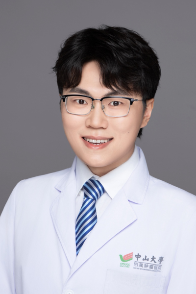

<!-- AUTO-GENERATED-BY: work/generate_obsidian_profiles.py -->

<!-- TEMPLATE: D:\workspace\信息收集整理\医生画像仓库\模板\医生画像模板.md -->

# 钟升

## 基础信息

| 字段 | 内容 |
|---|---|
| 姓名 | 钟升 |
| 医院 | 中山大学肿瘤防治中心 |
| 科室 | 神经外科 |
| 职称/身份 | 副主任医师 |
| 来源链接 | [官网原文](https://www.sysucc.org.cn/node/10052) |
| 采集日期 | 2026-08-10 |

## 简介/擅长

胶质瘤、脑膜瘤、转移瘤、椎管内肿瘤等中枢神经系统肿瘤的微创手术治疗与个体化综合治疗，垂体瘤的神经内镜经鼻微创治疗；脑积水分流术、Ommaya囊植入术、颅骨骨瓣修补术，以及中枢神经系统肿瘤的基因检测解读与分析。

## 教育与进修经历

- 一、基本情况 职称： 副主任医师、医学博士、博士后 门诊时间： 周五下午 云诊室（线上）： 周一至周日全天 二、教育及工作经历 2012.09-2020.06 哈佛大学-吉林大学白求恩医学院，联合培养临床医学八年制，医学博士 2019.09-2020.06 哈佛大学，生物医学信息学，医学硕士 2020.07-2023.07 中山大学肿瘤防治中心，神经外科，临床博士后 2020.07-2025.04 中山大学肿瘤防治中心，神经外科，住院医师 2025.04-2025.12 中山大学肿瘤防治中心，神经外科，主治医师…

## 科研项目与成果

- 四、主持科研项目 主持国家自然科学基金、广东省区域联合基金各一项，参与国家自然科学基金两项。

## 论文与学术产出

- 五、代表性论著 在Cell Reports Medicine, BMC Medicine, Journal of Neurosurgery等杂志以一作/通讯作者身份累计发表SCI论文30余篇，Google Scholar累计引用次数700，H-index：16。
- Brain、BMC cancer、Biomedical Pharmacology等期刊审稿人。

## 可包装亮点

- 副主任医师 钟升 职称：副主任医师 专长 胶质瘤、脑膜瘤、转移瘤、椎管内肿瘤等中枢神经系统肿瘤的微创手术治疗与个体化综合治疗，垂体瘤的神经内镜经鼻微创治疗；
- 一、基本情况 职称： 副主任医师、医学博士、博士后 门诊时间： 周五下午 云诊室（线上）： 周一至周日全天 二、教育及工作经历 2012.09-2020.06 哈佛大学-吉林大学白求恩医学院，联合培养临床医学八年制，医学博士 2019.09-2020.06 哈佛大学，生物医学信息学，医学硕士 2020.07-2023.07 中山大学肿瘤防治中心，神经外科…

## 重点疾病/人群标签

- 慢性病：
- 肿瘤：肿瘤、瘤
- 生殖疾病：
- 免疫/风湿：
- 术后恢复/康复：
- 疑难重症：

## 证据摘录

> 只摘录官网公开信息中的短句或关键字段，不复制大段原文。

- 官网身份字段：副主任医师
- 官网简介/擅长：胶质瘤、脑膜瘤、转移瘤、椎管内肿瘤等中枢神经系统肿瘤的微创手术治疗与个体化综合治疗，垂体瘤的神经内镜经鼻微创治疗；脑积水分流术、Ommaya囊植入术、颅骨骨瓣修补术，以及中枢神经系统肿瘤的基因检测解读与分析。
- 官网亮眼经历线索：副主任医师 钟升 职称：副主任医师 专长 胶质瘤、脑膜瘤、转移瘤、椎管内肿瘤等中枢神经系统肿瘤的微创手术治疗与个体化综合治疗，垂体瘤的神经内镜经鼻微创治疗； 一、基本情况 职称： 副主任医师、医学博士、博士后 门诊时间： 周五下午 云诊室（线上）： 周一至周日全天 二、教育及工作经历 2012.09-2020.06 哈佛大学-吉林大学白求恩医学院，联合培养临床医学八年制，医学博士 2019.09-2020.06 哈佛大学，生物医学信息…
- 异常提示：亮眼经历含导航文本，已清洗
- 来源链接：https://www.sysucc.org.cn/node/10052

## BD 画像摘要

钟升医生可作为肿瘤方向的基础画像候选。后续 BD 使用应继续以官网来源和人工复核为准，不添加疗效承诺或无来源包装。

## 合规边界

- 仅使用医院官网、官方公众号、官方小程序等公开渠道。
- 不采集私人电话、私人微信、家庭住址、患者隐私或非公开排班信息。
- 不写“保证治愈”“疗效第一”“包治疑难杂症”等无法由官网证明的表述。
