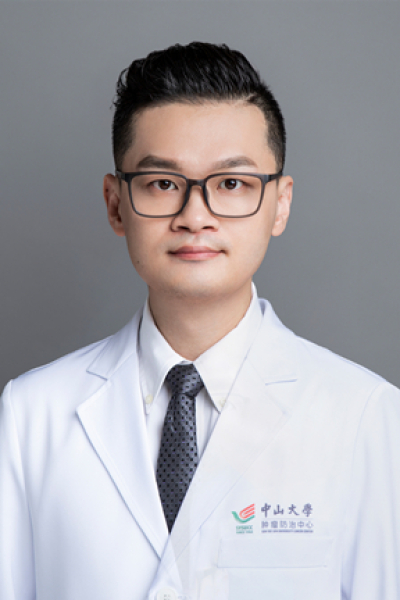

<!-- AUTO-GENERATED-BY: work/generate_obsidian_profiles.py -->

# 陈东泰

## 基础信息

| 字段 | 内容 |
|---|---|
| 医院 | 中山大学肿瘤防治中心 |
| 姓名 | 陈东泰 |
| 科室 | 手术麻醉科 |
| 职称/身份 | 医学博士，副主任医师，硕士生导师 |
| 重点优先级 | 高 |
| 来源类型 | 医院官网 |
| 来源链接 | [官网原文](https://www.sysucc.org.cn/node/3834) |
| 采集日期 | 2026-08-10 |
| 复核状态 | 待人工复核 |
| 异常提示 |  |

## 简介/擅长

肿瘤各专科麻醉与围术期管理；疼痛诊治 研究方向：1. 麻醉与肿瘤；2. 疼痛发病机制研究；3. 麻醉与认知功能 邮箱：chendt@sysucc.org.cn 加载更多 一、基本情况 职称：中山大学医学博士，肿瘤防治中心手术麻醉科副主任医师，硕士生导师 医疗专长：肿瘤各专科麻醉与围术期管理；疼痛诊治 研究方向：1. 麻醉与肿瘤；2. 疼痛发病机制研究；3. 麻醉与认知功能 邮箱：chendt@sysucc.org.cn 二、学习经历： 2015/09–2018/06， 中山大学，肿瘤防治中心，博士，导师：曾维安 2009/09–2012/06， 中山大学，肿瘤防治中心，硕士，导师：曾维安 2004/09–2009/06， 中山大学，学士 三、工作经历： 2020/12-至今，中山大学，肿瘤防治中心，副主任医师 2015/12-2020/12，中山大学，肿瘤防治中心，主治医师 2012/07-2015/12，中山大学，肿瘤防治中心，住院医师 四、学术兼职： 中国抗癌协会肿瘤麻醉与镇痛专业委员会委员 广东省医学会疼痛学分会第七届委员会青年委员会委员 广东省医学会麻醉学分会第十一届委员会药理组学组成员 广东省药学会第一届麻醉...

## 详情正文摘录

临床专家 面包屑 首页 / 临床科室 / 平台科室 / 手术麻醉科 / 临床专家 陈东泰 职称：医学博士，副主任医师，硕士生导师 专长 肿瘤各专科麻醉与围术期管理；疼痛诊治 职称：中山大学医学博士，肿瘤防治中心手术麻醉科副主任医师，硕士生导师 医疗专长：肿瘤各专科麻醉与围术期管理；疼痛诊治 研究方向：1. 麻醉与肿瘤；2. 疼痛发病机制研究；3. 麻醉与认知功能 邮箱：chendt@sysucc.org.cn 加载更多 一、基本情况 职称：中山大学医学博士，肿瘤防治中心手术麻醉科副主任医师，硕士生导师 医疗专长：肿瘤各专科麻醉与围术期管理；疼痛诊治 研究方向：1. 麻醉与肿瘤；2. 疼痛发病机制研究；3. 麻醉与认知功能 邮箱：chendt@sysucc.org.cn 二、学习经历： 2015/09–2018/06， 中山大学，肿瘤防治中心，博士，导师：曾维安 2009/09–2012/06， 中山大学，肿瘤防治中心，硕士，导师：曾维安 2004/09–2009/06， 中山大学，学士 三、工作经历： 2020/12-至今，中山大学，肿瘤防治中心，副主任医师 2015/12-2020/12，中山大学，肿瘤防治中心，主治医师 2012/07-2015/12，中山大学，肿瘤防治中心，住院医师 四、学术兼职： 中国抗癌协会肿瘤麻醉与镇痛专业委员会委员 广东省医学会疼痛学分会第七届委员会青年委员会委员 广东省医学会麻醉学分会第十一届委员会药理组学组成员 广东省药学会第一届麻醉专家委员会委员 广东省健康管理学会高级生命支持专业委员会委员 五、医疗工作情况： 毕业于中山大学，一直从事临床麻醉工作，熟练掌握各种肿瘤各专科手术的麻醉，擅长巨大复杂肿瘤手术的麻醉，并对于困难插管、大出血、休克、DIC等急危重症的抢救有丰富的临床实践。 六、教学工作情况： 广东省住院医师规范培训骨干教师 中山大学肿瘤防治中心优秀老师 住院医师规范化培训结业临床实践能力考核考官 中山大学肿瘤防治中心临床技能年度考核考官 七、科研工作情况： 主持课题： 1. 国家自然青年基金，长链非编码RNA BC01739…

## 重点关注范围

- 肿瘤
- 术后恢复/康复
- 疑难重症

## 重点疾病标签

- 肿瘤
- 癌
- 化疗
- 靶向
- 肝癌
- 疼痛
- 急危重
- 复杂

## 亮眼经历线索

- 医学博士，副主任医师，硕士生导师 3. 麻醉与认知功能 邮箱：chendt@sysucc.org.cn 加载更多 一、基本情况 职称：中山大学医学博士，肿瘤防治中心手术麻醉科副主任医师，硕士生导师 医疗专长：肿瘤各专科麻醉与围术期管理；
- 3. 麻醉与认知功能 邮箱：chendt@sysucc.org.cn 二、学习经历： 2015/09–2018/06， 中山大学，肿瘤防治中心，博士，导师：曾维安 2009/09–2012/06， 中山大学，肿瘤防治中心，硕士，导师：曾维安 2004/09–2009/06， 中山大学，学士 三、工作经历： 2020/12-至今，中山大学，肿瘤防治中心，副主…

## 异常提示

## 合规边界

- 本画像仅整理统一总底表中的医院官网公开字段。
- 不包含患者评价、排名、第三方来源内容或疗效承诺。
- 官网未展示的信息保持空白，后续如需补充须回到底表官方来源字段。
