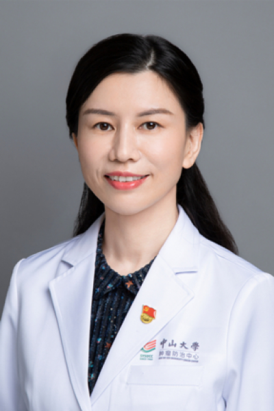

<!-- AUTO-GENERATED-BY: work/generate_obsidian_profiles.py -->

<!-- TEMPLATE: D:\workspace\信息收集整理\医生画像仓库\模板\医生画像模板.md -->

# 陈丽昆

## 基础信息

| 字段 | 内容 |
|---|---|
| 姓名 | 陈丽昆 |
| 医院 | 中山大学肿瘤防治中心 |
| 科室 | 内科 |
| 职称/身份 | 内科一区区长 职称：教授、主任医师、博士生导师 |
| 来源链接 | [官网原文](https://www.sysucc.org.cn/node/1480) |
| 采集日期 | 2026-08-10 |

## 简介/擅长

肺癌的内科治疗（化疗、靶向治疗、免疫治疗）及抗癌药物研究。

## 教育与进修经历

- 二、教育及工作经历 1996年毕业于中山医科大学临床医学系，1999年获得中山大学肿瘤学硕士学位，1999年至今在中山大学肿瘤防治中心内科工作。
- 2006年获得中山大学肿瘤学博士学位。
- 2015-2016赴美国佛罗里达大学医学院进修。

## 科研项目与成果

- 尤其对肺癌脑转移的临床和基础研究进行了多年的研究，包括药物在血脑屏障的通透性、化疗与脑放射联合治疗肺癌脑转移，肺癌脑转移的靶向治疗，肺癌脑转移的个体化治疗以及肺癌脑转移的机制研究，在相关领域取得较突出的研究和治疗成果。
- 牵头国家自然科学及广东省自然科学基金项目，并与美国FSU医学院合作，开展多项针对肺癌脑转移的转化研究。
- 负责及参加了多项肿瘤学省级及国家级研究项目。
- 负责及参加多项国际及国内多中心肿瘤学新药临床研究项目。

## 论文与学术产出

- 在国内外杂志发表相关论文60余篇。

## 可包装亮点

- 内科一区区长 职称：教授、主任医师、博士生导师 陈丽昆 职务：内科一区区长 职称：教授、主任医师、博士生导师 专长 肺癌的内科治疗（化疗、靶向治疗、免疫治疗）及抗癌药物研究。
- 一、基本情况 职称：教授、主任医师、博士生导师 专家门诊时间：周二上午、周四上午及下午 专业特长：从事肿瘤内科治疗的临床工作及抗癌药物研究，特别擅长肺癌的内科治疗（化疗、靶向治疗、免疫治疗）。
- 2015-2016赴美国佛罗里达大学医学院进修。

## 重点疾病/人群标签

- 慢性病：
- 肿瘤：肿瘤、癌、瘤、化疗、靶向、肺癌、免疫
- 生殖疾病：
- 免疫/风湿：肿瘤、癌、瘤、化疗、靶向、肺癌、免疫
- 术后恢复/康复：
- 疑难重症：

## 证据摘录

> 只摘录官网公开信息中的短句或关键字段，不复制大段原文。

- 官网身份字段：内科一区区长 职称：教授、主任医师、博士生导师
- 官网简介/擅长：肺癌的内科治疗（化疗、靶向治疗、免疫治疗）及抗癌药物研究。
- 官网亮眼经历线索：内科一区区长 职称：教授、主任医师、博士生导师 陈丽昆 职务：内科一区区长 职称：教授、主任医师、博士生导师 专长 肺癌的内科治疗（化疗、靶向治疗、免疫治疗）及抗癌药物研究。 一、基本情况 职称：教授、主任医师、博士生导师 专家门诊时间：周二上午、周四上午及下午 专业特长：从事肿瘤内科治疗的临床工作及抗癌药物研究，特别擅长肺癌的内科治疗（化疗、靶向治疗、免疫治疗）。 2015-2016赴美国佛罗里达大学医学院进修。
- 异常提示：亮眼经历含导航文本，已清洗
- 来源链接：https://www.sysucc.org.cn/node/1480

## BD 画像摘要

陈丽昆医生可作为肿瘤、免疫/风湿/感染方向的基础画像候选。后续 BD 使用应继续以官网来源和人工复核为准，不添加疗效承诺或无来源包装。

## 合规边界

- 仅使用医院官网、官方公众号、官方小程序等公开渠道。
- 不采集私人电话、私人微信、家庭住址、患者隐私或非公开排班信息。
- 不写“保证治愈”“疗效第一”“包治疑难杂症”等无法由官网证明的表述。
