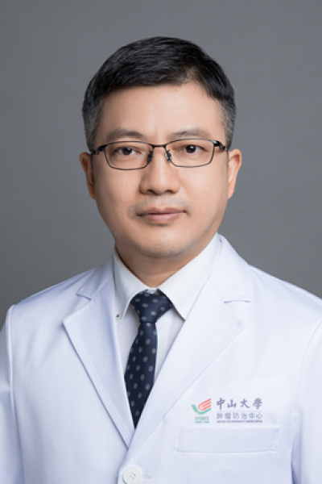

<!-- AUTO-GENERATED-BY: work/generate_obsidian_profiles.py -->

# 陈功

## 基础信息

| 字段 | 内容 |
|---|---|
| 医院 | 中山大学肿瘤防治中心 |
| 姓名 | 陈功 |
| 科室 | 结直肠科 |
| 职称/身份 | 结直肠科副主任 职称：主任医师、博士生导师 |
| 重点优先级 | 高 |
| 来源类型 | 医院官网 |
| 来源链接 | [官网原文](https://www.sysucc.org.cn/node/3677) |
| 采集日期 | 2026-08-10 |
| 复核状态 | 待人工复核 |
| 异常提示 |  |

## 简介/擅长

擅长于腹部肿瘤，尤其是胃肠肿瘤的诊治和肠造口康复治疗。研究方向是大肠癌的综合诊治研究。 医疗经历： 1998年硕士毕业于中山医科大学临床医学系七年制，毕业后留院工作至今，2001年～2003年赴澳大利亚Adelaide大学伊丽莎白女王医院从事访问学者工作并获澳大利亚南澳州“2002大肠与癌症研究基金”资助，从事结直肠癌淋巴结微转移的分子研究。2003年获医学博士学位。2005年12月获聘副主任医师。在高水平收录杂志Disease of Colon and Rectum发表论文1篇，参与国内杂志发表论文约20篇。参与MASCOT、AVANT、GIST等国际多中心临床试验。参与美国NCCN临床指南中国版研讨会的翻译工作，担任了2007版和2008版胃癌、结肠癌和直肠癌指南的主要翻译工作。 加载更多 主要从事结直肠癌的诊断、治疗（外科手术、化疗）和临床研究工作。1998年硕士毕业于中山医科大学临床医学系七年制，毕业后留院工作至今，2003年获博士学位，2005年12月获聘副主任医师。现任CSCO青年专家委员会主任委员，中国抗癌协会大肠癌专业青年委员会副主任委员，全国胃肠道间质瘤专家组组成员，美国临床肿瘤学学会会员，欧洲肿瘤学...

## 详情正文摘录

临床专家 面包屑 首页 / 临床科室 / 外科系列 / 结直肠科 / 临床专家 陈功 职务：结直肠科副主任 职称：主任医师、博士生导师 专长 主要从事结直肠癌的诊断、治疗（外科手术、化疗）和临床研究工作。 医疗专长： 擅长于腹部肿瘤，尤其是胃肠肿瘤的诊治和肠造口康复治疗。研究方向是大肠癌的综合诊治研究。 医疗经历： 1998年硕士毕业于中山医科大学临床医学系七年制，毕业后留院工作至今，2001年～2003年赴澳大利亚Adelaide大学伊丽莎白女王医院从事访问学者工作并获澳大利亚南澳州“2002大肠与癌症研究基金”资助，从事结直肠癌淋巴结微转移的分子研究。2003年获医学博士学位。2005年12月获聘副主任医师。在高水平收录杂志Disease of Colon and Rectum发表论文1篇，参与国内杂志发表论文约20篇。参与MASCOT、AVANT、GIST等国际多中心临床试验。参与美国NCCN临床指南中国版研讨会的翻译工作，担任了2007版和2008版胃癌、结肠癌和直肠癌指南的主要翻译工作。 加载更多 主要从事结直肠癌的诊断、治疗（外科手术、化疗）和临床研究工作。1998年硕士毕业于中山医科大学临床医学系七年制，毕业后留院工作至今，2003年获博士学位，2005年12月获聘副主任医师。现任CSCO青年专家委员会主任委员，中国抗癌协会大肠癌专业青年委员会副主任委员，全国胃肠道间质瘤专家组组成员，美国临床肿瘤学学会会员，欧洲肿瘤学学会会员，广东省胃肠外科学会委员，《中外胃肠外科杂志》编委，《癌症》杂志特约审稿专家，《肿瘤研究与临床》杂志特约审稿专家，欧洲《Annals of Oncology》杂志中文版编委，美国《The Oncologist》杂志中文版编委。 2001年～2003年赴澳大利亚Adelaide大学伊丽莎白女王医院从事访问学者工作，并获澳大利亚南澳“2002大肠与癌症研究基金”资助，从事结直肠癌淋巴结微转移的分子研究。2010年被遴选为“CSCO-哈佛英才计划”第一批学员，赴美国哈佛大学麻省总医院进修“结直肠癌多学科综合诊治”培训课程。参与MASCOT…

## 重点关注范围

- 肿瘤
- 术后恢复/康复
- 疑难重症

## 重点疾病标签

- 肿瘤
- 癌
- 瘤
- 化疗
- 胃癌
- 肠癌
- 康复
- 多学科

## 亮眼经历线索

- 结直肠科副主任 职称：主任医师、博士生导师 医疗经历： 1998年硕士毕业于中山医科大学临床医学系七年制，毕业后留院工作至今，2001年～2003年赴澳大利亚Adelaide大学伊丽莎白女王医院从事访问学者工作并获澳大利亚南澳州“2002大肠与癌症研究基金”资助，从事结直肠癌淋巴结微转移的分子研究。
- 2005年12月获聘副主任医师。
- 在高水平收录杂志Disease of Colon and Rectum发表论文1篇，参与国内杂志发表论文约20篇。

## 异常提示

## 合规边界

- 本画像仅整理统一总底表中的医院官网公开字段。
- 不包含患者评价、排名、第三方来源内容或疗效承诺。
- 官网未展示的信息保持空白，后续如需补充须回到底表官方来源字段。
