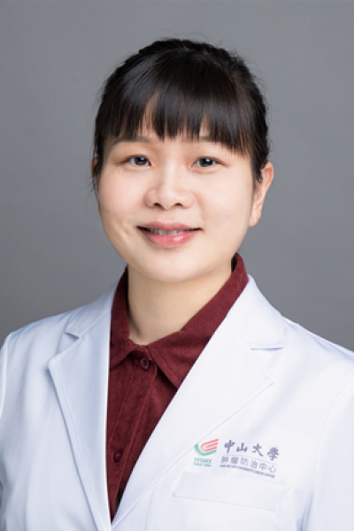

<!-- AUTO-GENERATED-BY: work/generate_obsidian_profiles.py -->

<!-- TEMPLATE: D:\workspace\信息收集整理\医生画像仓库\模板\医生画像模板.md -->

# 陈卓佳

## 基础信息

| 字段 | 内容 |
|---|---|
| 姓名 | 陈卓佳 |
| 医院 | 中山大学肿瘤防治中心 |
| 科室 | 药学部 |
| 职称/身份 | 药学部副主任 职称：主任药师、硕士生导师 |
| 来源链接 | [官网原文](https://www.sysucc.org.cn/node/3924) |
| 采集日期 | 2026-08-10 |

## 简介/擅长

乳腺癌的药物治疗管理、肿瘤合并心血管疾病患者的药物治疗管理、多药联用的药学评估、药物不良反应的判断与处理等。

## 教育与进修经历

- 门诊时间： 周四上午 2013年获中山大学药理学博士学位，随后入职中山大学肿瘤防治中心从事临床药学工作至今。
- 2014年获中国医院协会临床药师岗位培训证书，2019年获中华医学会临床药学分会临床药师师资规范化培训合格证书，2024年获国家卫健委紧缺人才-药师培训岗位合格证书。

## 科研项目与成果

- 先后主持国家自然科学基金等课题，在Journal of Medical Internet Research等期刊发表多篇论文，主编出版《认识药物不良反应-教您远离药物伤害》、《防癌抗癌药知道》等著作，学术兼职包括中国抗癌协会肿瘤临床药学专业委员会委员、广东省卫生经济学会药物依赖性临床评价专业委员会副主任委员、广东省药学会肿瘤用药专家委员会常务委员等。

## 论文与学术产出

- 先后主持国家自然科学基金等课题，在Journal of Medical Internet Research等期刊发表多篇论文，主编出版《认识药物不良反应-教您远离药物伤害》、《防癌抗癌药知道》等著作，学术兼职包括中国抗癌协会肿瘤临床药学专业委员会委员、广东省卫生经济学会药物依赖性临床评价专业委员会副主任委员、广东省药学会肿瘤用药专家委员会常务委员等。

## 可包装亮点

- 药学部副主任 职称：主任药师、硕士生导师 陈卓佳 职务：药学部副主任 职称：主任药师、硕士生导师 专长 乳腺癌的药物治疗管理、肿瘤合并心血管疾病患者的药物治疗管理、多药联用的药学评估、药物不良反应的判断与处理等。
- 2014年获中国医院协会临床药师岗位培训证书，2019年获中华医学会临床药学分会临床药师师资规范化培训合格证书，2024年获国家卫健委紧缺人才-药师培训岗位合格证书。
- 入选2016年广东省特支计划百千万工程青年拔尖人才，获中华医学会临床药学分会全国优秀临床药师等荣誉。

## 重点疾病/人群标签

- 慢性病：
- 肿瘤：肿瘤、癌、乳腺癌
- 生殖疾病：
- 免疫/风湿：
- 术后恢复/康复：
- 疑难重症：

## 证据摘录

> 只摘录官网公开信息中的短句或关键字段，不复制大段原文。

- 官网身份字段：药学部副主任 职称：主任药师、硕士生导师
- 官网简介/擅长：乳腺癌的药物治疗管理、肿瘤合并心血管疾病患者的药物治疗管理、多药联用的药学评估、药物不良反应的判断与处理等。
- 官网亮眼经历线索：药学部副主任 职称：主任药师、硕士生导师 陈卓佳 职务：药学部副主任 职称：主任药师、硕士生导师 专长 乳腺癌的药物治疗管理、肿瘤合并心血管疾病患者的药物治疗管理、多药联用的药学评估、药物不良反应的判断与处理等。 2014年获中国医院协会临床药师岗位培训证书，2019年获中华医学会临床药学分会临床药师师资规范化培训合格证书，2024年获国家卫健委紧缺人才-药师培训岗位合格证书。 入选2016年广东省特支计划百千万工程青年拔尖人才，获中…
- 异常提示：亮眼经历含导航文本，已清洗
- 来源链接：https://www.sysucc.org.cn/node/3924

## BD 画像摘要

陈卓佳医生可作为肿瘤方向的基础画像候选。后续 BD 使用应继续以官网来源和人工复核为准，不添加疗效承诺或无来源包装。

## 合规边界

- 仅使用医院官网、官方公众号、官方小程序等公开渠道。
- 不采集私人电话、私人微信、家庭住址、患者隐私或非公开排班信息。
- 不写“保证治愈”“疗效第一”“包治疑难杂症”等无法由官网证明的表述。
