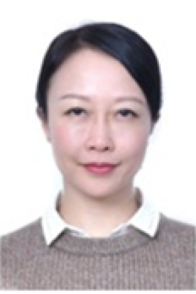

<!-- AUTO-GENERATED-BY: work/generate_obsidian_profiles.py -->

<!-- TEMPLATE: D:\workspace\信息收集整理\医生画像仓库\模板\医生画像模板.md -->

# 陈媛媛

## 基础信息

| 字段 | 内容 |
|---|---|
| 姓名 | 陈媛媛 |
| 医院 | 中山大学肿瘤防治中心 |
| 科室 | 放疗科 |
| 职称/身份 | 主任医师 |
| 来源链接 | [官网原文](https://www.sysucc.org.cn/node/1687) |
| 采集日期 | 2026-08-10 |

## 简介/擅长

成人及儿童中枢神经系统肿瘤及头颈部肿瘤的放射治疗；放疗联合药物的综合治疗；头颈部器官和组织的放射损伤防治。肿瘤患者的营养支持治疗。 一、基本情况 职称： 主任医师 专家

## 教育与进修经历

- 二、学习及工作经历 学习经历： 1989/09-1994/06 江西医学院临床医学系 医学学士 1999/10-2002/06 中山大学附属肿瘤医院放疗科 硕士 2017/01 美国MDACC访问学者 2017/10-2020/06 苏州大学二附院放疗科 博士 工作经历： 1994/06-1999/09 南昌大学附属第四医院肿瘤科 住院医师 2002/06-2012/09 中山大学附属肿瘤医院放疗科 主治医师 2012/10-2013/11 浙江省肿瘤医院放疗科 主治医师 2013/11-2019/12 浙江省肿…

## 可包装亮点

- 主任医师 一、基本情况 职称： 主任医师 专家 陈媛媛 职称：主任医师 专长 中枢神经系统肿瘤和其他头颈部肿瘤的诊断和放疗。
- 一、基本情况 职称： 主任医师 专家门诊时间： 周一下午（越秀院区）、周五上午8:30-10:30（黄埔院区） 专业特长： 中枢神经系统肿瘤和其他头颈部肿瘤的诊断和放疗。

## 重点疾病/人群标签

- 慢性病：
- 肿瘤：肿瘤、放疗、鼻咽癌、营养
- 生殖疾病：
- 免疫/风湿：
- 术后恢复/康复：肿瘤、放疗、鼻咽癌、营养
- 疑难重症：

## 证据摘录

> 只摘录官网公开信息中的短句或关键字段，不复制大段原文。

- 官网身份字段：主任医师
- 官网简介/擅长：成人及儿童中枢神经系统肿瘤及头颈部肿瘤的放射治疗；放疗联合药物的综合治疗；头颈部器官和组织的放射损伤防治。肿瘤患者的营养支持治疗。 一、基本情况 职称： 主任医师 专家
- 官网亮眼经历线索：主任医师 一、基本情况 职称： 主任医师 专家 陈媛媛 职称：主任医师 专长 中枢神经系统肿瘤和其他头颈部肿瘤的诊断和放疗。 一、基本情况 职称： 主任医师 专家门诊时间： 周一下午（越秀院区）、周五上午8:30-10:30（黄埔院区） 专业特长： 中枢神经系统肿瘤和其他头颈部肿瘤的诊断和放疗。
- 异常提示：亮眼经历含导航文本，已清洗
- 来源链接：https://www.sysucc.org.cn/node/1687

## BD 画像摘要

陈媛媛医生可作为肿瘤、术后恢复/康复方向的基础画像候选。后续 BD 使用应继续以官网来源和人工复核为准，不添加疗效承诺或无来源包装。

## 合规边界

- 仅使用医院官网、官方公众号、官方小程序等公开渠道。
- 不采集私人电话、私人微信、家庭住址、患者隐私或非公开排班信息。
- 不写“保证治愈”“疗效第一”“包治疑难杂症”等无法由官网证明的表述。
