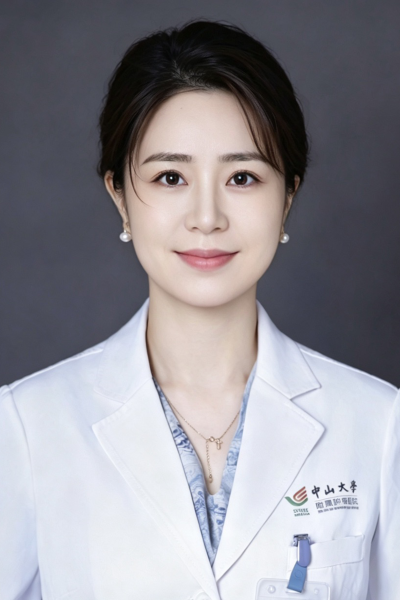

<!-- AUTO-GENERATED-BY: work/generate_obsidian_profiles.py -->

<!-- TEMPLATE: D:\workspace\信息收集整理\医生画像仓库\模板\医生画像模板.md -->

# 陈平

## 基础信息

| 字段 | 内容 |
|---|---|
| 姓名 | 陈平 |
| 医院 | 中山大学肿瘤防治中心 |
| 科室 | 中医科 |
| 职称/身份 | 副主任医师 |
| 来源链接 | [官网原文](https://www.sysucc.org.cn/node/3778) |
| 采集日期 | 2026-08-10 |

## 简介/擅长

主要从事鼻咽癌、肺癌、肠癌、胃癌、食管癌、肝癌、乳腺癌等肿瘤中西医结合治疗和预防复发转移。

## 教育与进修经历

- 二、教育及工作经历 2011-2014：中山大学肿瘤防治中心综合中医科 研究生 2014-2017：中山大学肿瘤防治中心综合中医科 医师（期间获肿瘤学专科医师、住院医师规范化培训证书） 2017-2022：中山大学肿瘤防治中心综合中医科 主治医师 2023-至今：中山大学肿瘤防治中心综合中医科 副主任医师 三、学术兼职 广东省肿瘤中西医整合治疗专委会副主委 广东省中西医结合学会肿瘤专业委员会委员 广东省抗癌协会传统医学专业委员会委员 广东省抗癌协会专业委员会委员 广东省精准医学应用学会委员 广东省抗癌协会多学科诊…

## 论文与学术产出

- 五、代表性论著 （一）近年发表第一/共一作者论文： (1) 陈平，黄圆圆，权琦，张蓓.名中医张蓓治疗鼻咽癌临床经验拾要[J].世界中西医结合杂志,2017,12(11). (2) 陈平，黄圆圆，丘惠娟，张蓓. 初诊为鼻咽癌患者的血清CRP水平与中医辨证分型的关系[J].实用中西医结合临床,2017,17(6). (3) Ping Chen, Bei Zhang, Guifang Guo, Liangping Xia, Huijuan Qiu. Efficacy comparison between hepatic…

## 可包装亮点

- 副主任医师 陈平 职称：副主任医师 专长 主要从事鼻咽癌、肺癌、肠癌、胃癌、食管癌、肝癌、乳腺癌等肿瘤中西医结合治疗和预防复发转移。
- 一、基本情况 副主任医师，医学博士。
- 深耕肿瘤中西医结合治疗多年，临床经验丰富，擅长辨证论治、精准遣方用药。

## 重点疾病/人群标签

- 慢性病：
- 肿瘤：肿瘤、癌、放疗、化疗、靶向、鼻咽癌、肺癌、肝癌、胃癌、肠癌、乳腺癌、免疫、康复、多学科
- 生殖疾病：
- 免疫/风湿：肿瘤、癌、放疗、化疗、靶向、鼻咽癌、肺癌、肝癌、胃癌、肠癌、乳腺癌、免疫、康复、多学科
- 术后恢复/康复：肿瘤、癌、放疗、化疗、靶向、鼻咽癌、肺癌、肝癌、胃癌、肠癌、乳腺癌、免疫、康复、多学科
- 疑难重症：肿瘤、癌、放疗、化疗、靶向、鼻咽癌、肺癌、肝癌、胃癌、肠癌、乳腺癌、免疫、康复、多学科

## 证据摘录

> 只摘录官网公开信息中的短句或关键字段，不复制大段原文。

- 官网身份字段：副主任医师
- 官网简介/擅长：主要从事鼻咽癌、肺癌、肠癌、胃癌、食管癌、肝癌、乳腺癌等肿瘤中西医结合治疗和预防复发转移。
- 官网亮眼经历线索：副主任医师 陈平 职称：副主任医师 专长 主要从事鼻咽癌、肺癌、肠癌、胃癌、食管癌、肝癌、乳腺癌等肿瘤中西医结合治疗和预防复发转移。 一、基本情况 副主任医师，医学博士。 深耕肿瘤中西医结合治疗多年，临床经验丰富，擅长辨证论治、精准遣方用药。
- 异常提示：亮眼经历含导航文本，已清洗
- 来源链接：https://www.sysucc.org.cn/node/3778

## BD 画像摘要

陈平医生可作为肿瘤、免疫/风湿/感染、术后恢复/康复、疑难重症方向的基础画像候选。后续 BD 使用应继续以官网来源和人工复核为准，不添加疗效承诺或无来源包装。

## 合规边界

- 仅使用医院官网、官方公众号、官方小程序等公开渠道。
- 不采集私人电话、私人微信、家庭住址、患者隐私或非公开排班信息。
- 不写“保证治愈”“疗效第一”“包治疑难杂症”等无法由官网证明的表述。
