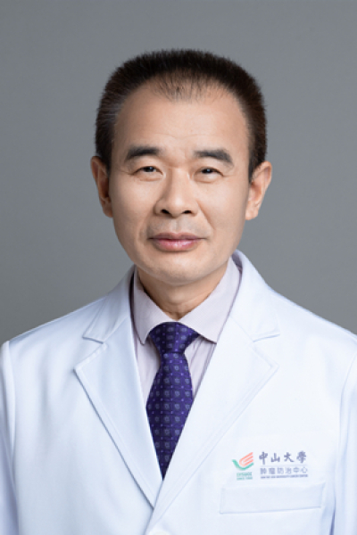

<!-- AUTO-GENERATED-BY: work/generate_obsidian_profiles.py -->

<!-- TEMPLATE: D:\workspace\信息收集整理\医生画像仓库\模板\医生画像模板.md -->

# 陈徐贤

## 基础信息

| 字段 | 内容 |
|---|---|
| 姓名 | 陈徐贤 |
| 医院 | 中山大学肿瘤防治中心 |
| 科室 | 中医科 |
| 职称/身份 | 副主任医师 |
| 来源链接 | [官网原文](https://www.sysucc.org.cn/node/3774) |
| 采集日期 | 2026-08-10 |

## 简介/擅长

肿瘤中医治疗 医疗经历:1988年毕业于广州中医药大学中医医疗系，获医学学士学位。1988年起在中山大学肿瘤医院从事肿瘤中西医结合治疗及肝癌介入治疗至今，拥有较丰富的临床经验，较擅长肝癌、肺癌、鼻咽癌、消化道肿瘤、乳腺癌及妇科肿瘤等恶性肿瘤的中医治疗。 加载更多 医疗专长 ：肿瘤中医治疗 医疗经历 :1988年毕业于广州中医药大学中医医疗系，获医学学士学位。1988年起在中山大学肿瘤医院从事肿瘤中西医结合治疗及肝癌介入治疗至今，拥有较丰富的临床经验，较擅长肝癌、肺癌、鼻咽癌、消化道肿瘤、乳腺癌及妇科肿瘤等恶性肿瘤的中医治疗。

## 教育与进修经历

- 临床专家 面包屑 首页 / 临床科室 / 内科系列 / 中医科 / 临床专家 陈徐贤 职称：副主任医师 专长 肿瘤中医治疗 医疗专长：肿瘤中医治疗 医疗经历:1988年毕业于广州中医药大学中医医疗系，获医学学士学位。
- 加载更多 医疗专长 ：肿瘤中医治疗 医疗经历 :1988年毕业于广州中医药大学中医医疗系，获医学学士学位。

## 可包装亮点

- 副主任医师 陈徐贤 职称：副主任医师 专长 肿瘤中医治疗 医疗专长：肿瘤中医治疗 医疗经历:1988年毕业于广州中医药大学中医医疗系，获医学学士学位。

## 重点疾病/人群标签

- 慢性病：
- 肿瘤：肿瘤、鼻咽癌、肺癌、肝癌、乳腺癌
- 生殖疾病：
- 免疫/风湿：
- 术后恢复/康复：
- 疑难重症：

## 证据摘录

> 只摘录官网公开信息中的短句或关键字段，不复制大段原文。

- 官网身份字段：副主任医师
- 官网简介/擅长：肿瘤中医治疗 医疗经历:1988年毕业于广州中医药大学中医医疗系，获医学学士学位。1988年起在中山大学肿瘤医院从事肿瘤中西医结合治疗及肝癌介入治疗至今，拥有较丰富的临床经验，较擅长肝癌、肺癌、鼻咽癌、消化道肿瘤、乳腺癌及妇科肿瘤等恶性肿瘤的中医治疗。 加载更多 医疗专长 ：肿瘤中医治疗 医疗经历 :1988年毕业于广州中医药大学中医医疗系，获医学学士学位。1988年起在中山大学肿瘤医院从事肿瘤中西医结合治疗及肝癌介入治疗至今，拥有较…
- 官网亮眼经历线索：副主任医师 陈徐贤 职称：副主任医师 专长 肿瘤中医治疗 医疗专长：肿瘤中医治疗 医疗经历:1988年毕业于广州中医药大学中医医疗系，获医学学士学位。
- 异常提示：亮眼经历含导航文本，已清洗
- 来源链接：https://www.sysucc.org.cn/node/3774

## BD 画像摘要

陈徐贤医生可作为肿瘤方向的基础画像候选。后续 BD 使用应继续以官网来源和人工复核为准，不添加疗效承诺或无来源包装。

## 合规边界

- 仅使用医院官网、官方公众号、官方小程序等公开渠道。
- 不采集私人电话、私人微信、家庭住址、患者隐私或非公开排班信息。
- 不写“保证治愈”“疗效第一”“包治疑难杂症”等无法由官网证明的表述。
