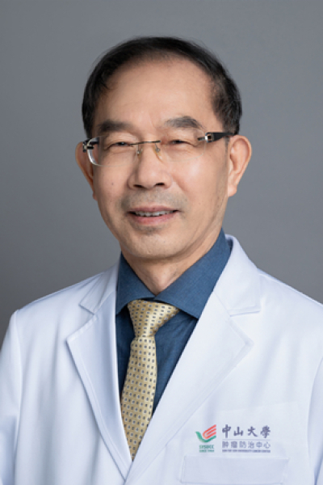

<!-- AUTO-GENERATED-BY: work/generate_obsidian_profiles.py -->

<!-- TEMPLATE: D:\workspace\信息收集整理\医生画像仓库\模板\医生画像模板.md -->

# 陈忠平

## 基础信息

| 字段 | 内容 |
|---|---|
| 姓名 | 陈忠平 |
| 医院 | 中山大学肿瘤防治中心 |
| 科室 | 神经外科 |
| 职称/身份 | 胶质瘤单病种首席专家、科主任导师 职称：教授、主任医师、博士生导师、胶质瘤资深首席专家 |
| 来源链接 | [官网原文](https://www.sysucc.org.cn/node/3707) |
| 采集日期 | 2026-08-10 |

## 简介/擅长

脑（神经系统）肿瘤的显微外科手术和综合治疗

## 教育与进修经历

- 二、学习工作经历： 1978年—1982年：苏州医学院医学系本科毕业 1982年12月—1993年：苏州医学院附一院神经外科工作；
- 期间在职读神经外科硕士(1989年毕业)和博士（1993年毕业） 1993年 9月—1999年9月： 加拿大麦吉尔大学，神经外科博士后/ Research associate 1999年11月至今：中山大学附属肿瘤医院心神经外科工作 加载更多 陈忠平 主任医师，博士导师，胶质瘤首席专家 1957年8月生，男，汉族，江苏江阴人 门诊时间：周二上午、周五上午 教育和工作经历 1982年：苏州医学院本科毕业 1982-1993年：苏州医学院附属第一医院神经外科 神经外科硕士（1989），神经外科博士（1993） 199…

## 论文与学术产出

- 发表学术论文300多篇，其中70多篇为高水平收录杂志。
- 中国科技出版社 1998年 2. 胶质瘤. 黄强 、陈忠平、兰青 主编， 中国科技出版社 ...

## 可包装亮点

- 胶质瘤单病种首席专家、科主任导师 职称：教授、主任医师、博士生导师、胶质瘤资深首席专家 陈忠平 职务：胶质瘤单病种首席专家、科主任导师 职称：教授、主任医师、博士生导师、胶质瘤资深首席专家 专长 脑（神经系统）肿瘤的显微外科手术和综合治疗 一、基本情况 职称：教授、主任医师、博士生导师、胶质瘤首席专家 职务：胶质瘤单病种首席专家、科主任导师 专家门诊时间：…
- 期间在职读神经外科硕士(1989年毕业)和博士（1993年毕业） 1993年 9月—1999年9月： 加拿大麦吉尔大学，神经外科博士后/ Research associate 1999年11月至今：中山大学附属肿瘤医院心神经外科工作 陈忠平 主任医师，博士导师，胶质瘤首席专家 1957年8月生，男，汉族，江苏江阴人 门诊时间：周二上午、周五上午 教育和工作…

## 重点疾病/人群标签

- 慢性病：
- 肿瘤：肿瘤、癌、瘤、化疗、免疫
- 生殖疾病：
- 免疫/风湿：肿瘤、癌、瘤、化疗、免疫
- 术后恢复/康复：
- 疑难重症：

## 证据摘录

> 只摘录官网公开信息中的短句或关键字段，不复制大段原文。

- 官网身份字段：胶质瘤单病种首席专家、科主任导师 职称：教授、主任医师、博士生导师、胶质瘤资深首席专家
- 官网简介/擅长：脑（神经系统）肿瘤的显微外科手术和综合治疗
- 官网亮眼经历线索：胶质瘤单病种首席专家、科主任导师 职称：教授、主任医师、博士生导师、胶质瘤资深首席专家 陈忠平 职务：胶质瘤单病种首席专家、科主任导师 职称：教授、主任医师、博士生导师、胶质瘤资深首席专家 专长 脑（神经系统）肿瘤的显微外科手术和综合治疗 一、基本情况 职称：教授、主任医师、博士生导师、胶质瘤首席专家 职务：胶质瘤单病种首席专家、科主任导师 专家门诊时间： 周二上午； 期间在职读神经外科硕士(1989年毕业)和博士（1993年毕业）…
- 异常提示：亮眼经历含导航文本，已清洗
- 来源链接：https://www.sysucc.org.cn/node/3707

## BD 画像摘要

陈忠平医生可作为肿瘤、免疫/风湿/感染方向的基础画像候选。后续 BD 使用应继续以官网来源和人工复核为准，不添加疗效承诺或无来源包装。

## 合规边界

- 仅使用医院官网、官方公众号、官方小程序等公开渠道。
- 不采集私人电话、私人微信、家庭住址、患者隐私或非公开排班信息。
- 不写“保证治愈”“疗效第一”“包治疑难杂症”等无法由官网证明的表述。
