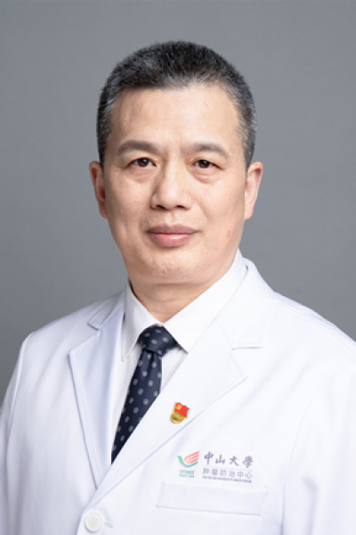

<!-- AUTO-GENERATED-BY: work/generate_obsidian_profiles.py -->

<!-- TEMPLATE: D:\workspace\信息收集整理\医生画像仓库\模板\医生画像模板.md -->

# 陈敏山

## 基础信息

| 字段 | 内容 |
|---|---|
| 姓名 | 陈敏山 |
| 医院 | 中山大学肿瘤防治中心 |
| 科室 | 肝脏外科 |
| 职称/身份 | 教授、主任医师、博士生导师、肝癌首席专家 |
| 来源链接 | [官网原文](https://www.sysucc.org.cn/node/3632) |
| 采集日期 | 2026-08-10 |

## 简介/擅长

肝癌的多学科治疗（包括肝癌的手术切除、射频消融、介入治疗、化疗和靶向治疗）。特别小肝癌的射频消融治疗及研究。

## 论文与学术产出

- 致力于小肝癌微创治疗的多学科治疗研究，共发表肝癌研究论文405篇，其中2006年国际上首个射频消融对比手术切除治疗小肝癌的RCT研究发表在Annals of Surgery杂志，研究结果备受国内外学者关注，据Google Scholar查询，至2021年6月已被引用1525次。
- 陈敏山教授共有6篇临床研究论文（第176、181、186、256、259、264篇参考文献）被美国NCCN指南（NCCN Clinical Practice Guidelines in Oncology）2015—2021年“肝癌”部分所引用。
- 2010年受中国抗癌协会肝癌专业委员会、中国抗癌协会临床肿瘤学协作委员会、中华医学会肝病学分会肝癌学组委托，执笔制定了以射频消融为模板的《肝癌局部消融治疗规范的专家共识》，在国内6个杂志发表。
- 近年来致力于推动肝癌MDT团队建立和多学科联合治疗，在国内多个学术专题会议倡议建立肝癌的MDT团队及开展肝癌的多学科联合治疗，并于2013年依托广东省抗癌协会肝癌专业委员会、广东省医学会肝胆胰外科学分会主持撰写并发表了《肝癌MDT团队的建立与多学科联合治疗策略――广东专家共识》（《中国实用外科杂志》，2014年）和《肝细胞肝癌合并门静脉癌栓多学科综合治疗广东专家共识(2015版)》（《中华消化外科杂...

## 可包装亮点

- 教授、主任医师、博士生导师、肝癌首席专家 肝癌的多学科治疗（包括肝癌的手术切除、射频消融、介入治疗、化疗和靶向治疗）。
- 陈敏山 职称：教授、主任医师、博士生导师、肝癌首席专家 专长 肝癌的多学科治疗（包括肝癌的手术切除、射频消融、介入治疗、化疗和靶向治疗）。
- 一、基本情况 职务： 科主任 职称： 教授、主任医师、博士生导师、肝癌首席专家 专家门诊时间： 周二上午（越秀院区），周三10:30 – 12:30（黄埔院区），周四下午（越秀院区） 专业特长： 肝癌的多学科治疗（包括肝癌的手术切除、射频消融、介入治疗、化疗和靶向治疗）。

## 重点疾病/人群标签

- 慢性病：
- 肿瘤：肿瘤、癌、放疗、化疗、靶向、肝癌、免疫、多学科、MDT
- 生殖疾病：
- 免疫/风湿：肿瘤、癌、放疗、化疗、靶向、肝癌、免疫、多学科、MDT
- 术后恢复/康复：
- 疑难重症：肿瘤、癌、放疗、化疗、靶向、肝癌、免疫、多学科、MDT

## 证据摘录

> 只摘录官网公开信息中的短句或关键字段，不复制大段原文。

- 官网身份字段：教授、主任医师、博士生导师、肝癌首席专家
- 官网简介/擅长：肝癌的多学科治疗（包括肝癌的手术切除、射频消融、介入治疗、化疗和靶向治疗）。特别小肝癌的射频消融治疗及研究。
- 官网亮眼经历线索：教授、主任医师、博士生导师、肝癌首席专家 肝癌的多学科治疗（包括肝癌的手术切除、射频消融、介入治疗、化疗和靶向治疗）。 陈敏山 职称：教授、主任医师、博士生导师、肝癌首席专家 专长 肝癌的多学科治疗（包括肝癌的手术切除、射频消融、介入治疗、化疗和靶向治疗）。 一、基本情况 职务： 科主任 职称： 教授、主任医师、博士生导师、肝癌首席专家 专家门诊时间： 周二上午（越秀院区），周三10:30 – 12:30（黄埔院区），周四下午（越秀院…
- 异常提示：亮眼经历含导航文本，已清洗
- 来源链接：https://www.sysucc.org.cn/node/3632

## BD 画像摘要

陈敏山医生可作为肿瘤、免疫/风湿/感染、疑难重症方向的基础画像候选。后续 BD 使用应继续以官网来源和人工复核为准，不添加疗效承诺或无来源包装。

## 合规边界

- 仅使用医院官网、官方公众号、官方小程序等公开渠道。
- 不采集私人电话、私人微信、家庭住址、患者隐私或非公开排班信息。
- 不写“保证治愈”“疗效第一”“包治疑难杂症”等无法由官网证明的表述。
