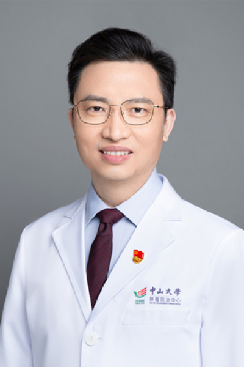

<!-- AUTO-GENERATED-BY: work/generate_obsidian_profiles.py -->

<!-- TEMPLATE: D:\workspace\信息收集整理\医生画像仓库\模板\医生画像模板.md -->

# 陈明远

## 基础信息

| 字段 | 内容 |
|---|---|
| 姓名 | 陈明远 |
| 医院 | 中山大学肿瘤防治中心 |
| 科室 | 鼻咽科 |
| 职称/身份 | 鼻咽科副主任，教育部“新世纪优秀人才”，中山大学肿瘤防治中心特支计划“临床医学科学家” 职称：教授、主任医师、肿瘤学博士、博士生导师 |
| 来源链接 | [官网原文](https://www.sysucc.org.cn/node/1525) |
| 采集日期 | 2026-08-10 |

## 简介/擅长

早期鼻咽癌放射治疗，复发鼻咽癌微创外科治疗，鼻咽癌放疗后遗症治疗和内镜颅底外科等

## 教育与进修经历

- 工作经历 2001.7-至今 中山大学肿瘤防治中心鼻咽科 教授/主任医师/科副主任 教育经历 2004.9-2007.6 中山大学肿瘤防治中心鼻咽科 肿瘤学 博士 1998.9-2001.6 中山大学第一附属医院耳鼻咽喉科 耳鼻咽喉科 硕士 1993.9-1998.6 南华大学医学院 临床医学 学士 出国/出境学习经历 2011.2-2012.3 美国马里兰大学医学院 博士后 2009.6-2009.9 香港大学玛丽医院头颈外科 Fellowship 2009.4-2009.5 荷兰癌症中心列文虎克医院头颈肿瘤外…

## 科研项目与成果

- 主持国家级、省部级和校级等各类科研基金项目近20项，总经费800余万；

## 论文与学术产出

- 发表第一/并列第一/通讯作者高水平论文30余篇，总IF超过100，最高IF为11.753，最高单篇引频85次；

## 可包装亮点

- 鼻咽科副主任，教育部“新世纪优秀人才”，中山大学肿瘤防治中心特支计划“临床医学科学家” 职称：教授、主任医师、肿瘤学博士、博士生导师 陈明远 职务：鼻咽科副主任，教育部“新世纪优秀人才”，中山大学肿瘤防治中心特支计划“临床医学科学家” 职称：教授、主任医师、肿瘤学博士、博士生导师 专长 早期鼻咽癌放射治疗，复发鼻咽癌微创外科治疗，鼻咽癌放疗后遗症治疗和内镜…
- 二、工作经历 2001.7-至今 中山大学肿瘤防治中心鼻咽科 教授/主任医师/科副主任 三、教育经历...

## 重点疾病/人群标签

- 慢性病：
- 肿瘤：肿瘤、癌、放疗、化疗、靶向、鼻咽癌、术后、创面、伤口、难治、多学科、高危
- 生殖疾病：
- 免疫/风湿：
- 术后恢复/康复：肿瘤、癌、放疗、化疗、靶向、鼻咽癌、术后、创面、伤口、难治、多学科、高危
- 疑难重症：肿瘤、癌、放疗、化疗、靶向、鼻咽癌、术后、创面、伤口、难治、多学科、高危

## 证据摘录

> 只摘录官网公开信息中的短句或关键字段，不复制大段原文。

- 官网身份字段：鼻咽科副主任，教育部“新世纪优秀人才”，中山大学肿瘤防治中心特支计划“临床医学科学家” 职称：教授、主任医师、肿瘤学博士、博士生导师
- 官网简介/擅长：早期鼻咽癌放射治疗，复发鼻咽癌微创外科治疗，鼻咽癌放疗后遗症治疗和内镜颅底外科等
- 官网亮眼经历线索：鼻咽科副主任，教育部“新世纪优秀人才”，中山大学肿瘤防治中心特支计划“临床医学科学家” 职称：教授、主任医师、肿瘤学博士、博士生导师 陈明远 职务：鼻咽科副主任，教育部“新世纪优秀人才”，中山大学肿瘤防治中心特支计划“临床医学科学家” 职称：教授、主任医师、肿瘤学博士、博士生导师 专长 早期鼻咽癌放射治疗，复发鼻咽癌微创外科治疗，鼻咽癌放疗后遗症治疗和内镜颅底外科等 一、基本情况 职务：鼻咽科副主任 职称：博士、教授、主任医师、博士生…
- 异常提示：亮眼经历含导航文本，已清洗
- 来源链接：https://www.sysucc.org.cn/node/1525

## BD 画像摘要

陈明远医生可作为肿瘤、术后恢复/康复、疑难重症方向的基础画像候选。后续 BD 使用应继续以官网来源和人工复核为准，不添加疗效承诺或无来源包装。

## 合规边界

- 仅使用医院官网、官方公众号、官方小程序等公开渠道。
- 不采集私人电话、私人微信、家庭住址、患者隐私或非公开排班信息。
- 不写“保证治愈”“疗效第一”“包治疑难杂症”等无法由官网证明的表述。
