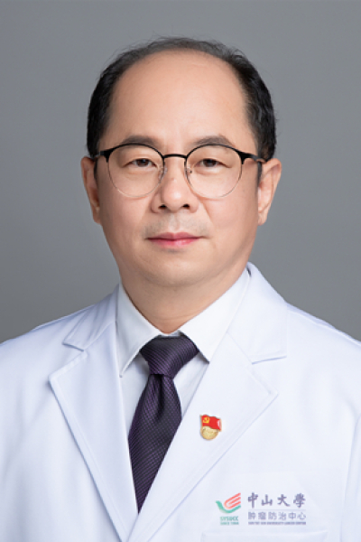

<!-- AUTO-GENERATED-BY: work/generate_obsidian_profiles.py -->

<!-- TEMPLATE: D:\workspace\信息收集整理\医生画像仓库\模板\医生画像模板.md -->

# 陈映波

## 基础信息

| 字段 | 内容 |
|---|---|
| 姓名 | 陈映波 |
| 医院 | 中山大学肿瘤防治中心 |
| 科室 | 胃外科 |
| 职称/身份 | 胃外科副主任 职称：主任医师、硕士导师 |
| 来源链接 | [官网原文](https://www.sysucc.org.cn/node/3655) |
| 采集日期 | 2026-08-10 |

## 简介/擅长

胃肠道肿瘤的诊治

## 教育与进修经历

- 专业学会兼职 广东省抗癌协会胃癌专业委员会委员 海外留学经历 2010年在澳洲悉尼Melanoma Institute Australia进修学习 科研基金(主持)： 2003年承担广东省卫生厅科研项目一项。

## 科研项目与成果

- 临床专家 面包屑 首页 / 临床科室 / 外科系列 / 胃外科 / 临床专家 陈映波 职务：胃外科副主任 职称：主任医师、硕士导师 专长 胃肠道肿瘤的诊治 一、基本情况 职务：胃外科副主任 职称：主任医师、硕士导师 专家门诊时间： 周二上午 专业特长：1992起在中山大学肿瘤防治中心腹科从事医疗、科研及教学工作。
- 专业学会兼职 广东省抗癌协会胃癌专业委员会委员 海外留学经历 2010年在澳洲悉尼Melanoma Institute Australia进修学习 科研基金(主持)： 2003年承担广东省卫生厅科研项目一项。
- 2004年承担医院科研项目一项。
- 2008年承担广东省科技厅科研项目一项。

## 论文与学术产出

- 专著编写 《黑色素瘤的基础与临床》 人民卫生出版社，2010年第1版 主编 《临床肿瘤学》 科学出版社 1999年第1版2005年第2版 编委 《社区肿瘤学》 科学出版社 2000年第1版2008年第2版 编委 《新编老年医学》 人民卫生出版社 2001年第1版 编写 《肿瘤学专题讲座》 郑州大学出版社2006年第1版 编写 发表论文（近年发表第一或通信作者） 1．P53蛋白及PCNA的表达与胃癌预后的关系，广东医学，2009，30（4） 2．胃癌患者全胃切除功能性空肠间置重建术后对化疗的耐受性，广东医学，201…

## 可包装亮点

- 胃外科副主任 职称：主任医师、硕士导师 陈映波 职务：胃外科副主任 职称：主任医师、硕士导师 专长 胃肠道肿瘤的诊治 一、基本情况 职务：胃外科副主任 职称：主任医师、硕士导师 专家门诊时间： 周二上午 专业特长：1992起在中山大学肿瘤防治中心腹科从事医疗、科研及教学工作。
- 二、学习及工作经历： 1986年—1992年 中山医科大学医学系本科 1992年—1997年 中山医科大学肿瘤医院腹科住院医师 1996年—1999年 中山医科大学肿瘤学硕士研究生 1997年—2004年 中山大学附属肿瘤医院腹科主治医师 2004年—2011年 中山大学附属肿瘤医院腹科副主任医师 2011年—至今 中山大学附属肿瘤医院胃胰科主任医师 学习…

## 重点疾病/人群标签

- 慢性病：
- 肿瘤：肿瘤、癌、瘤、化疗、胃癌、术后
- 生殖疾病：
- 免疫/风湿：
- 术后恢复/康复：肿瘤、癌、瘤、化疗、胃癌、术后
- 疑难重症：

## 证据摘录

> 只摘录官网公开信息中的短句或关键字段，不复制大段原文。

- 官网身份字段：胃外科副主任 职称：主任医师、硕士导师
- 官网简介/擅长：胃肠道肿瘤的诊治
- 官网亮眼经历线索：胃外科副主任 职称：主任医师、硕士导师 陈映波 职务：胃外科副主任 职称：主任医师、硕士导师 专长 胃肠道肿瘤的诊治 一、基本情况 职务：胃外科副主任 职称：主任医师、硕士导师 专家门诊时间： 周二上午 专业特长：1992起在中山大学肿瘤防治中心腹科从事医疗、科研及教学工作。 二、学习及工作经历： 1986年—1992年 中山医科大学医学系本科 1992年—1997年 中山医科大学肿瘤医院腹科住院医师 1996年—1999年 中山医科…
- 异常提示：亮眼经历含导航文本，已清洗
- 来源链接：https://www.sysucc.org.cn/node/3655

## BD 画像摘要

陈映波医生可作为肿瘤、术后恢复/康复方向的基础画像候选。后续 BD 使用应继续以官网来源和人工复核为准，不添加疗效承诺或无来源包装。

## 合规边界

- 仅使用医院官网、官方公众号、官方小程序等公开渠道。
- 不采集私人电话、私人微信、家庭住址、患者隐私或非公开排班信息。
- 不写“保证治愈”“疗效第一”“包治疑难杂症”等无法由官网证明的表述。
