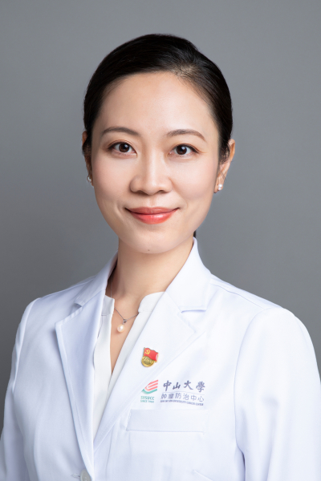

<!-- AUTO-GENERATED-BY: work/generate_obsidian_profiles.py -->

<!-- TEMPLATE: D:\workspace\信息收集整理\医生画像仓库\模板\医生画像模板.md -->

# 陈春燕

## 基础信息

| 字段 | 内容 |
|---|---|
| 姓名 | 陈春燕 |
| 医院 | 中山大学肿瘤防治中心 |
| 科室 | 放疗科 |
| 职称/身份 | 主任医师 |
| 来源链接 | [官网原文](https://www.sysucc.org.cn/node/1699) |
| 采集日期 | 2026-08-10 |

## 简介/擅长

头颈部肿瘤精确放疗及个体化治疗，包括鼻咽、口咽、口腔、喉、下咽，鼻腔副鼻窦癌、腺样囊性癌，涎腺癌等及淋巴瘤、转移瘤的调强适形放疗、立体定向放疗、TOMO等。

## 教育与进修经历

- 二、教育及工作经历 学习经历： 1999-2006 中山大学临床医学七年制，获肿瘤学硕士学位 2010-2013 中山大学附属肿瘤医院，获肿瘤学博士学位 2013-2014 美国M. D. 安德森癌症中心（全美癌症专科排名第一）访问学者 工作经历： 2006-2009 中山大学附属肿瘤医院放疗科 住院医师 2009-2017 中山大学附属肿瘤医院放疗科 主治医师 2017-2023 中山大学附属肿瘤医院放疗科 副主任医师 2023至今 中山大学附属肿瘤医院放疗科 主任医师 三、学术兼职 中国医学装备协会理事会 理…

## 可包装亮点

- 主任医师 陈春燕 职称：主任医师 专长 头颈部肿瘤精确放疗及个体化治疗，包括鼻咽、口咽、口腔、喉、下咽，鼻腔副鼻窦癌、腺样囊性癌，涎腺癌等及淋巴瘤、转移瘤的调强适形放疗、立体定向放疗、TOMO等。
- 一、基本情况 职称： 主任医师 专业特长： 头颈部肿瘤的精确放疗、综合治疗及个体化治疗，包括鼻咽癌、口咽癌、口腔癌、喉癌、下咽癌、鼻腔副鼻窦癌、腺样囊性癌、涎腺癌等，以及淋巴瘤、转移瘤的调强适形放疗（IMRT/VMAT）、立体定向放疗（SBRT）、螺旋断层放疗（TOMO）、磁共振引导放疗等。
- 二、教育及工作经历 学习经历： 1999-2006 中山大学临床医学七年制，获肿瘤学硕士学位 2010-2013 中山大学附属肿瘤医院，获肿瘤学博士学位 2013-2014 美国M. D. 安德森癌症中心（全美癌症专科排名第一）访问学者 工作经历： 2006-20...

## 重点疾病/人群标签

- 慢性病：
- 肿瘤：肿瘤、癌、瘤、淋巴瘤、放疗、鼻咽癌、免疫、多学科
- 生殖疾病：
- 免疫/风湿：肿瘤、癌、瘤、淋巴瘤、放疗、鼻咽癌、免疫、多学科
- 术后恢复/康复：
- 疑难重症：肿瘤、癌、瘤、淋巴瘤、放疗、鼻咽癌、免疫、多学科

## 证据摘录

> 只摘录官网公开信息中的短句或关键字段，不复制大段原文。

- 官网身份字段：主任医师
- 官网简介/擅长：头颈部肿瘤精确放疗及个体化治疗，包括鼻咽、口咽、口腔、喉、下咽，鼻腔副鼻窦癌、腺样囊性癌，涎腺癌等及淋巴瘤、转移瘤的调强适形放疗、立体定向放疗、TOMO等。
- 官网亮眼经历线索：主任医师 陈春燕 职称：主任医师 专长 头颈部肿瘤精确放疗及个体化治疗，包括鼻咽、口咽、口腔、喉、下咽，鼻腔副鼻窦癌、腺样囊性癌，涎腺癌等及淋巴瘤、转移瘤的调强适形放疗、立体定向放疗、TOMO等。 一、基本情况 职称： 主任医师 专业特长： 头颈部肿瘤的精确放疗、综合治疗及个体化治疗，包括鼻咽癌、口咽癌、口腔癌、喉癌、下咽癌、鼻腔副鼻窦癌、腺样囊性癌、涎腺癌等，以及淋巴瘤、转移瘤的调强适形放疗（IMRT/VMAT）、立体定向放疗（SB…
- 异常提示：亮眼经历含导航文本，已清洗
- 来源链接：https://www.sysucc.org.cn/node/1699

## BD 画像摘要

陈春燕医生可作为肿瘤、免疫/风湿/感染、疑难重症方向的基础画像候选。后续 BD 使用应继续以官网来源和人工复核为准，不添加疗效承诺或无来源包装。

## 合规边界

- 仅使用医院官网、官方公众号、官方小程序等公开渠道。
- 不采集私人电话、私人微信、家庭住址、患者隐私或非公开排班信息。
- 不写“保证治愈”“疗效第一”“包治疑难杂症”等无法由官网证明的表述。
