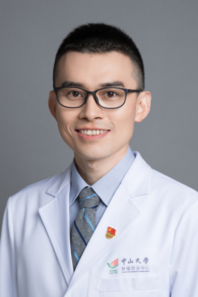

<!-- AUTO-GENERATED-BY: work/generate_obsidian_profiles.py -->

<!-- TEMPLATE: D:\workspace\信息收集整理\医生画像仓库\模板\医生画像模板.md -->

# 陈树伟

## 基础信息

| 字段 | 内容 |
|---|---|
| 姓名 | 陈树伟 |
| 医院 | 中山大学肿瘤防治中心 |
| 科室 | 头颈科 |
| 职称/身份 | 甲状腺癌单病种团队秘书 职称：主任医师、主诊教授、硕士研究生导师 |
| 来源链接 | [官网原文](https://www.sysucc.org.cn/node/3605) |
| 采集日期 | 2026-08-10 |

## 简介/擅长

甲状腺癌、口腔癌、口咽癌、喉癌、下咽癌等头颈癌的手术及综合治疗；肿瘤术后缺损的修复重建。

## 教育与进修经历

- 周三上午（黄埔院区） 二、教育及工作经历 2008年本科毕业于中山大学中山医学院（临床医学专业），2011年、2018年先后在中山大学肿瘤防治中心获得硕士、博士学位 2011年开始在中山大学肿瘤防治中心头颈外科工作，目前担任主诊教授 三、学术任职 中国医药教育协会头颈肿瘤专业委员会，常务委员 中国临床肿瘤学会（CSCO）头颈肿瘤专家委员会，委员 广东省抗癌协会头颈肿瘤专业委员会，常务委员 广东省精准医学应用学会头颈肿瘤分会，常务委员 广东省抗癌协会甲状腺癌专业委员会，秘书 中山大学肿瘤防治中心甲状腺癌单病种团队…

## 科研项目与成果

- 主持/参与多项临床研究，成果入选ASCO年会口头报告、ESMO年会壁报交流 五、代表性论著 以第一或通讯作者（含共同）身份在eClinicalMedicine、Cancer Letters等国际知名期刊上发表学术论文共30余篇。

## 论文与学术产出

- 主持/参与多项临床研究，成果入选ASCO年会口头报告、ESMO年会壁报交流 五、代表性论著 以第一或通讯作者（含共同）身份在eClinicalMedicine、Cancer Letters等国际知名期刊上发表学术论文共30余篇。
- 六、学术著作 《MD安德森肿瘤外科手册（原著第7版）》中文版，编委，2025年 《2025全国卫生专业技术资格考试指导——肿瘤学》，编委，2025年 《口腔癌、口咽癌——全生命周期诊疗及康复》，编委，2024年 《中国临床肿瘤学年度研究进展 2022/2023/2024》，编委，2023/2024/2025年 《头颈肿瘤外科临床实践与技巧》，编委，2020年 《肿瘤靶向治疗及免疫治疗进展》，编委，2020年 七、获奖及荣誉 2025年中山大学肿瘤防治中心“十佳员工” 2024年第十届“羊城好医生” 2022年“第…

## 可包装亮点

- 甲状腺癌单病种团队秘书 职称：主任医师、主诊教授、硕士研究生导师 陈树伟 职务：甲状腺癌单病种团队秘书 职称：主任医师、主诊教授、硕士研究生导师 专长 甲状腺癌、口腔癌、口咽癌、喉癌、下咽癌等头颈癌的手术及综合治疗；
- 一、基本情况 陈树伟，主任医师，主诊教授，医学博士，硕士研究生导师，甲状腺癌单病种团队秘书 门诊时间： 周一上午、周四下午（越秀院区）；
- 周三上午（黄埔院区） 二、教育及工作经历 2008年本科毕业于中山大学中山医学院（临床医学专业），2011年、2018年先后在中山大学肿瘤防治中心获得硕士、博士学位 2011年开始在中山大学肿瘤防治中心头颈外科工作，目前担任主诊教授 三、学术任职 中国医药教育协会头颈肿瘤专业委员会，常务委员 中国临床肿瘤学会（CSCO）头颈肿瘤专家委员会，委员 广东省抗癌…

## 重点疾病/人群标签

- 慢性病：
- 肿瘤：肿瘤、癌、靶向、免疫、术后、康复
- 生殖疾病：
- 免疫/风湿：肿瘤、癌、靶向、免疫、术后、康复
- 术后恢复/康复：肿瘤、癌、靶向、免疫、术后、康复
- 疑难重症：

## 证据摘录

> 只摘录官网公开信息中的短句或关键字段，不复制大段原文。

- 官网身份字段：甲状腺癌单病种团队秘书 职称：主任医师、主诊教授、硕士研究生导师
- 官网简介/擅长：甲状腺癌、口腔癌、口咽癌、喉癌、下咽癌等头颈癌的手术及综合治疗；肿瘤术后缺损的修复重建。
- 官网亮眼经历线索：甲状腺癌单病种团队秘书 职称：主任医师、主诊教授、硕士研究生导师 陈树伟 职务：甲状腺癌单病种团队秘书 职称：主任医师、主诊教授、硕士研究生导师 专长 甲状腺癌、口腔癌、口咽癌、喉癌、下咽癌等头颈癌的手术及综合治疗； 一、基本情况 陈树伟，主任医师，主诊教授，医学博士，硕士研究生导师，甲状腺癌单病种团队秘书 门诊时间： 周一上午、周四下午（越秀院区）； 周三上午（黄埔院区） 二、教育及工作经历 2008年本科毕业于中山大学中山医学院（…
- 异常提示：亮眼经历含导航文本，已清洗
- 来源链接：https://www.sysucc.org.cn/node/3605

## BD 画像摘要

陈树伟医生可作为肿瘤、免疫/风湿/感染、术后恢复/康复方向的基础画像候选。后续 BD 使用应继续以官网来源和人工复核为准，不添加疗效承诺或无来源包装。

## 合规边界

- 仅使用医院官网、官方公众号、官方小程序等公开渠道。
- 不采集私人电话、私人微信、家庭住址、患者隐私或非公开排班信息。
- 不写“保证治愈”“疗效第一”“包治疑难杂症”等无法由官网证明的表述。
