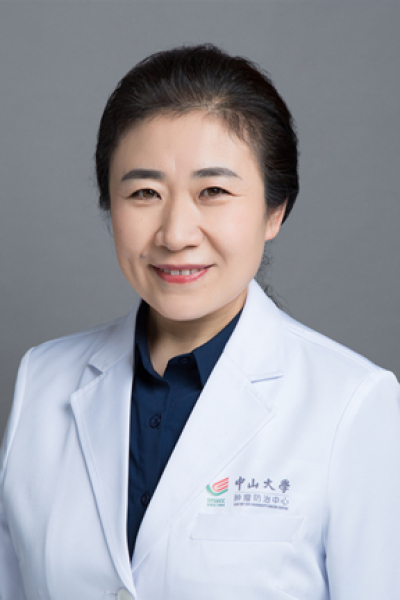

<!-- AUTO-GENERATED-BY: work/generate_obsidian_profiles.py -->

<!-- TEMPLATE: D:\workspace\信息收集整理\医生画像仓库\模板\医生画像模板.md -->

# 陈艳峰

## 基础信息

| 字段 | 内容 |
|---|---|
| 姓名 | 陈艳峰 |
| 医院 | 中山大学肿瘤防治中心 |
| 科室 | 头颈科 |
| 职称/身份 | 主任医师 |
| 来源链接 | [官网原文](https://www.sysucc.org.cn/node/3602) |
| 采集日期 | 2026-08-10 |

## 简介/擅长

头颈肿瘤的临床工作及相关基础研究

## 教育与进修经历

- 职称：主任医师 专长 头颈肿瘤的临床工作及相关基础研究 一、基本情况 职称：主任医师 专家门诊时间： 周一下午 专业特长：头颈肿瘤的临床工作及相关基础研究 二、学习及工作经历： 1990年9月—1995年7月：山西医科大学攻读临床医学专业学士学位 1995年8月—1998年8月：西山煤电集团职工总院耳鼻喉科工作 1998年9月—2001年6月：中山大学第二附属医院攻读耳鼻咽喉专业硕士学位 2001年9月—2004年6月：中山大学…

## 可包装亮点

- 主任医师 陈艳峰 职称：主任医师 专长 头颈肿瘤的临床工作及相关基础研究 一、基本情况 职称：主任医师 专家门诊时间： 周一下午 专业特长：头颈肿瘤的临床工作及相关基础研究 二、学习及工作经历： 1990年9月—1995年7月：山西医科大学攻读临床医学专业学士学位 1995年8月—1998年8月：西山煤电集团职工总院耳鼻喉科工作 1998年9月—2001年…

## 重点疾病/人群标签

- 慢性病：
- 肿瘤：肿瘤
- 生殖疾病：
- 免疫/风湿：
- 术后恢复/康复：
- 疑难重症：

## 证据摘录

> 只摘录官网公开信息中的短句或关键字段，不复制大段原文。

- 官网身份字段：主任医师
- 官网简介/擅长：头颈肿瘤的临床工作及相关基础研究
- 官网亮眼经历线索：主任医师 陈艳峰 职称：主任医师 专长 头颈肿瘤的临床工作及相关基础研究 一、基本情况 职称：主任医师 专家门诊时间： 周一下午 专业特长：头颈肿瘤的临床工作及相关基础研究 二、学习及工作经历： 1990年9月—1995年7月：山西医科大学攻读临床医学专业学士学位 1995年8月—1998年8月：西山煤电集团职工总院耳鼻喉科工作 1998年9月—2001年6月：中山大学第二附属医院攻读耳鼻咽喉专业硕士学位 2001年9月—2004年6…
- 异常提示：亮眼经历含导航文本，已清洗
- 来源链接：https://www.sysucc.org.cn/node/3602

## BD 画像摘要

陈艳峰医生可作为肿瘤方向的基础画像候选。后续 BD 使用应继续以官网来源和人工复核为准，不添加疗效承诺或无来源包装。

## 合规边界

- 仅使用医院官网、官方公众号、官方小程序等公开渠道。
- 不采集私人电话、私人微信、家庭住址、患者隐私或非公开排班信息。
- 不写“保证治愈”“疗效第一”“包治疑难杂症”等无法由官网证明的表述。
