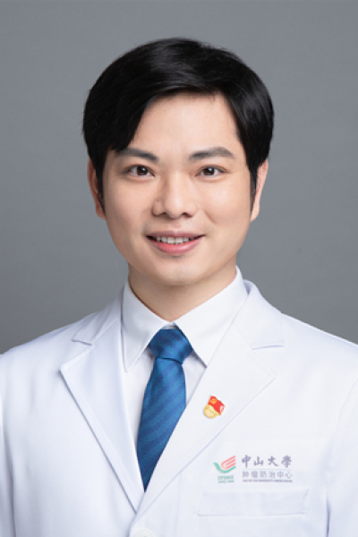

<!-- AUTO-GENERATED-BY: work/generate_obsidian_profiles.py -->

<!-- TEMPLATE: D:\workspace\信息收集整理\医生画像仓库\模板\医生画像模板.md -->

# 陈银生

## 基础信息

| 字段 | 内容 |
|---|---|
| 姓名 | 陈银生 |
| 医院 | 中山大学肿瘤防治中心 |
| 科室 | 神经外科 |
| 职称/身份 | 主任医师、主诊教授、博士、博士生导师 |
| 来源链接 | [官网原文](https://www.sysucc.org.cn/node/3715) |
| 采集日期 | 2026-08-10 |

## 简介/擅长

胶质瘤、脑膜瘤、垂体瘤、脑转移瘤、颅咽管瘤、髓母细胞瘤、神经鞘瘤、神经纤维瘤、生殖细胞肿瘤、淋巴瘤、胆脂瘤等脑和椎管内肿瘤的精准微创手术和综合治疗。

## 教育与进修经历

- 历经国内外多个著名神经外科中心“理论知识-实验技能-住院医师-专科医师-高级医生”系统培训，有前沿的神经系统肿瘤诊疗理论和扎实的手术技能。

## 可包装亮点

- 主任医师、主诊教授、博士、博士生导师 胶质瘤、脑膜瘤、垂体瘤、脑转移瘤、颅咽管瘤、髓母细胞瘤、神经鞘瘤、神经纤维瘤、生殖细胞肿瘤、淋巴瘤、胆脂瘤等脑和椎管内肿瘤的精准微创手术和综合治疗。
- 陈银生 职称：主任医师、主诊教授、博士、博士生导师 专长 胶质瘤、脑膜瘤、垂体瘤、脑转移瘤、颅咽管瘤、髓母细胞瘤、神经鞘瘤、神经纤维瘤、生殖细胞肿瘤、淋巴瘤、胆脂瘤等脑和椎管内肿瘤的精准微创手术和综合治疗。
- 一、基本情况 职称：主任医师、主诊教授、博士、博士生导师 门诊时间：周三下午、周五下午 云诊室（线上）：周一至周日全天 二、学习及工作经历 中国医科大学博士，中山大学访问博士。

## 重点疾病/人群标签

- 慢性病：
- 肿瘤：肿瘤、瘤、淋巴瘤、放疗、生殖
- 生殖疾病：肿瘤、瘤、淋巴瘤、放疗、生殖
- 免疫/风湿：
- 术后恢复/康复：
- 疑难重症：

## 证据摘录

> 只摘录官网公开信息中的短句或关键字段，不复制大段原文。

- 官网身份字段：主任医师、主诊教授、博士、博士生导师
- 官网简介/擅长：胶质瘤、脑膜瘤、垂体瘤、脑转移瘤、颅咽管瘤、髓母细胞瘤、神经鞘瘤、神经纤维瘤、生殖细胞肿瘤、淋巴瘤、胆脂瘤等脑和椎管内肿瘤的精准微创手术和综合治疗。
- 官网亮眼经历线索：主任医师、主诊教授、博士、博士生导师 胶质瘤、脑膜瘤、垂体瘤、脑转移瘤、颅咽管瘤、髓母细胞瘤、神经鞘瘤、神经纤维瘤、生殖细胞肿瘤、淋巴瘤、胆脂瘤等脑和椎管内肿瘤的精准微创手术和综合治疗。 陈银生 职称：主任医师、主诊教授、博士、博士生导师 专长 胶质瘤、脑膜瘤、垂体瘤、脑转移瘤、颅咽管瘤、髓母细胞瘤、神经鞘瘤、神经纤维瘤、生殖细胞肿瘤、淋巴瘤、胆脂瘤等脑和椎管内肿瘤的精准微创手术和综合治疗。 一、基本情况 职称：主任医师、主诊教授、博…
- 异常提示：亮眼经历含导航文本，已清洗
- 来源链接：https://www.sysucc.org.cn/node/3715

## BD 画像摘要

陈银生医生可作为肿瘤、生殖疾病方向的基础画像候选。后续 BD 使用应继续以官网来源和人工复核为准，不添加疗效承诺或无来源包装。

## 合规边界

- 仅使用医院官网、官方公众号、官方小程序等公开渠道。
- 不采集私人电话、私人微信、家庭住址、患者隐私或非公开排班信息。
- 不写“保证治愈”“疗效第一”“包治疑难杂症”等无法由官网证明的表述。
