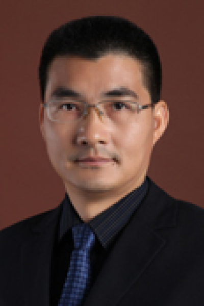

<!-- AUTO-GENERATED-BY: work/generate_obsidian_profiles.py -->

# 韦尉东

## 基础信息

| 字段 | 内容 |
|---|---|
| 医院 | 中山大学肿瘤防治中心 |
| 姓名 | 韦尉东 |
| 科室 | 乳腺科 |
| 职称/身份 | 主任医师、硕士生导师 |
| 重点优先级 | 高 |
| 来源类型 | 医院官网 |
| 来源链接 | [官网原文](https://www.sysucc.org.cn/node/3740) |
| 采集日期 | 2026-08-10 |
| 复核状态 | 待人工复核 |
| 异常提示 |  |

## 简介/擅长

擅长乳腺癌保乳及乳房重建术、改良根治及根治术及综合治疗，局部晚期或可手术晚期、复发或转移性乳腺癌及胸壁、锁骨上或内乳淋巴结复发胸壁切除及皮瓣转移修复手术。 中山大学肿瘤防治中心、肿瘤医院主任医师，研究生导师 中山大学肿瘤学博士，美国佛罗里达大学访问学者，美国AACR会员 从事胸部肿瘤及乳腺肿瘤治疗与研究20余年。近10年专注于乳腺癌外科及多学科综合治疗、乳腺癌同期及异时乳房重建及功能整复，有超过4000例乳腺癌综合治疗经验。擅长乳腺癌保乳及乳房重建术、改良根治及根治术及综合治疗，局部晚期或可手术晚期、复发或转移性乳腺癌及胸壁、锁骨上或内乳淋巴结复发胸壁切除及皮瓣转移修复手术。 临床研究集中于年轻乳腺癌的综合治疗及生育功能保全、局部晚期或可手术晚期乳腺癌的外科干预。基础研究聚焦于乳腺癌转移机制及治疗耐受机制。研究成果已分别发表中文论文11篇，英文高水平论著21篇。主持及参与的基础研究包括国家自然科学基金重点课题、省自然及省科技基金、省卫计委基金7项。 加载更多 中山大学肿瘤防治中心、肿瘤医院主任医师，研究生导师 中山大学肿瘤学博士，美国佛罗里达大学访问学者，美国AACR会员 从事胸部肿瘤及乳腺肿瘤治疗与研究20余年。近1...

## 详情正文摘录

临床专家 面包屑 首页 / 临床科室 / 外科系列 / 乳腺科 / 临床专家 韦尉东 职称：主任医师、硕士生导师 专长 擅长乳腺癌保乳及乳房重建术、改良根治及根治术及综合治疗，局部晚期或可手术晚期、复发或转移性乳腺癌及胸壁、锁骨上或内乳淋巴结复发胸壁切除及皮瓣转移修复手术。 中山大学肿瘤防治中心、肿瘤医院主任医师，研究生导师 中山大学肿瘤学博士，美国佛罗里达大学访问学者，美国AACR会员 从事胸部肿瘤及乳腺肿瘤治疗与研究20余年。近10年专注于乳腺癌外科及多学科综合治疗、乳腺癌同期及异时乳房重建及功能整复，有超过4000例乳腺癌综合治疗经验。擅长乳腺癌保乳及乳房重建术、改良根治及根治术及综合治疗，局部晚期或可手术晚期、复发或转移性乳腺癌及胸壁、锁骨上或内乳淋巴结复发胸壁切除及皮瓣转移修复手术。 临床研究集中于年轻乳腺癌的综合治疗及生育功能保全、局部晚期或可手术晚期乳腺癌的外科干预。基础研究聚焦于乳腺癌转移机制及治疗耐受机制。研究成果已分别发表中文论文11篇，英文高水平论著21篇。主持及参与的基础研究包括国家自然科学基金重点课题、省自然及省科技基金、省卫计委基金7项。 加载更多 中山大学肿瘤防治中心、肿瘤医院主任医师，研究生导师 中山大学肿瘤学博士，美国佛罗里达大学访问学者，美国AACR会员 从事胸部肿瘤及乳腺肿瘤治疗与研究20余年。近10年专注于乳腺癌外科及多学科综合治疗、乳腺癌同期及异时乳房重建及功能整复，有超过4000例乳腺癌综合治疗经验。擅长乳腺癌保乳及乳房重建术、改良根治及根治术及综合治疗，局部晚期或可手术晚期、复发或转移性乳腺癌及胸壁、锁骨上或内乳淋巴结复发胸壁切除及皮瓣转移修复手术。 临床研究集中于年轻乳腺癌的综合治疗及生育功能保全、局部晚期或可手术晚期乳腺癌的外科干预。基础研究聚焦于乳腺癌转移机制及治疗耐受机制。研究成果已分别发表中文论文11篇，英文高水平论著21篇。主持及参与的基础研究包括国家自然科学基金重点课题、省自然及省科技基金、省卫计委基金7项。 更新日期：2018年9月3日

## 重点关注范围

- 肿瘤
- 疑难重症

## 重点疾病标签

- 肿瘤
- 乳腺癌
- 多学科

## 亮眼经历线索

- 主任医师、硕士生导师 中山大学肿瘤防治中心、肿瘤医院主任医师，研究生导师 中山大学肿瘤学博士，美国佛罗里达大学访问学者，美国AACR会员 从事胸部肿瘤及乳腺肿瘤治疗与研究20余年。
- 近10年专注于乳腺癌外科及多学科综合治疗、乳腺癌同期及异时乳房重建及功能整复，有超过4000例乳腺癌综合治疗经验。
- 研究成果已分别发表中文论文11篇，英文高水平论著21篇。

## 异常提示

## 合规边界

- 本画像仅整理统一总底表中的医院官网公开字段。
- 不包含患者评价、排名、第三方来源内容或疗效承诺。
- 官网未展示的信息保持空白，后续如需补充须回到底表官方来源字段。
