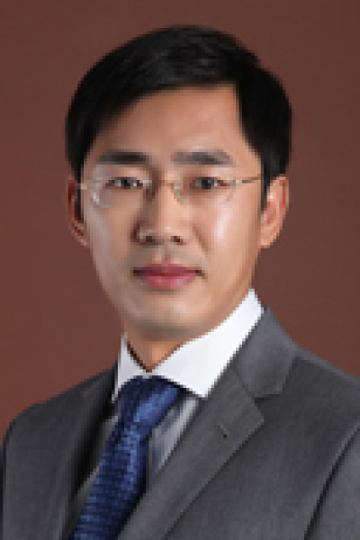

<!-- AUTO-GENERATED-BY: work/generate_obsidian_profiles.py -->

# 韩峰

## 基础信息

| 字段 | 内容 |
|---|---|
| 医院 | 中山大学肿瘤防治中心 |
| 姓名 | 韩峰 |
| 科室 | 超声科 |
| 职称/身份 | 主任医师 |
| 重点优先级 | 高 |
| 来源类型 | 医院官网 |
| 来源链接 | [官网原文](https://www.sysucc.org.cn/node/3899) |
| 采集日期 | 2026-08-10 |
| 复核状态 | 待人工复核 |
| 异常提示 |  |

## 简介/擅长

擅长肝胆、泌尿系、乳腺、甲状腺、淋巴结、妇科等肿瘤的超声诊断，在超声引导下的介入诊断与治疗有较深入的研究，特别是在甲状腺良性肿瘤、难治转移性淋巴结的微创介入治疗，超声引导下PTCD等方面有较丰富经验。 学习及工作经历： 2002年中山大学本科毕业后一直在中山大学肿瘤防治中心超声科工作，2008年获中山大学临床医学硕士学位，2011年获中山大学临床医学博士学位，2013年赴美国加州大学圣地亚哥分校进修学习。2017年1月起聘为超声科副主任医师，从事肿瘤的超声诊断及介入治疗工作。 研究方向： 目前主要从事超声引导下肿瘤诊断与甲状腺良性肿瘤、难治转移性淋巴结的微创介入治疗，超声引导下PTCD等工作。 加载更多 社会兼职： 中国超声医学工程学会仪器工程开发专业委员会委员 抗癌协会微创介入专委会委员 广东临床医学会肿瘤微创诊疗专业委员会委员 海峡两岸医药卫生交流协会超声医学专家委员会青年委员 专长： 擅长肝胆、泌尿系、乳腺、甲状腺、淋巴结、妇科等肿瘤的超声诊断，在超声引导下的介入诊断与治疗有较深入的研究，特别是在甲状腺良性肿瘤、难治转移性淋巴结的微创介入治疗，超声引导下PTCD等方面有较丰富经验。 学习及工作经历： 2002年中...

## 详情正文摘录

职称：主任医师 专长 擅长肝胆、泌尿系、乳腺、甲状腺、淋巴结、妇科等肿瘤的超声诊断，在超声引导下的介入诊断与治疗有较深入的研究，特别是在甲状腺良性肿瘤、难治转移性淋巴结的微创介入治疗，超声引导下PTCD等方面有较丰富经验。 社会兼职： 中国超声医学工程学会仪器工程开发专业委员会委员 抗癌协会微创介入专委会委员 广东临床医学会肿瘤微创诊疗专业委员会委员 海峡两岸医药卫生交流协会超声医学专家委员会青年委员 专长： 擅长肝胆、泌尿系、乳腺、甲状腺、淋巴结、妇科等肿瘤的超声诊断，在超声引导下的介入诊断与治疗有较深入的研究，特别是在甲状腺良性肿瘤、难治转移性淋巴结的微创介入治疗，超声引导下PTCD等方面有较丰富经验。 学习及工作经历： 2002年中山大学本科毕业后一直在中山大学肿瘤防治中心超声科工作，2008年获中山大学临床医学硕士学位，2011年获中山大学临床医学博士学位，2013年赴美国加州大学圣地亚哥分校进修学习。2017年1月起聘为超声科副主任医师，从事肿瘤的超声诊断及介入治疗工作。 研究方向： 目前主要从事超声引导下肿瘤诊断与甲状腺良性肿瘤、难治转移性淋巴结的微创介入治疗，超声引导下PTCD等工作。 加载更多 社会兼职： 中国超声医学工程学会仪器工程开发专业委员会委员 抗癌协会微创介入专委会委员 广东临床医学会肿瘤微创诊疗专业委员会委员 海峡两岸医药卫生交流协会超声医学专家委员会青年委员 专长： 擅长肝胆、泌尿系、乳腺、甲状腺、淋巴结、妇科等肿瘤的超声诊断，在超声引导下的介入诊断与治疗有较深入的研究，特别是在甲状腺良性肿瘤、难治转移性淋巴结的微创介入治疗，超声引导下PTCD等方面有较丰富经验。 学习及工作经历： 2002年中山大学本科毕业后一直在中山大学肿瘤防治中心超声科工作，2008年获中山大学临床医学硕士学位，2011年获中山大学临床医学博士学位，2013年赴美国加州大学圣地亚哥分校进修学习。2017年1月起聘为超声科副主任医师，从事肿瘤的超声诊断及介入治疗工作。 研究方向： 目前…

## 重点关注范围

- 肿瘤
- 疑难重症

## 重点疾病标签

- 肿瘤
- 癌
- 难治

## 亮眼经历线索

- 主任医师 学习及工作经历： 2002年中山大学本科毕业后一直在中山大学肿瘤防治中心超声科工作，2008年获中山大学临床医学硕士学位，2011年获中山大学临床医学博士学位，2013年赴美国加州大学圣地亚哥分校进修学习。
- 2017年1月起聘为超声科副主任医师，从事肿瘤的超声诊断及介入治疗工作。
- 加载更多 社会兼职： 中国超声医学工程学会仪器工程开发专业委员会委员 抗癌协会微创介入专委会委员 广东临床医学会肿瘤微创诊疗专业委员会委员 海峡两岸医药卫生交流协会超声医学专家委员会青年委员 专长： 擅长肝胆、泌尿系、乳腺、甲状腺、淋巴结、妇科等肿瘤的超声诊断，在超声引导下的介入诊断与治疗有较深入的研究，特别是在甲状腺良性肿瘤、难治转移性淋巴结的微创介入治…

## 异常提示

## 合规边界

- 本画像仅整理统一总底表中的医院官网公开字段。
- 不包含患者评价、排名、第三方来源内容或疗效承诺。
- 官网未展示的信息保持空白，后续如需补充须回到底表官方来源字段。
