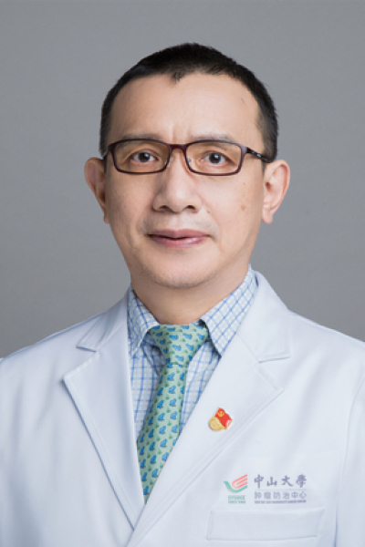

<!-- AUTO-GENERATED-BY: work/generate_obsidian_profiles.py -->

# 韩辉

## 基础信息

| 字段 | 内容 |
|---|---|
| 医院 | 中山大学肿瘤防治中心 |
| 姓名 | 韩辉 |
| 科室 | 泌尿外科 |
| 职称/身份 | 泌尿外科副主任 职称：主任医师、博士生导师、肾癌及阴茎癌单病种首席专家 |
| 重点优先级 | 高 |
| 来源类型 | 医院官网 |
| 来源链接 | [官网原文](https://www.sysucc.org.cn/node/3722) |
| 采集日期 | 2026-08-10 |
| 复核状态 | 待人工复核 |
| 异常提示 |  |

## 简介/擅长

擅长肾癌、肾上腺肿瘤、腹膜后肿瘤及阴茎癌等泌尿系肿瘤的外科治疗及多学科综合治疗。 教育经历： 1990年毕业于武汉大学医学院，2000年华中科技大学同济医学院泌尿外科硕博连读，博士毕业。 专业学会兼职： 广东省抗癌协会泌尿生殖系肿瘤专业委员会副主任委员 中华医学会广东省泌尿外科分会肿瘤学组委员 广东医师协会泌尿微创专业委员会副主任委员 中国中西医结合泌尿外科专业委员会肿瘤专业组学术委员 广东省抗癌协会肿瘤麻醉与镇痛专业委员 欧洲泌尿外科协会会员 专业杂志编委（审稿人）： 《cancer comunication》，Journal of Nephrology Research和Minerva Urologica e Nefrologica杂志特约审稿人 海外留学经历： 2012年至2013年美国MD.Anderson Cancer Center（安德鲁森癌症中心，全美排名第一）高级临床访问学者，主要研修腹腔镜、机器人手术及泌尿系肿瘤综合治疗。 临床医疗经验 ： 专注于腹腔镜技术在泌尿肿瘤领域治疗技术，擅长“腹腔镜下肾部分切除术”、“腹腔镜下全膀胱切除”、“腹腔镜下前列腺癌根治术”、 “腹腔镜下腹膜后肿瘤切除术”、“腹腔镜...

## 详情正文摘录

职务：泌尿外科副主任 职称：主任医师、博士生导师、肾癌及阴茎癌单病种首席专家 专长 擅长肾癌、肾上腺肿瘤、腹膜后肿瘤及阴茎癌等泌尿系肿瘤的外科治疗及多学科综合治疗 一、基本情况 职称：主诊教授、主任医师、博士生导师、肾癌及阴茎癌单病种首席专家 职务：泌尿外科副主任 专家门诊时间： 周二上午、周二下午 专业特长：擅长肾癌、肾上腺肿瘤、腹膜后肿瘤及阴茎癌等泌尿系肿瘤的外科治疗及多学科综合治疗 二、学习及工作经历： 1985年9月至1990年7月:湖北医科大学医疗系就读本科 1990年8月至1995年8月:武钢集团总医院外科工作 1995年9月至2000年7月:在武汉同济医院泌尿外科硕博连读 2000年8月至今:在中山大学肿瘤防治中心泌尿外科工作 2005年:中山大学肿瘤医院泌尿外科副主任医师 2012年11月至2013年1月： MD.Anderson Cancer Center.USA高级临床访问学者 2013年：中山大学肿瘤医院泌尿外科主任医师 2013年3月-2014年8月：新疆医科大附属肿瘤医院（援疆） 三、学术兼职： 广东省抗癌协会泌尿生殖系肿瘤专业委员会副主任委员 中华医学会广东省泌尿外科分会肿瘤学组委员 广东医师协会泌尿微创专业委员会副主任委员 中国中西医结合泌尿外科专业委员会肿瘤专业组学术委员 广东省抗癌协会肿瘤麻醉与镇痛专业委员 欧洲泌尿外科协会会员 《cancer comunication》，Journal of Nephrology Research和Minerva Urologica e Nefrologica杂志特约审稿人 加载更多 专长： 擅长肾癌、肾上腺肿瘤、腹膜后肿瘤及阴茎癌等泌尿系肿瘤的外科治疗及多学科综合治疗。 教育经历： 1990年毕业于武汉大学医学院，2000年华中科技大学同济医学院泌尿外科硕博连读，博士毕业。 专业学会兼职： 广东省抗癌协会泌尿生殖系肿瘤专业委员会副主任委员 中华医学会广东省泌尿外科分会肿瘤学组委员 广东医师协会泌尿微创专业委员会副…

## 重点关注范围

- 肿瘤
- 生殖疾病
- 免疫/风湿/感染
- 术后恢复/康复
- 疑难重症

## 重点疾病标签

- 肿瘤
- 癌
- 瘤
- 靶向
- 生殖
- 免疫
- 术后
- 多学科

## 亮眼经历线索

- 泌尿外科副主任 职称：主任医师、博士生导师、肾癌及阴茎癌单病种首席专家 擅长肾癌、肾上腺肿瘤、腹膜后肿瘤及阴茎癌等泌尿系肿瘤的外科治疗及多学科综合治疗。
- 专业学会兼职： 广东省抗癌协会泌尿生殖系肿瘤专业委员会副主任委员 中华医学会广东省泌尿外科分会肿瘤学组委员 广东医师协会泌尿微创专业委员会副主任委员 中国中西医结合泌尿外科专业委员会肿瘤专业组学术委员 广东省抗癌协会肿瘤麻醉与镇痛专业委员 欧洲泌尿外科协会会员 专业杂志编委（审稿人）： 《cancer comunication》，Journal of Ne…
- 对于阴茎癌的研...

## 异常提示

## 合规边界

- 本画像仅整理统一总底表中的医院官网公开字段。
- 不包含患者评价、排名、第三方来源内容或疗效承诺。
- 官网未展示的信息保持空白，后续如需补充须回到底表官方来源字段。
