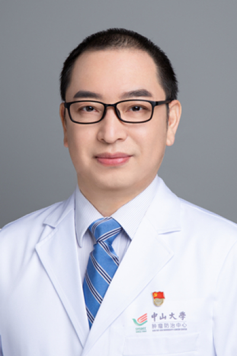

<!-- AUTO-GENERATED-BY: work/generate_obsidian_profiles.py -->

<!-- TEMPLATE: D:\workspace\信息收集整理\医生画像仓库\模板\医生画像模板.md -->

# 韩非

## 基础信息

| 字段 | 内容 |
|---|---|
| 姓名 | 韩非 |
| 医院 | 中山大学肿瘤防治中心 |
| 科室 | 放疗科 |
| 职称/身份 | 科副主任 职称：主任医师 |
| 来源链接 | [官网原文](https://www.sysucc.org.cn/node/1670) |
| 采集日期 | 2026-08-10 |

## 简介/擅长

头颈肿瘤的放射治疗，尤其是鼻咽癌精确放疗和复发转移鼻咽癌的综合治疗。

## 教育与进修经历

- 二、教育及工作经历 1994年毕业于江西医学院医疗系（本科）。
- 2000年中山医科大学放射肿瘤学硕士毕业，2010年中山大学肿瘤学博士毕业。

## 科研项目与成果

- 三、学术兼职 1. 广东省抗癌协会放疗专业委员会 前主任委员 2. 中华医学会放射肿瘤治疗学分会生物学组 副组长 3. 国家肿瘤质控中心喉癌质控专家委员会 副主任委员 4. CSCO头颈肿瘤专家委员会 常务委员 5. 中国抗癌协会放射防护专业委员会 常务委员 6. 泛珠江区域放疗协作组 秘书长 四、主持科研项目 1. 中大项目：共建平台(国科离子)子项目:离子射线治疗复发鼻咽癌的放射生物效应和免疫微环境影响的研究 2. 放疗联合同步化疗对比单纯放疗治疗 rT3/T4期局部复发鼻咽癌的多中心、前瞻性、III期随机对…

## 可包装亮点

- 科副主任 职称：主任医师 韩非 职务：科副主任 职称：主任医师 专长 头颈肿瘤的放射治疗，尤其是鼻咽癌精确放疗和复发转移鼻咽癌的综合治疗。
- 一、基本情况 现任中山大学附属肿瘤医院放疗科主任医师，放射肿瘤学科博士导师。
- 三、学术兼职 1. 广东省抗癌协会放疗专业委员会 前主任委员 2. 中华医学会放射肿瘤治疗学分会生物学组 副组长 3. 国家肿瘤质控中心喉癌质控专家委员会 副主任委员 4. CSCO头颈肿瘤专家委员会 常务委员 5. 中国抗癌协会放射防护专业委员会 常务委员 6. 泛珠江区域放疗协作组 秘书长 四、主持科研项目 1. 中大项目：共建平台(国科离子)子项目:…

## 重点疾病/人群标签

- 慢性病：
- 肿瘤：肿瘤、癌、瘤、放疗、化疗、鼻咽癌、免疫
- 生殖疾病：
- 免疫/风湿：肿瘤、癌、瘤、放疗、化疗、鼻咽癌、免疫
- 术后恢复/康复：
- 疑难重症：

## 证据摘录

> 只摘录官网公开信息中的短句或关键字段，不复制大段原文。

- 官网身份字段：科副主任 职称：主任医师
- 官网简介/擅长：头颈肿瘤的放射治疗，尤其是鼻咽癌精确放疗和复发转移鼻咽癌的综合治疗。
- 官网亮眼经历线索：科副主任 职称：主任医师 韩非 职务：科副主任 职称：主任医师 专长 头颈肿瘤的放射治疗，尤其是鼻咽癌精确放疗和复发转移鼻咽癌的综合治疗。 一、基本情况 现任中山大学附属肿瘤医院放疗科主任医师，放射肿瘤学科博士导师。 三、学术兼职 1. 广东省抗癌协会放疗专业委员会 前主任委员 2. 中华医学会放射肿瘤治疗学分会生物学组 副组长 3. 国家肿瘤质控中心喉癌质控专家委员会 副主任委员 4. CSCO头颈肿瘤专家委员会 常务委员 5. 中…
- 异常提示：亮眼经历含导航文本，已清洗
- 来源链接：https://www.sysucc.org.cn/node/1670

## BD 画像摘要

韩非医生可作为肿瘤、免疫/风湿/感染方向的基础画像候选。后续 BD 使用应继续以官网来源和人工复核为准，不添加疗效承诺或无来源包装。

## 合规边界

- 仅使用医院官网、官方公众号、官方小程序等公开渠道。
- 不采集私人电话、私人微信、家庭住址、患者隐私或非公开排班信息。
- 不写“保证治愈”“疗效第一”“包治疑难杂症”等无法由官网证明的表述。
