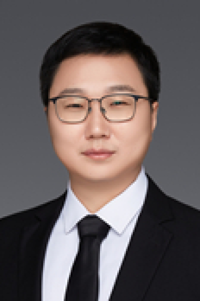

<!-- AUTO-GENERATED-BY: work/generate_obsidian_profiles.py -->

<!-- TEMPLATE: D:\workspace\信息收集整理\医生画像仓库\模板\医生画像模板.md -->

# 顾海风

## 基础信息

| 字段 | 内容 |
|---|---|
| 姓名 | 顾海风 |
| 医院 | 中山大学肿瘤防治中心 |
| 科室 | 妇科 |
| 职称/身份 | 医学博士、副主任医师、硕士研究生导师、住院医师规范化培训全程导师 |
| 来源链接 | [官网原文](https://www.sysucc.org.cn/node/3705) |
| 采集日期 | 2026-08-10 |

## 简介/擅长

宫颈癌、卵巢癌、子宫内膜癌等妇科恶性肿瘤的诊断、手术、化疗和综合治疗。

## 教育与进修经历

- 临床专家 面包屑 首页 / 临床科室 / 外科系列 / 妇科 / 临床专家 顾海风 职称：医学博士、副主任医师、硕士研究生导师、住院医师规范化培训全程导师 专长 宫颈癌、卵巢癌、子宫内膜癌等妇科恶性肿瘤的诊断、手术、化疗和综合治疗。
- 一、基本情况 毕业于中山大学和复旦大学医学院，师从我国著名妇科肿瘤学家刘继红教授。

## 科研项目与成果

- 在早期子宫内膜癌的精准化、微创化诊治方面有较为深入的研究，研究成果得到国际同行高度认可并被欧洲妇科肿瘤学会（ESGO）、巴西肿瘤外科学会等国际指南累计引用6次。
- 开展多项临床研究，具有较为丰富的项目管理经验，研究成果在国际妇科肿瘤协会全球年会（IGCS）、欧洲肿瘤内科学会年会（ESMO）等重要国际会议做展示。
- 主持国家自然科学基金1项、省部级基金2项。
- 持有国家实用新型专利2项，指导在读研究生2名。

## 论文与学术产出

- 近年来共发表SCI论文26篇，其中第一/通讯作者论文13篇。

## 可包装亮点

- 医学博士、副主任医师、硕士研究生导师、住院医师规范化培训全程导师 顾海风 职称：医学博士、副主任医师、硕士研究生导师、住院医师规范化培训全程导师 专长 宫颈癌、卵巢癌、子宫内膜癌等妇科恶性肿瘤的诊断、手术、化疗和综合治疗。
- 在早期子宫内膜癌的精准化、微创化诊治方面有较为深入的研究，研究成果得到国际同行高度认可并被欧洲妇科肿瘤学会（ESGO）、巴西肿瘤外科学会等国际指南累计引用6次。
- 开展多项临床研究，具有较为丰富的项目管理经验，研究成果在国际妇科肿瘤协会全球年会（IGCS）、欧洲肿瘤内科学会年会（ESMO）等重要国际会议做展示。

## 重点疾病/人群标签

- 慢性病：
- 肿瘤：肿瘤、癌、瘤、化疗、卵巢、难治、复杂
- 生殖疾病：肿瘤、癌、瘤、化疗、卵巢、难治、复杂
- 免疫/风湿：
- 术后恢复/康复：
- 疑难重症：肿瘤、癌、瘤、化疗、卵巢、难治、复杂

## 证据摘录

> 只摘录官网公开信息中的短句或关键字段，不复制大段原文。

- 官网身份字段：医学博士、副主任医师、硕士研究生导师、住院医师规范化培训全程导师
- 官网简介/擅长：宫颈癌、卵巢癌、子宫内膜癌等妇科恶性肿瘤的诊断、手术、化疗和综合治疗。
- 官网亮眼经历线索：医学博士、副主任医师、硕士研究生导师、住院医师规范化培训全程导师 顾海风 职称：医学博士、副主任医师、硕士研究生导师、住院医师规范化培训全程导师 专长 宫颈癌、卵巢癌、子宫内膜癌等妇科恶性肿瘤的诊断、手术、化疗和综合治疗。 在早期子宫内膜癌的精准化、微创化诊治方面有较为深入的研究，研究成果得到国际同行高度认可并被欧洲妇科肿瘤学会（ESGO）、巴西肿瘤外科学会等国际指南累计引用6次。 开展多项临床研究，具有较为丰富的项目管理经验，研究成…
- 异常提示：亮眼经历含导航文本，已清洗
- 来源链接：https://www.sysucc.org.cn/node/3705

## BD 画像摘要

顾海风医生可作为肿瘤、生殖疾病、疑难重症方向的基础画像候选。后续 BD 使用应继续以官网来源和人工复核为准，不添加疗效承诺或无来源包装。

## 合规边界

- 仅使用医院官网、官方公众号、官方小程序等公开渠道。
- 不采集私人电话、私人微信、家庭住址、患者隐私或非公开排班信息。
- 不写“保证治愈”“疗效第一”“包治疑难杂症”等无法由官网证明的表述。
