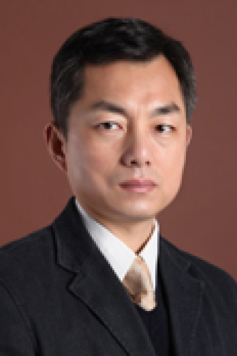

<!-- AUTO-GENERATED-BY: work/generate_obsidian_profiles.py -->

<!-- TEMPLATE: D:\workspace\信息收集整理\医生画像仓库\模板\医生画像模板.md -->

# 顾葆春

## 基础信息

| 字段 | 内容 |
|---|---|
| 姓名 | 顾葆春 |
| 医院 | 中山大学肿瘤防治中心 |
| 科室 | 重症医学科 |
| 职称/身份 | 科副主任 职称：副主任医师 |
| 来源链接 | [官网原文](https://www.sysucc.org.cn/node/3812) |
| 采集日期 | 2026-08-10 |

## 简介/擅长

危重病及肿瘤患者的器官支持治疗 1991年毕业于上海第二军医大学，1994年起从事重症医学，精于危重病及肿瘤重症患者的呼吸、循环、肝肾等器官的功能评估和支持，近年主要研究免疫缺陷患者的重症感染治疗、肿瘤重症患者在器官支持下实施重症化疗、肺食管手术后并发症的处理，擅长应用各种血流动力学监测、呼吸机、血液净化、重症超声、内镜、气管支架植入等重症医学技术解决患者多器官功能不全、脓毒症（SEPSIS）、急性呼吸窘迫综合征（ARDS）、心衰、休克、急性肾损伤、化疗药物过量、肿瘤溶解综合征、肝功能不全、严重肺部感染、重度营养不良、危重病人转运、恶性气管狭窄、腹腔高压综合征等临床问题。 发表论文二十余篇，曾获军队科技进步

## 教育与进修经历

- 职务：科副主任 职称：副主任医师 专长 危重病及肿瘤患者的器官支持治疗 1991年毕业于上海第二军医大学，1994年起从事重症医学，精于危重病及肿瘤重症患者的呼吸、循环、肝肾等器官的功能评估和支持，近年主要研究免疫缺陷患者的重症感染治疗、肿瘤重症患者在器官支持下实施重症化疗、肺食管手术后并发症的处理，擅长应用各种血流动力学监测、呼吸机、血液净化、重症超声、内镜、气管支架植入等重症医学技术解决患者多器官功能不全、脓毒症（SEP…
- 加载更多 1991年毕业于上海第二军医大学，1994年起从事重症医学，精于危重病及肿瘤重症患者的呼吸、循环、肝肾等器官的功能评估和支持，近年主要研究免疫缺陷患者的重症感染治疗、肿瘤重症患者在器官支持下实施重症化疗、肺食管手术后并发症的处理，擅长应用各种血流动力学监测、呼吸机、血液净化、重症超声、内镜、气管支架植入等重症医学技术解决患者多器官功能不全、脓毒症（SEPSIS）、急性呼吸窘迫综合征（ARDS）、心衰、休克、急性肾损伤、化疗药物过量、肿瘤溶解综合征、肝功能不全、严重肺部感染、重度营养不良、危重病人转运、恶…

## 论文与学术产出

- 发表论文二十余篇，曾获军队科技进步二、三等奖。

## 可包装亮点

- 科副主任 职称：副主任医师 危重病及肿瘤患者的器官支持治疗 1991年毕业于上海第二军医大学，1994年起从事重症医学，精于危重病及肿瘤重症患者的呼吸、循环、肝肾等器官的功能评估和支持，近年主要研究免疫缺陷患者的重症感染治疗、肿瘤重症患者在器官支持下实施重症化疗、肺食管手术后并发症的处理，擅长应用各种血流动力学监测、呼吸机、血液净化、重症超声、内镜、气管支…
- 发表论文二十余篇，曾获军队科技进步 顾葆春 职务：科副主任 职称：副主任医师 专长 危重病及肿瘤患者的器官支持治疗 1991年毕业于上海第二军医...

## 重点疾病/人群标签

- 慢性病：心衰、肿瘤、化疗、免疫、感染、术后、营养、危重、重症
- 肿瘤：心衰、肿瘤、化疗、免疫、感染、术后、营养、危重、重症
- 生殖疾病：
- 免疫/风湿：心衰、肿瘤、化疗、免疫、感染、术后、营养、危重、重症
- 术后恢复/康复：心衰、肿瘤、化疗、免疫、感染、术后、营养、危重、重症
- 疑难重症：心衰、肿瘤、化疗、免疫、感染、术后、营养、危重、重症

## 证据摘录

> 只摘录官网公开信息中的短句或关键字段，不复制大段原文。

- 官网身份字段：科副主任 职称：副主任医师
- 官网简介/擅长：危重病及肿瘤患者的器官支持治疗 1991年毕业于上海第二军医大学，1994年起从事重症医学，精于危重病及肿瘤重症患者的呼吸、循环、肝肾等器官的功能评估和支持，近年主要研究免疫缺陷患者的重症感染治疗、肿瘤重症患者在器官支持下实施重症化疗、肺食管手术后并发症的处理，擅长应用各种血流动力学监测、呼吸机、血液净化、重症超声、内镜、气管支架植入等重症医学技术解决患者多器官功能不全、脓毒症（SEPSIS）、急性呼吸窘迫综合征（ARDS）、心衰、休…
- 官网亮眼经历线索：科副主任 职称：副主任医师 危重病及肿瘤患者的器官支持治疗 1991年毕业于上海第二军医大学，1994年起从事重症医学，精于危重病及肿瘤重症患者的呼吸、循环、肝肾等器官的功能评估和支持，近年主要研究免疫缺陷患者的重症感染治疗、肿瘤重症患者在器官支持下实施重症化疗、肺食管手术后并发症的处理，擅长应用各种血流动力学监测、呼吸机、血液净化、重症超声、内镜、气管支架植入等重症医学技术解决患者多器官功能不全、脓毒症（SEPSIS）、急性呼吸窘迫…
- 异常提示：亮眼经历含导航文本，已清洗
- 来源链接：https://www.sysucc.org.cn/node/3812

## BD 画像摘要

顾葆春医生可作为慢性病、肿瘤、免疫/风湿/感染、术后恢复/康复、疑难重症方向的基础画像候选。后续 BD 使用应继续以官网来源和人工复核为准，不添加疗效承诺或无来源包装。

## 合规边界

- 仅使用医院官网、官方公众号、官方小程序等公开渠道。
- 不采集私人电话、私人微信、家庭住址、患者隐私或非公开排班信息。
- 不写“保证治愈”“疗效第一”“包治疑难杂症”等无法由官网证明的表述。
