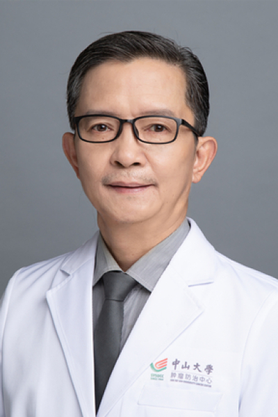

<!-- AUTO-GENERATED-BY: work/generate_obsidian_profiles.py -->

<!-- TEMPLATE: D:\workspace\信息收集整理\医生画像仓库\模板\医生画像模板.md -->

# 马刚

## 基础信息

| 字段 | 内容 |
|---|---|
| 姓名 | 马刚 |
| 医院 | 中山大学肿瘤防治中心 |
| 科室 | 重症医学科 |
| 职称/身份 | 主任医师，硕士导师 |
| 来源链接 | [官网原文](https://www.sysucc.org.cn/node/3807) |
| 采集日期 | 2026-08-10 |

## 简介/擅长

肿瘤合并重症的诊断治疗，目前在研项目4项，核心期刊发表学术论著20余篇，参与编写学术专著2部。

## 教育与进修经历

- 1985年毕业于重庆医科大学临床医疗系，1992年毕业于广州呼吸疾病研究所获医学硕士学位。

## 科研项目与成果

- 主要研究方向 ：肿瘤合并重症的诊断治疗，目前在研项目4项，核心期刊发表学术论著20余篇，参与编写学术专著2部。

## 论文与学术产出

- 主要研究方向 ：肿瘤合并重症的诊断治疗，目前在研项目4项，核心期刊发表学术论著20余篇，参与编写学术专著2部。

## 可包装亮点

- 主任医师，硕士导师 肿瘤合并重症的诊断治疗，目前在研项目4项，核心期刊发表学术论著20余篇，参与编写学术专著2部。
- 马刚 职称：主任医师，硕士导师 专长 肿瘤合并重症的临床及教研工作 从事重症医学专业。
- 学术任职 ：广东省重症医学会 常务委员、广东省医师协会重症医师委员会 常务委员、广东省生物医学工程学会生命信息监测与传输专业委员会 常务委员、广东省胸心外科学会复苏组 常务委员、广东省药学会合理用药专业委员会 常务委员、中国医药信息专业委员会 常务理事、医院管理学会重症医学委员会 委员。

## 重点疾病/人群标签

- 慢性病：
- 肿瘤：肿瘤、癌、化疗、感染、术后、重症
- 生殖疾病：
- 免疫/风湿：肿瘤、癌、化疗、感染、术后、重症
- 术后恢复/康复：肿瘤、癌、化疗、感染、术后、重症
- 疑难重症：肿瘤、癌、化疗、感染、术后、重症

## 证据摘录

> 只摘录官网公开信息中的短句或关键字段，不复制大段原文。

- 官网身份字段：主任医师，硕士导师
- 官网简介/擅长：肿瘤合并重症的诊断治疗，目前在研项目4项，核心期刊发表学术论著20余篇，参与编写学术专著2部。
- 官网亮眼经历线索：主任医师，硕士导师 肿瘤合并重症的诊断治疗，目前在研项目4项，核心期刊发表学术论著20余篇，参与编写学术专著2部。 马刚 职称：主任医师，硕士导师 专长 肿瘤合并重症的临床及教研工作 从事重症医学专业。 学术任职 ：广东省重症医学会 常务委员、广东省医师协会重症医师委员会 常务委员、广东省生物医学工程学会生命信息监测与传输专业委员会 常务委员、广东省胸心外科学会复苏组 常务委员、广东省药学会合理用药专业委员会 常务委员、中国医药信息专…
- 异常提示：亮眼经历含导航文本，已清洗
- 来源链接：https://www.sysucc.org.cn/node/3807

## BD 画像摘要

马刚医生可作为肿瘤、免疫/风湿/感染、术后恢复/康复、疑难重症方向的基础画像候选。后续 BD 使用应继续以官网来源和人工复核为准，不添加疗效承诺或无来源包装。

## 合规边界

- 仅使用医院官网、官方公众号、官方小程序等公开渠道。
- 不采集私人电话、私人微信、家庭住址、患者隐私或非公开排班信息。
- 不写“保证治愈”“疗效第一”“包治疑难杂症”等无法由官网证明的表述。
