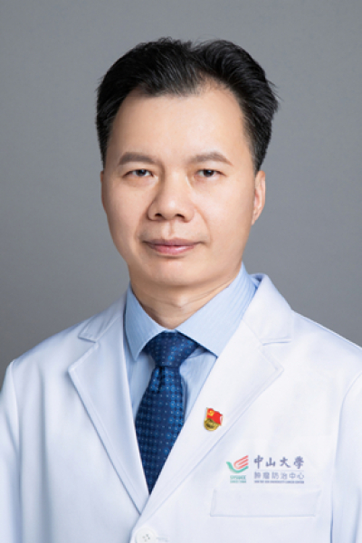

<!-- AUTO-GENERATED-BY: work/generate_obsidian_profiles.py -->

<!-- TEMPLATE: D:\workspace\信息收集整理\医生画像仓库\模板\医生画像模板.md -->

# 高远红

## 基础信息

| 字段 | 内容 |
|---|---|
| 姓名 | 高远红 |
| 医院 | 中山大学肿瘤防治中心 |
| 科室 | 放疗科 |
| 职称/身份 | 总支书记，科副主任 职称：主任医师、教授、博士生导师、博士后合作导师 |
| 来源链接 | [官网原文](https://www.sysucc.org.cn/node/1659) |
| 采集日期 | 2026-08-10 |

## 简介/擅长

结直肠癌、肝癌、泌尿系肿瘤、儿童肿瘤、鼻咽癌等放射治疗、综合治疗与转化研究。

## 教育与进修经历

- 临床专家 面包屑 首页 / 临床科室 / 放疗系列 / 放疗科 / 临床专家 高远红 职务：总支书记，科副主任 职称：主任医师、教授、博士生导师、博士后合作导师 专长 结直肠癌、肝癌、泌尿系肿瘤、儿童肿瘤、鼻咽癌等放射治疗、综合治疗与转化研究。
- 二、教育及工作经历 1986.09-1991.07 南昌大学医学院，临床医学系，本科，获学士学位 1991.08-1997.08 南昌大学医学院一附院，住院医师、主治医师、讲师 1997.09-2002.07 中国协和医科大学/中国医学科学院，肿瘤学，获博士学位 2006.09-2008.05 Baylor College of Medicine，分子放射肿瘤学，博士后 2002.07- 中山大学肿瘤防治中心，主治、副主任、主任医师，教授 2006.06- 中山大学肿瘤防治中心，放疗科，硕士生导师 2015.02…

## 科研项目与成果

- 主持国家自然科学基金面上项目4项。
- 五项研究成果分别被NCCN《结直肠癌诊疗指南》、CSCO《结直肠癌诊疗指南》和《中国直肠癌放射治疗指南》等引用。
- 发明专利：检测直肠癌放化疗敏感性相关15基因突变位点的试剂盒及其应用，专利授权，202110012311.X，国家知识产权局，2022年6月21日，ZL 2021 1 0012311.X。

## 论文与学术产出

- 以第一和通讯作者在国内外专业学术期刊如BMJ、Cancer Cell、J Clin Oncol、Cancer Commun、Cancer Immunol Res、Front Immunol、Int J Radiat Oncol Biol Phys等发表研究论文130余篇。
- 参编学术专著6部，以及参与撰写CSCO《结直肠癌诊疗指南》、国家卫健委《中国结直肠癌诊疗规范》、中国医师协会《直肠癌放射治疗指南》和中国抗癌协会《肠癌肝转移治疗共识》和《中国结直肠癌肝转移MDT临床实践共识》等。

## 可包装亮点

- 总支书记，科副主任 职称：主任医师、教授、博士生导师、博士后合作导师 高远红 职务：总支书记，科副主任 职称：主任医师、教授、博士生导师、博士后合作导师 专长 结直肠癌、肝癌、泌尿系肿瘤、儿童肿瘤、鼻咽癌等放射治疗、综合治疗与转化研究。
- 以第一和通讯作者在国内外专业学术期刊如BMJ、Cancer Cell、J Clin Oncol、Cancer Commun、Cancer Immunol Res、Front Immunol、Int J Radiat Oncol Biol Phys等发表研究论文130余篇。
- 主持国家自然科学基金面上项目4项。

## 重点疾病/人群标签

- 慢性病：
- 肿瘤：肿瘤、癌、瘤、放疗、化疗、鼻咽癌、肝癌、肠癌、生殖、免疫、多学科、MDT、高危
- 生殖疾病：肿瘤、癌、瘤、放疗、化疗、鼻咽癌、肝癌、肠癌、生殖、免疫、多学科、MDT、高危
- 免疫/风湿：肿瘤、癌、瘤、放疗、化疗、鼻咽癌、肝癌、肠癌、生殖、免疫、多学科、MDT、高危
- 术后恢复/康复：
- 疑难重症：肿瘤、癌、瘤、放疗、化疗、鼻咽癌、肝癌、肠癌、生殖、免疫、多学科、MDT、高危

## 证据摘录

> 只摘录官网公开信息中的短句或关键字段，不复制大段原文。

- 官网身份字段：总支书记，科副主任 职称：主任医师、教授、博士生导师、博士后合作导师
- 官网简介/擅长：结直肠癌、肝癌、泌尿系肿瘤、儿童肿瘤、鼻咽癌等放射治疗、综合治疗与转化研究。
- 官网亮眼经历线索：总支书记，科副主任 职称：主任医师、教授、博士生导师、博士后合作导师 高远红 职务：总支书记，科副主任 职称：主任医师、教授、博士生导师、博士后合作导师 专长 结直肠癌、肝癌、泌尿系肿瘤、儿童肿瘤、鼻咽癌等放射治疗、综合治疗与转化研究。 以第一和通讯作者在国内外专业学术期刊如BMJ、Cancer Cell、J Clin Oncol、Cancer Commun、Cancer Immunol Res、Front Immunol、Int J…
- 异常提示：亮眼经历含导航文本，已清洗
- 来源链接：https://www.sysucc.org.cn/node/1659

## BD 画像摘要

高远红医生可作为肿瘤、生殖疾病、免疫/风湿/感染、疑难重症方向的基础画像候选。后续 BD 使用应继续以官网来源和人工复核为准，不添加疗效承诺或无来源包装。

## 合规边界

- 仅使用医院官网、官方公众号、官方小程序等公开渠道。
- 不采集私人电话、私人微信、家庭住址、患者隐私或非公开排班信息。
- 不写“保证治愈”“疗效第一”“包治疑难杂症”等无法由官网证明的表述。
