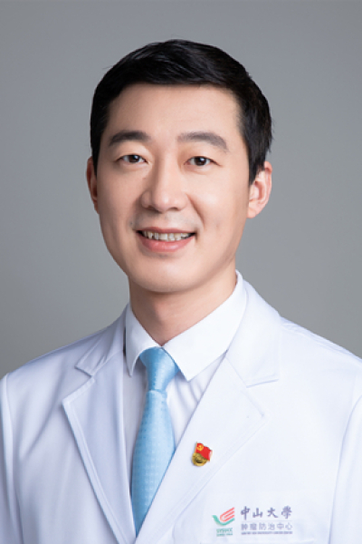

<!-- AUTO-GENERATED-BY: work/generate_obsidian_profiles.py -->

# 高飞

## 基础信息

| 字段 | 内容 |
|---|---|
| 医院 | 中山大学肿瘤防治中心 |
| 姓名 | 高飞 |
| 科室 | 微创介入治疗科 |
| 职称/身份 | 微创介入治疗科副主任 职称：科副主任、主任医师、博士生导师、首届国之名医•青年新锐、广东省杰出青年医学人才（首批） |
| 重点优先级 | 高 |
| 来源类型 | 医院官网 |
| 来源链接 | [官网原文](https://www.sysucc.org.cn/node/3756) |
| 采集日期 | 2026-08-10 |
| 复核状态 | 待人工复核 |
| 异常提示 |  |

## 简介/擅长

肝癌合并门静脉高压症微创介入治疗（尤其疑难门静脉高压症TIPS术、复杂门静脉闭塞性疾病介入开通）、实体肿瘤射频（微波）消融及粒子植入、复杂恶性梗阻性黄疸胆道支架植入及腔内近距离治疗 学习&教育： 中山大学肿瘤学博士、美国 Rochester 大学博士后 2003 年毕业于中山大学医学院留校在附属肿瘤医院工作至今。2014年5月至2015年8月美国Rochester大学医学中心访问学者，获Research Fellowship。从事肿瘤微创介入治疗20余年,在肝癌合并门静脉高压症微创介入治疗（尤其疑难门静脉高压症TIPS术、复杂门静脉闭塞性疾病介入开通）、实体肿瘤射频（微波）消融及粒子植入、复杂恶性梗阻性黄疸胆道支架植入及腔内近距离治疗等方面具有丰富的临床经验。作为发起人与执行主席连续主办八届“南方TIPS论坛”。主张肝癌合并门静脉高压症的积极干预，以期改善患者生活质量与预后、提高生存。以通讯或第一作者在《Radiology》、《Eur Radiol》等国际知名杂志发表论文60余篇。主持国家自然科学基金面上项目、广东省自然科学基金等十余项课题研究，发明专利3项。国际交流：APSCVIR 2018、APSCVIR 2019...

## 详情正文摘录

临床专家 面包屑 首页 / 临床科室 / 外科系列 / 微创介入治疗科 / 临床专家 高飞 职务：微创介入治疗科副主任 职称：科副主任、主任医师、博士生导师、首届国之名医•青年新锐、广东省杰出青年医学人才（首批） 专长 肝癌合并门静脉高压症微创介入治疗（尤其疑难门静脉高压症TIPS术、复杂门静脉闭塞性疾病介入开通）、实体肿瘤射频（微波）消融及粒子植入、复杂恶性梗阻性黄疸胆道支架植入及腔内近距离治疗 学习&教育： 中山大学肿瘤学博士、美国 Rochester 大学博士后 2003 年毕业于中山大学医学院留校在附属肿瘤医院工作至今。2014年5月至2015年8月美国Rochester大学医学中心访问学者，获Research Fellowship。从事肿瘤微创介入治疗20余年,在肝癌合并门静脉高压症微创介入治疗（尤其疑难门静脉高压症TIPS术、复杂门静脉闭塞性疾病介入开通）、实体肿瘤射频（微波）消融及粒子植入、复杂恶性梗阻性黄疸胆道支架植入及腔内近距离治疗等方面具有丰富的临床经验。作为发起人与执行主席连续主办八届“南方TIPS论坛”。主张肝癌合并门静脉高压症的积极干预，以期改善患者生活质量与预后、提高生存。以通讯或第一作者在《Radiology》、《Eur Radiol》等国际知名杂志发表论文60余篇。主持国家自然科学基金面上项目、广东省自然科学基金等十余项课题研究，发明专利3项。国际交流：APSCVIR 2018、APSCVIR 2019 APSCVIR 2021、APSCVIR 2022（第13、14、15、16届亚太介入年会口头报告、第51届日本介入年会口头报告）、 CIRSE 2019、CIRSE 2022 （2019、2022年欧洲介入年会口头报告）、SIR 2019 （2019年美国介入年会口头报告）。参编“中国经颈静脉肝内门体分流术（TIPS）临床实践指南（2019年版）”及“经颈静脉肝内门体静脉分流术治疗门静脉高压专家共识（2022年版） ”。 获奖： 中国抗癌协会科技进步二等奖（第三） 广东省科技进步一等奖（第七） 首届国之名医•青年新锐 2019 年中国…

## 重点关注范围

- 肿瘤
- 疑难重症

## 重点疾病标签

- 肿瘤
- 癌
- 肝癌
- 疑难
- 复杂

## 亮眼经历线索

- 微创介入治疗科副主任 职称：科副主任、主任医师、博士生导师、首届国之名医•青年新锐、广东省杰出青年医学人才（首批） 肝癌合并门静脉高压症微创介入治疗（尤其疑难门静脉高压症TIPS术、复杂门静脉闭塞性疾病介入开通）、实体肿瘤射频（微波）消融及粒子植入、复杂恶性梗阻性黄疸胆道支架植入及腔内近距离治疗 学习&教育： 中山大学肿瘤学博士、美国 Rochester…
- 2014年5月至2015年8月美国Rochester大学医学中心访问学者，获Research Fellowship。
- 从事肿瘤微创介入治疗20余年,在肝癌合并门静脉高压症微创介入治疗（尤其疑难门静脉高压症TIPS术、复杂门静脉闭塞性疾病介入开通）、实体肿瘤射频（微波）消融及粒子植入、复杂恶性梗阻性黄疸胆道支架植入及腔内近距离治疗等方面具有丰富的临床经验。

## 异常提示

## 合规边界

- 本画像仅整理统一总底表中的医院官网公开字段。
- 不包含患者评价、排名、第三方来源内容或疗效承诺。
- 官网未展示的信息保持空白，后续如需补充须回到底表官方来源字段。
