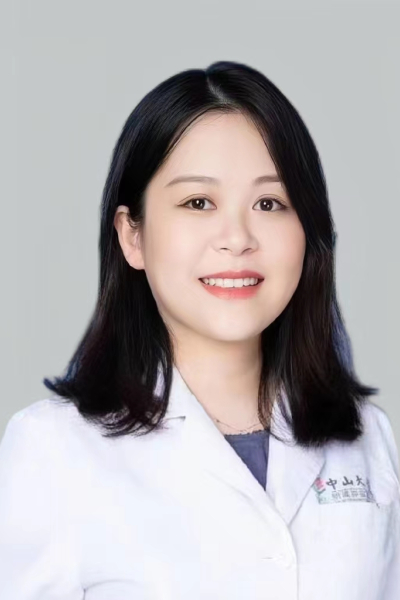

<!-- AUTO-GENERATED-BY: work/generate_obsidian_profiles.py -->

<!-- TEMPLATE: D:\workspace\信息收集整理\医生画像仓库\模板\医生画像模板.md -->

# 魏薇

## 基础信息

| 字段 | 内容 |
|---|---|
| 姓名 | 魏薇 |
| 医院 | 中山大学肿瘤防治中心 |
| 科室 | 妇科 |
| 职称/身份 | 副主任医师 |
| 来源链接 | [官网原文](https://www.sysucc.org.cn/node/8001) |
| 采集日期 | 2026-08-10 |

## 简介/擅长

妇科肿瘤的外科治疗，复发性妇科恶性肿瘤综合治疗。

## 教育与进修经历

- 一、基本情况 妇科副主任医师，出诊时间：周二下午 二、教育及工作经历 本科就读于四川大学华西临床医学院，博士毕业于北京协和医学院及UCLA联合培养博士。

## 科研项目与成果

- 三、学术兼职 ESMO泛亚洲区子宫内膜癌指南委员会成员 中国抗癌协会宫颈癌整合防筛专委会委员 广东省药学会妇科肿瘤专委会委员 广东省健康管理委员会妇科肿瘤MDT专委会委员 四、主持科研项目 参与国家自然科学基金2项，负责省自然科学基金1项 五、代表性论著 第一作者/共同第一作者在Journal for ImmunoTherapy of Cancer，Analytical Chemistry等1区期刊发表SCI论文多篇。

## 论文与学术产出

- 三、学术兼职 ESMO泛亚洲区子宫内膜癌指南委员会成员 中国抗癌协会宫颈癌整合防筛专委会委员 广东省药学会妇科肿瘤专委会委员 广东省健康管理委员会妇科肿瘤MDT专委会委员 四、主持科研项目 参与国家自然科学基金2项，负责省自然科学基金1项 五、代表性论著 第一作者/共同第一作者在Journal for ImmunoTherapy of Cancer，Analytical Chemistry等1区期刊发表SCI论文多篇。

## 可包装亮点

- 副主任医师 魏薇 职称：副主任医师 专长 妇科肿瘤的外科治疗，复发性妇科恶性肿瘤综合治疗。
- 一、基本情况 妇科副主任医师，出诊时间：周二下午 二、教育及工作经历 本科就读于四川大学华西临床医学院，博士毕业于北京协和医学院及UCLA联合培养博士。
- 妇产科及妇科肿瘤十余年临床工作经验，擅长妇科肿瘤外科治疗，对复发性妇科恶性肿瘤的综合治疗及根据分子检测进行精准治疗具有丰富经验。

## 重点疾病/人群标签

- 慢性病：
- 肿瘤：肿瘤、癌、MDT
- 生殖疾病：
- 免疫/风湿：
- 术后恢复/康复：
- 疑难重症：肿瘤、癌、MDT

## 证据摘录

> 只摘录官网公开信息中的短句或关键字段，不复制大段原文。

- 官网身份字段：副主任医师
- 官网简介/擅长：妇科肿瘤的外科治疗，复发性妇科恶性肿瘤综合治疗。
- 官网亮眼经历线索：副主任医师 魏薇 职称：副主任医师 专长 妇科肿瘤的外科治疗，复发性妇科恶性肿瘤综合治疗。 一、基本情况 妇科副主任医师，出诊时间：周二下午 二、教育及工作经历 本科就读于四川大学华西临床医学院，博士毕业于北京协和医学院及UCLA联合培养博士。 妇产科及妇科肿瘤十余年临床工作经验，擅长妇科肿瘤外科治疗，对复发性妇科恶性肿瘤的综合治疗及根据分子检测进行精准治疗具有丰富经验。
- 异常提示：亮眼经历含导航文本，已清洗
- 来源链接：https://www.sysucc.org.cn/node/8001

## BD 画像摘要

魏薇医生可作为肿瘤、疑难重症方向的基础画像候选。后续 BD 使用应继续以官网来源和人工复核为准，不添加疗效承诺或无来源包装。

## 合规边界

- 仅使用医院官网、官方公众号、官方小程序等公开渠道。
- 不采集私人电话、私人微信、家庭住址、患者隐私或非公开排班信息。
- 不写“保证治愈”“疗效第一”“包治疑难杂症”等无法由官网证明的表述。
