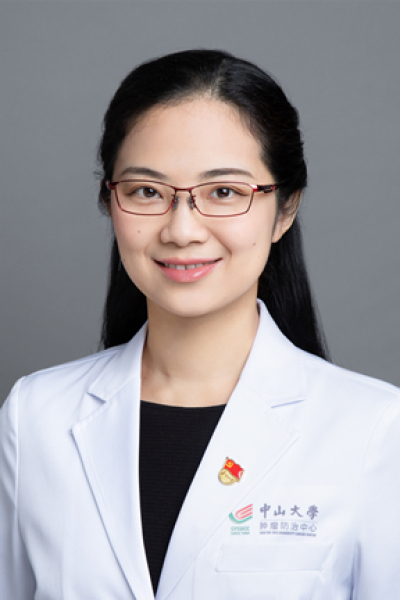

<!-- AUTO-GENERATED-BY: work/generate_obsidian_profiles.py -->

<!-- TEMPLATE: D:\workspace\信息收集整理\医生画像仓库\模板\医生画像模板.md -->

# 黄嘉佳

## 基础信息

| 字段 | 内容 |
|---|---|
| 姓名 | 黄嘉佳 |
| 医院 | 中山大学肿瘤防治中心 |
| 科室 | 内科 |
| 职称/身份 | 主诊教授、主任医师、硕士导师、医学博士 |
| 来源链接 | [官网原文](https://www.sysucc.org.cn/node/1497) |
| 采集日期 | 2026-08-10 |

## 简介/擅长

乳腺癌的个体化治疗及全程管理（化疗、内分泌治疗、免疫治疗、靶向治疗等），乳腺肿瘤遗传咨询，乳腺疾病筛查

## 教育与进修经历

- 曾先后在南瑞士肿瘤研究所、美国加州大学圣地亚哥分校Moores Cancer Center从事访问学者进修。

## 科研项目与成果

- 一、基本情况 职称：主诊教授、主任医师 硕士导师 医学博士 专长：乳腺癌的个体化治疗及全程管理（化疗、内分泌治疗、免疫治疗、靶向治疗等），乳腺肿瘤遗传咨询，乳腺疾病筛查 门诊时间：周二下午、周四上午 从事乳腺癌临床工作，作为项目负责人承担国家自然、广东省自然科学项目、中山大学肿瘤防治中心优秀人才计划项目等课题多项，参加多项国际多中心新药注册临床试验。

## 论文与学术产出

- 以第一作者或共同第一作者发表SCI论文多篇，其中包括《Annals of Oncology》、《Journal of the National Cancer Institute》、《Clinical Cancer Research》、《Autophagy》等。

## 可包装亮点

- 主诊教授、主任医师、硕士导师、医学博士 黄嘉佳 职称：主诊教授、主任医师、硕士导师、医学博士 专长 乳腺癌个体化治疗及全程管理（化疗、内分泌、靶向治疗），乳腺肿瘤遗传咨询，乳腺疾病筛查。
- 一、基本情况 职称：主诊教授、主任医师 硕士导师 医学博士 专长：乳腺癌的个体化治疗及全程管理（化疗、内分泌治疗、免疫治疗、靶向治疗等），乳腺肿瘤遗传咨询，乳腺疾病筛查 门诊时间：周二下午、周四上午 从事乳腺癌临床工作，作为项目负责人承担国家自然、广东省自然科学项目、中山大学肿瘤防治中心优秀人才计划项目等课题多项，参加多项国际多中心新药注册临床试验。
- 曾先后在南瑞士肿瘤研究所、美国加州大学圣地亚哥分校Moores Cancer Center从事访问学者进修。

## 重点疾病/人群标签

- 慢性病：
- 肿瘤：肿瘤、癌、化疗、靶向、乳腺癌、免疫
- 生殖疾病：
- 免疫/风湿：肿瘤、癌、化疗、靶向、乳腺癌、免疫
- 术后恢复/康复：
- 疑难重症：

## 证据摘录

> 只摘录官网公开信息中的短句或关键字段，不复制大段原文。

- 官网身份字段：主诊教授、主任医师、硕士导师、医学博士
- 官网简介/擅长：乳腺癌的个体化治疗及全程管理（化疗、内分泌治疗、免疫治疗、靶向治疗等），乳腺肿瘤遗传咨询，乳腺疾病筛查
- 官网亮眼经历线索：主诊教授、主任医师、硕士导师、医学博士 黄嘉佳 职称：主诊教授、主任医师、硕士导师、医学博士 专长 乳腺癌个体化治疗及全程管理（化疗、内分泌、靶向治疗），乳腺肿瘤遗传咨询，乳腺疾病筛查。 一、基本情况 职称：主诊教授、主任医师 硕士导师 医学博士 专长：乳腺癌的个体化治疗及全程管理（化疗、内分泌治疗、免疫治疗、靶向治疗等），乳腺肿瘤遗传咨询，乳腺疾病筛查 门诊时间：周二下午、周四上午 从事乳腺癌临床工作，作为项目负责人承担国家自然、广…
- 异常提示：亮眼经历含导航文本，已清洗
- 来源链接：https://www.sysucc.org.cn/node/1497

## BD 画像摘要

黄嘉佳医生可作为肿瘤、免疫/风湿/感染方向的基础画像候选。后续 BD 使用应继续以官网来源和人工复核为准，不添加疗效承诺或无来源包装。

## 合规边界

- 仅使用医院官网、官方公众号、官方小程序等公开渠道。
- 不采集私人电话、私人微信、家庭住址、患者隐私或非公开排班信息。
- 不写“保证治愈”“疗效第一”“包治疑难杂症”等无法由官网证明的表述。
