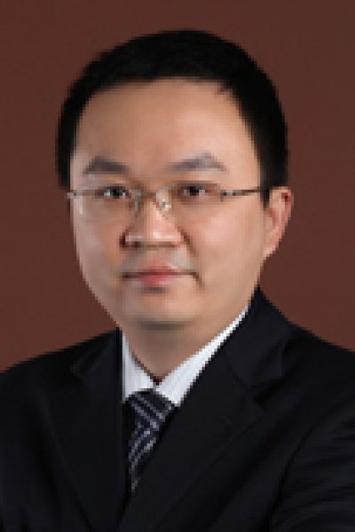

<!-- AUTO-GENERATED-BY: work/generate_obsidian_profiles.py -->

# 黄培钰

## 基础信息

| 字段 | 内容 |
|---|---|
| 医院 | 中山大学肿瘤防治中心 |
| 姓名 | 黄培钰 |
| 科室 | 鼻咽科 |
| 职称/身份 | 主任医师、博士生导师 |
| 重点优先级 | 高 |
| 来源类型 | 医院官网 |
| 来源链接 | [官网原文](https://www.sysucc.org.cn/node/1532) |
| 采集日期 | 2026-08-10 |
| 复核状态 | 待人工复核 |
| 异常提示 |  |

## 简介/擅长

鼻咽癌的放疗、化疗以及免疫、分子靶向的综合治疗。 二、主要学历： 1995.9 -2002.7 中山医科大学临床医学七年制本硕连读。 2005.9 -2009.7 中山大学肿瘤防治中心博士研究生。 三、工作经历： 从事鼻咽癌的临床诊治工作20余年。诊治鼻咽癌患者近万例。对鼻咽癌综合治疗，特别是放疗、化疗及免疫、分子靶向治疗有丰富的临床经验。2016年于美国排名第一的MD Anderson 癌症中心作为访问副教授学习一年。2018年底起任中山大学肿瘤防治中心鼻咽癌科主任医师。 具有丰富的临床教学经验，被评为2013年中山大学优秀临床带教老师。 开展多项鼻咽癌治疗的临床研究，发表在《柳叶刀》、《美国医学会杂志·肿瘤学》等国际权威期刊，成果被美国NCCN指南、中国CSCO指南等国内外权威指南采纳。荣获2019年、2023年中国抗癌协会科技奖一等奖；2019年广东医学科技奖一等奖。 四、

## 详情正文摘录

职称：主任医师、博士生导师 专长 鼻咽癌的放疗、化疗以及免疫、分子靶向的综合治疗。 一、基本情况： 职称：主任医师、博士生导师 专长：鼻咽癌的放疗、化疗以及免疫、分子靶向的综合治疗。 二、主要学历： 1995.9 -2002.7 中山医科大学临床医学七年制本硕连读。 2005.9 -2009.7 中山大学肿瘤防治中心博士研究生。 三、工作经历： 从事鼻咽癌的临床诊治工作20余年。诊治鼻咽癌患者近万例。对鼻咽癌综合治疗，特别是放疗、化疗及免疫、分子靶向治疗有丰富的临床经验。2016年于美国排名第一的MD Anderson 癌症中心作为访问副教授学习一年。2018年底起任中山大学肿瘤防治中心鼻咽癌科主任医师。 具有丰富的临床教学经验，被评为2013年中山大学优秀临床带教老师。 开展多项鼻咽癌治疗的临床研究，发表在《柳叶刀》、《美国医学会杂志·肿瘤学》等国际权威期刊，成果被美国NCCN指南、中国CSCO指南等国内外权威指南采纳。荣获2019年、2023年中国抗癌协会科技奖一等奖；2019年广东医学科技奖一等奖。 四、学术任职： 中国医促会鼻咽癌防治分会委员 广东省抗癌协会鼻咽癌专业委员会委员 广东省临床医学精准医疗专业委员会委员 广东省医院协会肿瘤防治管理分会委员 五、主要研究方向： 鼻咽癌的放疗、化疗以及免疫、分子靶向的综合治疗研究。 六、科研及基金： 1. 主持国家自然科学基金面上项目1项（项目编号，81874134，54万经费） 2. 主持中山大学临床5010常规项目1项（项目编号，2018015，160万经费） 3. 主持广东省医学科研基金2项 4. 主持中山大学青年教师培育项目1项 5. 主持中山大学临床5010培育项目1项 七、第一/通讯作者（含共同）文章节选： 1.You R, Liu YP, Xie YL,...,Huang PY*（共同通讯）, Chen MY*. Hyperfractionation compared with standard fractionatio…

## 重点关注范围

- 肿瘤
- 免疫/风湿/感染

## 重点疾病标签

- 肿瘤
- 癌
- 放疗
- 化疗
- 靶向
- 鼻咽癌
- 免疫

## 亮眼经历线索

- 主任医师、博士生导师 2016年于美国排名第一的MD Anderson 癌症中心作为访问副教授学习一年。
- 2018年底起任中山大学肿瘤防治中心鼻咽癌科主任医师。
- 开展多项鼻咽癌治疗的临床研究，发表在《柳叶刀》、《美国医学会杂志·肿瘤学》等国际权威期刊，成果被美国NCCN指南、中国CSCO指南等国内外权威指南采纳。

## 异常提示

## 合规边界

- 本画像仅整理统一总底表中的医院官网公开字段。
- 不包含患者评价、排名、第三方来源内容或疗效承诺。
- 官网未展示的信息保持空白，后续如需补充须回到底表官方来源字段。
