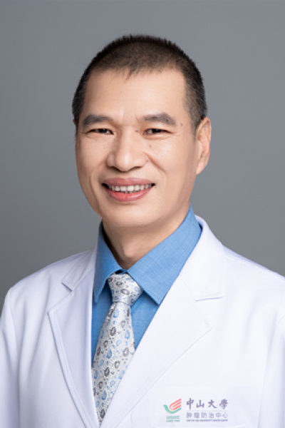

<!-- AUTO-GENERATED-BY: work/generate_obsidian_profiles.py -->

<!-- TEMPLATE: D:\workspace\信息收集整理\医生画像仓库\模板\医生画像模板.md -->

# 黄子林

## 基础信息

| 字段 | 内容 |
|---|---|
| 姓名 | 黄子林 |
| 医院 | 中山大学肿瘤防治中心 |
| 科室 | 微创介入治疗科 |
| 职称/身份 | 主任医师 |
| 来源链接 | [官网原文](https://www.sysucc.org.cn/node/3755) |
| 采集日期 | 2026-08-10 |

## 简介/擅长

影像引导下肿瘤微创介入治疗。擅长原发性肝癌和肝转移瘤、肺癌、肺转移瘤、骨与软组织肿瘤等实体肿瘤的射频、微波及氩氦冷冻治疗；晚期肝癌的血管介入联合靶向及免疫治疗。

## 论文与学术产出

- 二、学习及工作经历： 1985年—1991年：中山医科大学医学系就读 1991年至今：中山大学附属肿瘤医院工作 三、学术兼职： 1. 中国抗癌协会肿瘤微创治疗专业委员会委员 2. 广东省抗癌协会肝癌癌专业委员会委员 3. 广州抗癌协会肿瘤微创治疗专业委员会常委 4. 亚洲冷冻治疗学会委员 四、近期发表的主要论文： 1. Chen QF, Li W, Wu P, Shen L, Huang ZL. Alternative splicing events are prognostic in hepatocellula…

## 可包装亮点

- 主任医师 黄子林 职称：主任医师 专长 影像引导下肿瘤微创介入治疗。
- 一、基本情况 职称： 主任医师 专家门诊时间： 周三下午 专业特长： 影像引导下肿瘤微创介入治疗。
- 二、学习及工作经历： 1985年—1991年：中山医科大学医学系就读 1991年至今：中山大学附属肿瘤医院工作 三、学术兼职： 1. 中国抗癌协会肿瘤微创治疗专业委员会委员 2. 广东省抗癌协会肝癌癌专业委员会委员 3. 广州抗癌协会肿瘤微创治疗专业委员会常委 4. 亚洲冷冻治疗学会委员 一、基本情况 职称： 主任医师 专家门诊时间： 周三下午 专业特长：…

## 重点疾病/人群标签

- 慢性病：
- 肿瘤：肿瘤、癌、瘤、靶向、肺癌、肝癌、免疫
- 生殖疾病：
- 免疫/风湿：肿瘤、癌、瘤、靶向、肺癌、肝癌、免疫
- 术后恢复/康复：
- 疑难重症：

## 证据摘录

> 只摘录官网公开信息中的短句或关键字段，不复制大段原文。

- 官网身份字段：主任医师
- 官网简介/擅长：影像引导下肿瘤微创介入治疗。擅长原发性肝癌和肝转移瘤、肺癌、肺转移瘤、骨与软组织肿瘤等实体肿瘤的射频、微波及氩氦冷冻治疗；晚期肝癌的血管介入联合靶向及免疫治疗。
- 官网亮眼经历线索：主任医师 黄子林 职称：主任医师 专长 影像引导下肿瘤微创介入治疗。 一、基本情况 职称： 主任医师 专家门诊时间： 周三下午 专业特长： 影像引导下肿瘤微创介入治疗。 二、学习及工作经历： 1985年—1991年：中山医科大学医学系就读 1991年至今：中山大学附属肿瘤医院工作 三、学术兼职： 1. 中国抗癌协会肿瘤微创治疗专业委员会委员 2. 广东省抗癌协会肝癌癌专业委员会委员 3. 广州抗癌协会肿瘤微创治疗专业委员会常委 4.…
- 异常提示：亮眼经历含导航文本，已清洗
- 来源链接：https://www.sysucc.org.cn/node/3755

## BD 画像摘要

黄子林医生可作为肿瘤、免疫/风湿/感染方向的基础画像候选。后续 BD 使用应继续以官网来源和人工复核为准，不添加疗效承诺或无来源包装。

## 合规边界

- 仅使用医院官网、官方公众号、官方小程序等公开渠道。
- 不采集私人电话、私人微信、家庭住址、患者隐私或非公开排班信息。
- 不写“保证治愈”“疗效第一”“包治疑难杂症”等无法由官网证明的表述。
