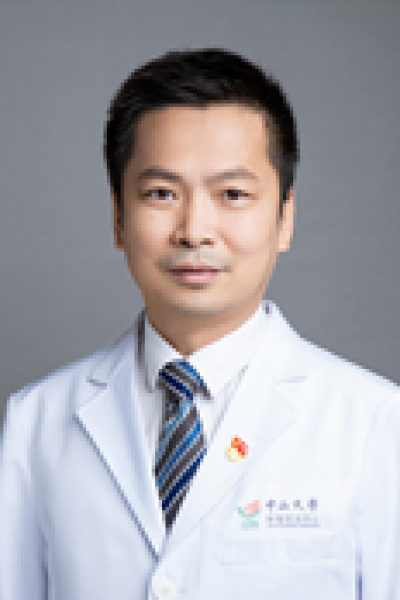

<!-- AUTO-GENERATED-BY: work/generate_obsidian_profiles.py -->

# 黄春雨

## 基础信息

| 字段 | 内容 |
|---|---|
| 医院 | 中山大学肿瘤防治中心 |
| 姓名 | 黄春雨 |
| 科室 | 内镜科 |
| 职称/身份 | 副主任医师、硕士生导师 |
| 重点优先级 | 高 |
| 来源类型 | 医院官网 |
| 来源链接 | [官网原文](https://www.sysucc.org.cn/node/3913) |
| 采集日期 | 2026-08-10 |
| 复核状态 | 待人工复核 |
| 异常提示 |  |

## 简介/擅长

消化道肿瘤的内镜诊疗，尤其是消化道早癌及粘膜下肿物的内镜切除，内镜腹腔镜联合手术亦有丰富经验。 广东阳春人，系中山大学临床医学学士（2003）、肿瘤学博士（2013）。主要从事肿瘤内镜诊断及治疗，擅长于消化道恶性肿瘤的早诊早治及消化道良性肿瘤的内镜诊疗，对消化系统恶性肿瘤的综合治疗亦有较丰富的经验。 二、临床技能 早期从事普通外科及消化道肿瘤外科工作，擅长急腹症/腹部外伤/胃肠道肿瘤的诊治，对胃肠道恶性肿瘤的综合治疗具有较丰富的经验，2013年开始从事肿瘤内镜工作，专注消化道恶性肿瘤的早诊早治及消化道良性肿瘤的内镜诊疗。 三、学术团体主要任职 广东省抗癌协会肿瘤内镜专业委员会青年委员； 广东省抗癌协会大肠癌专业委员会青年委员； 广东省抗癌协会黑色素瘤专业委员会委员； 广东省抗癌协会肿瘤微创介入专业委员会青年委员。 加载更多 一、基本情况 姓名：黄春雨 职称：副主任医师、硕士生导师 专家

## 详情正文摘录

职称：副主任医师、硕士生导师 专长 消化道肿瘤的内镜诊疗，尤其是消化道早癌及粘膜下肿物的内镜切除，内镜腹腔镜联合手术亦有丰富经验。 一、基本情况 姓名：黄春雨 职称：副主任医师、硕士生导师 专家门诊时间：周三下午；周五下午 专长：消化道肿瘤的内镜诊疗，尤其是消化道早癌及粘膜下肿物的内镜切除，内镜腹腔镜联合手术亦有丰富经验。 广东阳春人，系中山大学临床医学学士（2003）、肿瘤学博士（2013）。主要从事肿瘤内镜诊断及治疗，擅长于消化道恶性肿瘤的早诊早治及消化道良性肿瘤的内镜诊疗，对消化系统恶性肿瘤的综合治疗亦有较丰富的经验。 二、临床技能 早期从事普通外科及消化道肿瘤外科工作，擅长急腹症/腹部外伤/胃肠道肿瘤的诊治，对胃肠道恶性肿瘤的综合治疗具有较丰富的经验，2013年开始从事肿瘤内镜工作，专注消化道恶性肿瘤的早诊早治及消化道良性肿瘤的内镜诊疗。 三、学术团体主要任职 广东省抗癌协会肿瘤内镜专业委员会青年委员； 广东省抗癌协会大肠癌专业委员会青年委员； 广东省抗癌协会黑色素瘤专业委员会委员； 广东省抗癌协会肿瘤微创介入专业委员会青年委员。 加载更多 一、基本情况 姓名：黄春雨 职称：副主任医师、硕士生导师 专家门诊时间：周三下午；周五下午 专长：消化道肿瘤的内镜诊疗，尤其是消化道早癌及粘膜下肿物的内镜切除，内镜腹腔镜联合手术亦有丰富经验。 广东阳春人，系中山大学临床医学学士（2003）、肿瘤学博士（2013）。主要从事肿瘤内镜诊断及治疗，擅长于消化道恶性肿瘤的早诊早治及消化道良性肿瘤的内镜诊疗，对消化系统恶性肿瘤的综合治疗亦有较丰富的经验。 二、临床技能 早期从事普通外科及消化道肿瘤外科工作，擅长急腹症/腹部外伤/胃肠道肿瘤的诊治，对胃肠道恶性肿瘤的综合治疗具有较丰富的经验，2013年开始从事肿瘤内镜工作，专注消化道恶性肿瘤的早诊早治及消化道良性肿瘤的内镜诊疗。 三、学术团体主要任职 广东省抗癌协会肿瘤内镜专业委员会青年委员； 广东省抗癌协会大肠癌专业委员会青年委员； 广东省抗癌协会…

## 重点关注范围

- 肿瘤

## 重点疾病标签

- 肿瘤
- 癌
- 瘤
- 化疗
- 胃癌
- 肠癌

## 亮眼经历线索

- 副主任医师、硕士生导师 三、学术团体主要任职 广东省抗癌协会肿瘤内镜专业委员会青年委员；
- 广东省抗癌协会大肠癌专业委员会青年委员；
- 广东省抗癌协会黑色素瘤专业委员会委员；

## 异常提示

## 合规边界

- 本画像仅整理统一总底表中的医院官网公开字段。
- 不包含患者评价、排名、第三方来源内容或疗效承诺。
- 官网未展示的信息保持空白，后续如需补充须回到底表官方来源字段。
