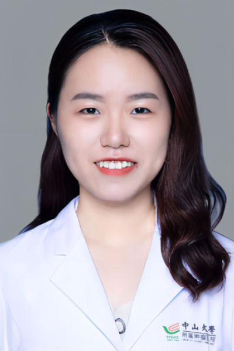

<!-- AUTO-GENERATED-BY: work/generate_obsidian_profiles.py -->

<!-- TEMPLATE: D:\workspace\信息收集整理\医生画像仓库\模板\医生画像模板.md -->

# 黄晓丹

## 基础信息

| 字段 | 内容 |
|---|---|
| 姓名 | 黄晓丹 |
| 医院 | 中山大学肿瘤防治中心 |
| 科室 | 放疗科 |
| 职称/身份 | 副主任医师 |
| 来源链接 | [官网原文](https://www.sysucc.org.cn/node/6666) |
| 采集日期 | 2026-08-10 |

## 简介/擅长

放射肿瘤的研究工作，近年主要关注妇科肿瘤的放射治疗和基础研究。 二、教育及工作经历 2023年12月至今 中山大学肿瘤防治中心放疗科 副主任医师 2021年12月至2023年12月 中山大学肿瘤防治中心放疗科 主治医师 2019年7月至2021年12月 中山大学肿瘤防治中心放疗科 住院医师 2019年7月至2021年8月 中山大学肿瘤防治中心 博士后/助理研究员 2011年9月至2019年6月 中山大学中山医学院 临床医学八年制博士 三、主持科研项目 国家自然科学基金青年项目、中国博士后科学基金面上项目 四、代表性论著 以第一/共一作者发表SCI论文10余篇，包括Cell Research, Cell Death and Differentiation, Int J Radiat Oncol Biol Phys, Radiotherapy and Oncology, Cancer等。 更新时间：2024.04.28

## 教育与进修经历

- 二、教育及工作经历 2023年12月至今 中山大学肿瘤防治中心放疗科 副主任医师 2021年12月至2023年12月 中山大学肿瘤防治中心放疗科 主治医师 2019年7月至2021年12月 中山大学肿瘤防治中心放疗科 住院医师 2019年7月至2021年8月 中山大学肿瘤防治中心 博士后/助理研究员 2011年9月至2019年6月 中山大学中山医学院 临床医学八年制博士 三、主持科研项目 国家自然科学基金青年项目、中国博士后科学基金面上项目 四、代表性论著 以第一/共一作者发表SCI论文10余篇，包括Cell R…

## 科研项目与成果

- 二、教育及工作经历 2023年12月至今 中山大学肿瘤防治中心放疗科 副主任医师 2021年12月至2023年12月 中山大学肿瘤防治中心放疗科 主治医师 2019年7月至2021年12月 中山大学肿瘤防治中心放疗科 住院医师 2019年7月至2021年8月 中山大学肿瘤防治中心 博士后/助理研究员 2011年9月至2019年6月 中山大学中山医学院 临床医学八年制博士 三、主持科研项目 国家自然科学基金青年项目、中国博士后科学基金面上项目 四、代表性论著 以第一/共一作者发表SCI论文10余篇，包括Cell R…

## 论文与学术产出

- 二、教育及工作经历 2023年12月至今 中山大学肿瘤防治中心放疗科 副主任医师 2021年12月至2023年12月 中山大学肿瘤防治中心放疗科 主治医师 2019年7月至2021年12月 中山大学肿瘤防治中心放疗科 住院医师 2019年7月至2021年8月 中山大学肿瘤防治中心 博士后/助理研究员 2011年9月至2019年6月 中山大学中山医学院 临床医学八年制博士 三、主持科研项目 国家自然科学基金青年项目、中国博士后科学基金面上项目 四、代表性论著 以第一/共一作者发表SCI论文10余篇，包括Cell R…

## 可包装亮点

- 副主任医师 二、教育及工作经历 2023年12月至今 中山大学肿瘤防治中心放疗科 副主任医师 2021年12月至2023年12月 中山大学肿瘤防治中心放疗科 主治医师 2019年7月至2021年12月 中山大学肿瘤防治中心放疗科 住院医师 2019年7月至2021年8月 中山大学肿瘤防治中心 博士后/助理研究员 2011年9月至2019年6月 中山大学中山…

## 重点疾病/人群标签

- 慢性病：
- 肿瘤：肿瘤、癌、放疗、化疗、靶向、免疫
- 生殖疾病：
- 免疫/风湿：肿瘤、癌、放疗、化疗、靶向、免疫
- 术后恢复/康复：
- 疑难重症：

## 证据摘录

> 只摘录官网公开信息中的短句或关键字段，不复制大段原文。

- 官网身份字段：副主任医师
- 官网简介/擅长：放射肿瘤的研究工作，近年主要关注妇科肿瘤的放射治疗和基础研究。 二、教育及工作经历 2023年12月至今 中山大学肿瘤防治中心放疗科 副主任医师 2021年12月至2023年12月 中山大学肿瘤防治中心放疗科 主治医师 2019年7月至2021年12月 中山大学肿瘤防治中心放疗科 住院医师 2019年7月至2021年8月 中山大学肿瘤防治中心 博士后/助理研究员 2011年9月至2019年6月 中山大学中山医学院 临床医学八年制博士…
- 官网亮眼经历线索：副主任医师 二、教育及工作经历 2023年12月至今 中山大学肿瘤防治中心放疗科 副主任医师 2021年12月至2023年12月 中山大学肿瘤防治中心放疗科 主治医师 2019年7月至2021年12月 中山大学肿瘤防治中心放疗科 住院医师 2019年7月至2021年8月 中山大学肿瘤防治中心 博士后/助理研究员 2011年9月至2019年6月 中山大学中山医学院 临床医学八年制博士 三、主持科研项目 国家自然科学基金青年项目、中国博士…
- 异常提示：亮眼经历含导航文本，已清洗
- 来源链接：https://www.sysucc.org.cn/node/6666

## BD 画像摘要

黄晓丹医生可作为肿瘤、免疫/风湿/感染方向的基础画像候选。后续 BD 使用应继续以官网来源和人工复核为准，不添加疗效承诺或无来源包装。

## 合规边界

- 仅使用医院官网、官方公众号、官方小程序等公开渠道。
- 不采集私人电话、私人微信、家庭住址、患者隐私或非公开排班信息。
- 不写“保证治愈”“疗效第一”“包治疑难杂症”等无法由官网证明的表述。
