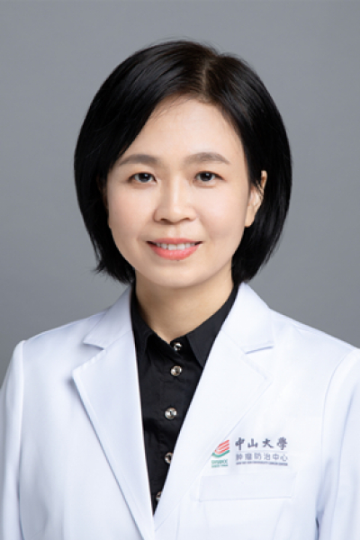

<!-- AUTO-GENERATED-BY: work/generate_obsidian_profiles.py -->

<!-- TEMPLATE: D:\workspace\信息收集整理\医生画像仓库\模板\医生画像模板.md -->

# 黄莹

## 基础信息

| 字段 | 内容 |
|---|---|
| 姓名 | 黄莹 |
| 医院 | 中山大学肿瘤防治中心 |
| 科室 | 放疗科 |
| 职称/身份 | 主任医师 |
| 来源链接 | [官网原文](https://www.sysucc.org.cn/node/1680) |
| 采集日期 | 2026-08-10 |

## 简介/擅长

头颈部肿瘤放射治疗及综合治疗，包括鼻咽癌，口咽癌，口腔癌，喉癌，下咽癌，鼻腔副鼻窦癌，眼眶肿瘤等肿瘤精准放疗和综合治疗；淋巴瘤及恶性肿瘤转移瘤的放射治疗。

## 教育与进修经历

- 专家门诊时间：周一，周四上午 越秀院区门诊 周三上午 黄埔院区门诊 二、学习及工作经历 工作经历 1999/07-2004/12 中山大学肿瘤防治中心放疗科 住院医师 2005/01-2012/12 中山大学肿瘤防治中心放疗科 主治医师 2012/12-2021/12 中山大学肿瘤防治中心放疗科 副主任医师 2022/01-至今 中山大学肿瘤防治中心放疗科 主任医师 教育经历 1994/09-1999/07 中山医科大学临床医学系 本科/学士学位 1999/09-2004/12 中山大学 肿瘤学/硕士学位 200…

## 可包装亮点

- 主任医师 头颈部肿瘤放射治疗及综合治疗，包括鼻咽癌，口咽癌，口腔癌，喉癌，下咽癌，鼻腔副鼻窦癌，眼眶肿瘤等肿瘤精准放疗和综合治疗；
- 黄莹 职称：主任医师 专长 头颈部肿瘤放射治疗及综合治疗，包括鼻咽癌，口咽癌，口腔癌，喉癌，下咽癌，鼻腔副鼻窦癌，眼眶肿瘤等肿瘤精准放疗和综合治疗；
- 一、基本情况 职称：主任医师 专业特长：头颈部肿瘤放射治疗及综合治疗，包括鼻咽癌，口咽癌，口腔癌，喉癌，下咽癌，鼻腔副鼻窦癌，眼眶肿瘤等肿瘤精准放疗和综合治疗；

## 重点疾病/人群标签

- 慢性病：
- 肿瘤：肿瘤、癌、瘤、淋巴瘤、放疗、鼻咽癌
- 生殖疾病：
- 免疫/风湿：
- 术后恢复/康复：
- 疑难重症：

## 证据摘录

> 只摘录官网公开信息中的短句或关键字段，不复制大段原文。

- 官网身份字段：主任医师
- 官网简介/擅长：头颈部肿瘤放射治疗及综合治疗，包括鼻咽癌，口咽癌，口腔癌，喉癌，下咽癌，鼻腔副鼻窦癌，眼眶肿瘤等肿瘤精准放疗和综合治疗；淋巴瘤及恶性肿瘤转移瘤的放射治疗。
- 官网亮眼经历线索：主任医师 头颈部肿瘤放射治疗及综合治疗，包括鼻咽癌，口咽癌，口腔癌，喉癌，下咽癌，鼻腔副鼻窦癌，眼眶肿瘤等肿瘤精准放疗和综合治疗； 黄莹 职称：主任医师 专长 头颈部肿瘤放射治疗及综合治疗，包括鼻咽癌，口咽癌，口腔癌，喉癌，下咽癌，鼻腔副鼻窦癌，眼眶肿瘤等肿瘤精准放疗和综合治疗； 一、基本情况 职称：主任医师 专业特长：头颈部肿瘤放射治疗及综合治疗，包括鼻咽癌，口咽癌，口腔癌，喉癌，下咽癌，鼻腔副鼻窦癌，眼眶肿瘤等肿瘤精准放疗和综合治…
- 异常提示：亮眼经历含导航文本，已清洗
- 来源链接：https://www.sysucc.org.cn/node/1680

## BD 画像摘要

黄莹医生可作为肿瘤方向的基础画像候选。后续 BD 使用应继续以官网来源和人工复核为准，不添加疗效承诺或无来源包装。

## 合规边界

- 仅使用医院官网、官方公众号、官方小程序等公开渠道。
- 不采集私人电话、私人微信、家庭住址、患者隐私或非公开排班信息。
- 不写“保证治愈”“疗效第一”“包治疑难杂症”等无法由官网证明的表述。
