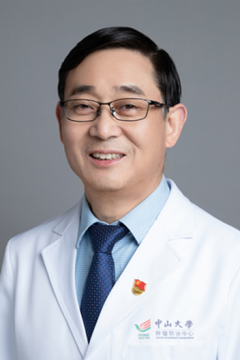

<!-- AUTO-GENERATED-BY: work/generate_obsidian_profiles.py -->

<!-- TEMPLATE: D:\workspace\信息收集整理\医生画像仓库\模板\医生画像模板.md -->

# 黄金华

## 基础信息

| 字段 | 内容 |
|---|---|
| 姓名 | 黄金华 |
| 医院 | 中山大学肿瘤防治中心 |
| 科室 | 微创介入治疗科 |
| 职称/身份 | 科主任导师 职称：教授、主任医师、博士生导师 |
| 来源链接 | [官网原文](https://www.sysucc.org.cn/node/3751) |
| 采集日期 | 2026-08-10 |

## 简介/擅长

擅长肝癌、全身实体肿瘤介入、消融、粒子微创综合治疗；周四下午特设AI协同抗癌智慧医疗专家

## 教育与进修经历

- 加载更多 1985年毕业于江西医学院医疗系（本科）。
- 1992年上海第二医科大学硕士毕业，现任中山大学附属肿瘤医院微创介入科主任导师、教授、主任医师。
- 6.（食道狭窄、胆道梗阻、腔静脉狭窄等）腔内支架植入治疗 专业协会会员 ： 中华医学会（CMA）会员（1997-至今） 中国抗癌协会（CACA）会员（1997-至今） 专业学会兼职 ： 中国抗癌协会肿瘤微创介入治疗专业委员会委员（2005至今） 广东省医师协会介入医师分会常委（2008年至今） 广东省抗癌协会肿瘤影像介入专业委员会委员 （2002-至今） 广东省抗癌协会癌症康复与姑息治疗专业委员会委员 专业杂志编委（审稿人）： 《介入放射学》杂志编委（2005年至今） 海外留学经历： 2003年至2004年在美国…

## 科研项目与成果

- 近期研究成果显示：肝动脉精细栓塞联合药物治疗可显著提高大肝癌临床疗效，成果发表在国际一流期刊。

## 论文与学术产出

- 广东省抗癌协会副理事长、秘书长，中国抗癌协会超声治疗专业委员会主委，中华医学会放射分会介入学组委员，中国医师协会肝癌微创介入专委会副主委，中国抗癌协会介入治疗专业委员会常委，《介入放射学》杂志编委，《Journal of intervenal radiology》副主编 对肝癌介入治疗长期深入研究，临床经验丰富，尤其擅长中大肝癌及中晚期肝癌微创介入综合治疗（精细栓塞、灌注化疗、消融、粒子植入、海扶等联合靶向免疫综合治疗）。
- 近期研究成果显示：肝动脉精细栓塞联合药物治疗可显著提高大肝癌临床疗效，成果发表在国际一流期刊。

## 可包装亮点

- 科主任导师 职称：教授、主任医师、博士生导师 黄金华 职务：科主任导师 职称：教授、主任医师、博士生导师 专长 擅长肝癌、全身实体肿瘤介入、消融、粒子微创综合治疗；
- 周四下午特设AI协同抗癌智慧医疗专家门诊，为患者提供个性化精准诊疗服务。
- 黄金华，教授，博士生导师 微创介入治疗科创始人之一，该领域国内知名专家。

## 重点疾病/人群标签

- 慢性病：
- 肿瘤：肿瘤、癌、瘤、化疗、靶向、鼻咽癌、肺癌、肝癌、免疫、康复、姑息、疼痛、难治、复杂
- 生殖疾病：
- 免疫/风湿：肿瘤、癌、瘤、化疗、靶向、鼻咽癌、肺癌、肝癌、免疫、康复、姑息、疼痛、难治、复杂
- 术后恢复/康复：肿瘤、癌、瘤、化疗、靶向、鼻咽癌、肺癌、肝癌、免疫、康复、姑息、疼痛、难治、复杂
- 疑难重症：肿瘤、癌、瘤、化疗、靶向、鼻咽癌、肺癌、肝癌、免疫、康复、姑息、疼痛、难治、复杂

## 证据摘录

> 只摘录官网公开信息中的短句或关键字段，不复制大段原文。

- 官网身份字段：科主任导师 职称：教授、主任医师、博士生导师
- 官网简介/擅长：擅长肝癌、全身实体肿瘤介入、消融、粒子微创综合治疗；周四下午特设AI协同抗癌智慧医疗专家
- 官网亮眼经历线索：科主任导师 职称：教授、主任医师、博士生导师 黄金华 职务：科主任导师 职称：教授、主任医师、博士生导师 专长 擅长肝癌、全身实体肿瘤介入、消融、粒子微创综合治疗； 周四下午特设AI协同抗癌智慧医疗专家门诊，为患者提供个性化精准诊疗服务。 黄金华，教授，博士生导师 微创介入治疗科创始人之一，该领域国内知名专家。
- 异常提示：亮眼经历含导航文本，已清洗
- 来源链接：https://www.sysucc.org.cn/node/3751

## BD 画像摘要

黄金华医生可作为肿瘤、免疫/风湿/感染、术后恢复/康复、疑难重症方向的基础画像候选。后续 BD 使用应继续以官网来源和人工复核为准，不添加疗效承诺或无来源包装。

## 合规边界

- 仅使用医院官网、官方公众号、官方小程序等公开渠道。
- 不采集私人电话、私人微信、家庭住址、患者隐私或非公开排班信息。
- 不写“保证治愈”“疗效第一”“包治疑难杂症”等无法由官网证明的表述。
