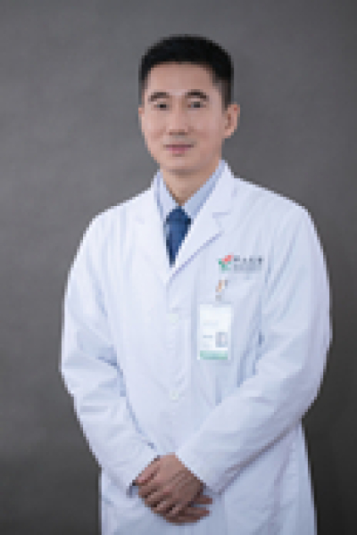

<!-- AUTO-GENERATED-BY: work/generate_obsidian_profiles.py -->

# 黎建军

## 基础信息

| 字段 | 内容 |
|---|---|
| 医院 | 中山大学肿瘤防治中心 |
| 姓名 | 黎建军 |
| 科室 | 内镜科 |
| 职称/身份 | 内镜科主任 职称：主任医师、 博士研究生导师、广东省杰出青年医学人才、第七届“羊城好医生” |
| 重点优先级 | 高 |
| 来源类型 | 医院官网 |
| 来源链接 | [官网原文](https://www.sysucc.org.cn/node/3906) |
| 采集日期 | 2026-08-10 |
| 复核状态 | 待人工复核 |
| 异常提示 |  |

## 简介/擅长

从事肿瘤(消化/呼吸/鼻咽）内镜诊治临床及科研工作 职务： 内镜科主任 职称： 主任医师、 博士研究生导师、广东省杰出青年医学人才、第七届“羊城好医生” 中国医药教育协会消化内镜专业委员会委员； 中国抗癌协会肿瘤内镜专业委员会委员； 广东省抗癌协会肿瘤内镜学专业委员会常务委员； 广东省医药质量管理协会消化与消化内镜专委会副主任委员 广东健康管理学会消化内镜MDT专业委员会副主任委员 美国University of Michigan 访问学者； 从事肿瘤(消化/呼吸/鼻咽）内镜诊治临床及科研工作。发表SCI论文20余篇，多篇论文以第一作者或通讯作者在本专业顶级期刊如： Clincical Cancer Research,Endoscopy,Gastrointestinal Endoscopy等发表。 主持国际级基金1项：亚洲肿瘤研究基金（Asian Fund for Cancer Research, AFCR）一项 加载更多 职务： 内镜科主任 职称： 主任医师、 博士研究生导师、广东省杰出青年医学人才、第七届“羊城好医生” 中国医药教育协会消化内镜专业委员会委员； 中国抗癌协会肿瘤内镜专业委员会委员； 广东省抗癌协会肿...

## 详情正文摘录

临床专家 面包屑 首页 / 临床科室 / 平台科室 / 内镜科 / 临床专家 黎建军 职务：内镜科主任 职称：主任医师、 博士研究生导师、广东省杰出青年医学人才、第七届“羊城好医生” 专长 从事肿瘤(消化/呼吸/鼻咽）内镜诊治临床及科研工作 职务： 内镜科主任 职称： 主任医师、 博士研究生导师、广东省杰出青年医学人才、第七届“羊城好医生” 中国医药教育协会消化内镜专业委员会委员； 中国抗癌协会肿瘤内镜专业委员会委员； 广东省抗癌协会肿瘤内镜学专业委员会常务委员； 广东省医药质量管理协会消化与消化内镜专委会副主任委员 广东健康管理学会消化内镜MDT专业委员会副主任委员 美国University of Michigan 访问学者； 从事肿瘤(消化/呼吸/鼻咽）内镜诊治临床及科研工作。发表SCI论文20余篇，多篇论文以第一作者或通讯作者在本专业顶级期刊如： Clincical Cancer Research,Endoscopy,Gastrointestinal Endoscopy等发表。 主持国际级基金1项：亚洲肿瘤研究基金（Asian Fund for Cancer Research, AFCR）一项 加载更多 职务： 内镜科主任 职称： 主任医师、 博士研究生导师、广东省杰出青年医学人才、第七届“羊城好医生” 中国医药教育协会消化内镜专业委员会委员； 中国抗癌协会肿瘤内镜专业委员会委员； 广东省抗癌协会肿瘤内镜学专业委员会常务委员； 广东省医药质量管理协会消化与消化内镜专委会副主任委员 广东健康管理学会消化内镜MDT专业委员会副主任委员 美国University of Michigan 访问学者； 从事肿瘤(消化/呼吸/鼻咽）内镜诊治临床及科研工作。发表SCI论文20余篇，多篇论文以第一作者或通讯作者在本专业顶级期刊如： Clincical Cancer Research,Endoscopy,Gastrointestinal Endoscopy等发表。 主持国际级基金1项：亚洲肿瘤研究基金（Asian Fund for Cancer Research, AFCR）一项…

## 重点关注范围

- 肿瘤
- 疑难重症

## 重点疾病标签

- 肿瘤
- 癌
- 瘤
- 放疗
- 化疗
- 鼻咽癌
- 肝癌
- MDT

## 亮眼经历线索

- 内镜科主任 职称：主任医师、 博士研究生导师、广东省杰出青年医学人才、第七届“羊城好医生” 从事肿瘤(消化/呼吸/鼻咽）内镜诊治临床及科研工作 职务： 内镜科主任 职称： 主任医师、 博士研究生导师、广东省杰出青年医学人才、第七届“羊城好医生” 中国医药教育协会消化内镜专业委员会委员；
- 中国抗癌协会肿瘤内镜专业委员会委员；
- 广东省抗癌协会肿瘤内镜学专业委员会常务委员；

## 异常提示

## 合规边界

- 本画像仅整理统一总底表中的医院官网公开字段。
- 不包含患者评价、排名、第三方来源内容或疗效承诺。
- 官网未展示的信息保持空白，后续如需补充须回到底表官方来源字段。
