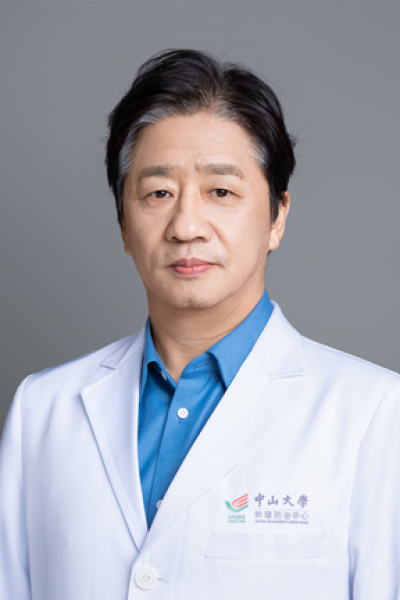

<!-- AUTO-GENERATED-BY: work/generate_obsidian_profiles.py -->

<!-- TEMPLATE: D:\workspace\信息收集整理\医生画像仓库\模板\医生画像模板.md -->

# 龙浩

## 基础信息

| 字段 | 内容 |
|---|---|
| 姓名 | 龙浩 |
| 医院 | 中山大学肿瘤防治中心 |
| 科室 | 胸科 |
| 职称/身份 | 肺癌首席专家 职称：教授、主任医师、博士/博士后导师 |
| 来源链接 | [官网原文](https://www.sysucc.org.cn/node/3609) |
| 采集日期 | 2026-08-10 |

## 简介/擅长

微创胸外科、胸腔镜，胸壁重建，擅长肺癌综合治疗。

## 教育与进修经历

- 临床专家 面包屑 首页 / 临床科室 / 外科系列 / 胸科 / 临床专家 龙浩 职务：肺癌首席专家 职称：教授、主任医师、博士/博士后导师 专长 微创胸外科、胸腔镜，胸壁重建，擅长肺癌综合治疗。
- 一、基本情况 肺癌首席专家、教授、主任医师、博士/博士后导师 二、教育及工作经历 主要学历： 1984年毕业于中山医科大学医学系 2007年获临床博士学位 工作经历： 1984年8月至1990年2月在湖南省肿瘤医院胸外科工作， 1990年2月至今在中山大学附属肿瘤医院胸外科工作 2000年至2001年留学于澳大利亚墨尔本大学附属Austin医院，师从Peter Clarke教授，专攻普胸外科及胸腔镜外科。
- 2002年8-9月进修于香港中文大学威尔斯亲王医院，师从Anthony Yim教授，学习胸腔镜外科。
- 2004年4-6月进修于加拿大多伦多总医院，学习肺移植。

## 科研项目与成果

- 三、学术兼职 中山大学肺癌专家委员会 主任，首席专家 中山大学附属肿瘤医院 肺癌首席专家 英国皇家外科学院院士 吴阶平基金会模拟医学部胸外科专业委员会 主任委员 “Thoracic Cancer” 常务编委 中国肺癌杂志 常务编委 中国医师协会胸科医师分会肺癌专家委员会 委员 中国医药卫生事业发展基金会肿瘤数字治疗专家委员会 主任委员 四、主持科研项目 主持或参与了国家十五攻关、卫生部、科技部、省及大学的多项肺癌、乳腺癌及食管贲门癌研究课题。
- 包括： （1）863重大项目肺癌的分子分型和个体化诊疗分题：多中心肺癌诊疗和随访研究；
- （3）食管贲门癌术后静脉全营养胰岛素使用方法的随机对照研究 (吴阶平医学基金)；
- （4）早期乳腺癌规范化保乳综合治疗的临床研究（国家十五攻关课题）；

## 可包装亮点

- 肺癌首席专家 职称：教授、主任医师、博士/博士后导师 龙浩 职务：肺癌首席专家 职称：教授、主任医师、博士/博士后导师 专长 微创胸外科、胸腔镜，胸壁重建，擅长肺癌综合治疗。
- 一、基本情况 肺癌首席专家、教授、主任医师、博士/博士后导师 二、教育及工作经历 主要学历： 1984年毕业于中山医科大学医学系 2007年获临床博士学位 工作经历： 1984年8月至1990年2月在湖南省肿瘤医院胸外科工作， 1990年2月至今在中山大学附属肿瘤医院胸外科工作 2000年至2001年留学于澳大利亚墨尔本大学附属Austin医院，师从Pet…
- 2002年8-9月进修于香港中文大学威尔斯亲王医院，师从Anthony Yim教授，学习胸腔镜外科。

## 重点疾病/人群标签

- 慢性病：
- 肿瘤：肿瘤、癌、瘤、肺癌、乳腺癌、术后、营养
- 生殖疾病：
- 免疫/风湿：
- 术后恢复/康复：肿瘤、癌、瘤、肺癌、乳腺癌、术后、营养
- 疑难重症：

## 证据摘录

> 只摘录官网公开信息中的短句或关键字段，不复制大段原文。

- 官网身份字段：肺癌首席专家 职称：教授、主任医师、博士/博士后导师
- 官网简介/擅长：微创胸外科、胸腔镜，胸壁重建，擅长肺癌综合治疗。
- 官网亮眼经历线索：肺癌首席专家 职称：教授、主任医师、博士/博士后导师 龙浩 职务：肺癌首席专家 职称：教授、主任医师、博士/博士后导师 专长 微创胸外科、胸腔镜，胸壁重建，擅长肺癌综合治疗。 一、基本情况 肺癌首席专家、教授、主任医师、博士/博士后导师 二、教育及工作经历 主要学历： 1984年毕业于中山医科大学医学系 2007年获临床博士学位 工作经历： 1984年8月至1990年2月在湖南省肿瘤医院胸外科工作， 1990年2月至今在中山大学附属肿…
- 异常提示：亮眼经历含导航文本，已清洗
- 来源链接：https://www.sysucc.org.cn/node/3609

## BD 画像摘要

龙浩医生可作为肿瘤、术后恢复/康复方向的基础画像候选。后续 BD 使用应继续以官网来源和人工复核为准，不添加疗效承诺或无来源包装。

## 合规边界

- 仅使用医院官网、官方公众号、官方小程序等公开渠道。
- 不采集私人电话、私人微信、家庭住址、患者隐私或非公开排班信息。
- 不写“保证治愈”“疗效第一”“包治疑难杂症”等无法由官网证明的表述。
