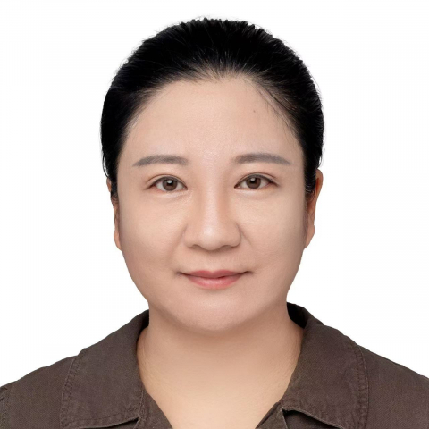

<!-- AUTO-GENERATED-BY: work/generate_obsidian_profiles.py -->

<!-- TEMPLATE: D:\workspace\信息收集整理\医生画像仓库\模板\医生画像模板.md -->

# 丁雪冰

## 基础信息

| 字段 | 内容 |
|---|---|
| 姓名 | 丁雪冰 |
| 医院 | 中山大学附属第一医院 |
| 科室 | 神经一科 |
| 职称/身份 | 主任医师/教授 |
| 来源链接 | [官网原文](https://www.fahsysu.org.cn/node/34899) |
| 采集日期 | 2026-08-13 |

## 简介/擅长

主要从事帕金森病等神经退行性疾病的诊断、治疗及新技术研发工作。 对脑血管病、头痛、头晕的诊断、治疗及预防具有丰富的临床经验。 研究方向：神经退行性疾病 教育和工作经历：2011年获中山大学博士学位，2015年于美国UCLA从事帕金森综合征等神经退行性疾病博士后工作。 社会兼职：中华医学会神经病学分会青年委员、河南省医学会神经病学青委会副主任委员。 基金和论著：主持囯家自然科学基金面上项目3项、主持囯家自然科学基金青年项目1项、参与科技部重点研发项目1项、主持河南省自然科学基金杰出青年基金1项。 以第一或通讯作者在Nature medicine（IF: 87.2）、Nature Communications（IF: 17.6）、Acta Neuropathologica（IF: 15.8）等发表高质量SCI文章54篇。 专著：《临床神经遗传病学》编委 其他工作成绩：曾获河南省卫生健康科技创新领军人才、河南省中青年学科带头人。 荣获河南省级科技进步奖一等奖1项、厅级科技进步一等奖2项。 研究成果解决了帕金森综合征临床诊断的世界性难题。

## 教育与进修经历

- 研究方向：神经退行性疾病 教育和工作经历：2011年获中山大学博士学位，2015年于美国UCLA从事帕金森综合征等神经退行性疾病博士后工作。

## 科研项目与成果

- 基金和论著：主持囯家自然科学基金面上项目3项、主持囯家自然科学基金青年项目1项、参与科技部重点研发项目1项、主持河南省自然科学基金杰出青年基金1项。
- 研究成果解决了帕金森综合征临床诊断的世界性难题。

## 论文与学术产出

- 以第一或通讯作者在Nature medicine（IF: 87.2）、Nature Communications（IF: 17.6）、Acta Neuropathologica（IF: 15.8）等发表高质量SCI文章54篇。

## 可包装亮点

- 研究方向：神经退行性疾病 教育和工作经历：2011年获中山大学博士学位，2015年于美国UCLA从事帕金森综合征等神经退行性疾病博士后工作。
- 社会兼职：中华医学会神经病学分会青年委员、河南省医学会神经病学青委会副主任委员。
- 基金和论著：主持囯家自然科学基金面上项目3项、主持囯家自然科学基金青年项目1项、参与科技部重点研发项目1项、主持河南省自然科学基金杰出青年基金1项。
- 以第一或通讯作者在Nature medicine（IF: 87.2）、Nature Communications（IF: 17.6）、Acta Neuropathologica（IF: 15.8）等发表高质量SCI文章54篇。

## 重点疾病/人群标签

- 慢性病：
- 肿瘤：
- 生殖疾病：
- 免疫/风湿：
- 术后恢复/康复：
- 疑难重症：

## 证据摘录

> 只摘录官网公开信息中的短句或关键字段，不复制大段原文。

- 官网身份字段：主任医师/教授
- 官网简介/擅长：主要从事帕金森病等神经退行性疾病的诊断、治疗及新技术研发工作。 对脑血管病、头痛、头晕的诊断、治疗及预防具有丰富的临床经验。 研究方向：神经退行性疾病 教育和工作经历：2011年获中山大学博士学位，2015年于美国UCLA从事帕金森综合征等神经退行性疾病博士后工作。 社会兼职：中华医学会神经病学分会青年委员、河南省医学会神经病学青委会副主任委员。 基金和论著：主持囯家自然科学基金面上项目3项、主持囯家自然科学基金青年项目1项、参与科技…
- 官网亮眼经历线索：研究方向：神经退行性疾病 教育和工作经历：2011年获中山大学博士学位，2015年于美国UCLA从事帕金森综合征等神经退行性疾病博士后工作。 社会兼职：中华医学会神经病学分会青年委员、河南省医学会神经病学青委会副主任委员。 基金和论著：主持囯家自然科学基金面上项目3项、主持囯家自然科学基金青年项目1项、参与科技部重点研发项目1项、主持河南省自然科学基金杰出青年基金1项。 以第一或通讯作者在Nature medicine（IF: 87.…
- 来源链接：https://www.fahsysu.org.cn/node/34899

## BD 画像摘要

丁雪冰医生可作为中山大学附属第一医院神经一科的基础医生资料入库。当前重点方向以总底表标签为准，官网未展示的信息保持空白。

## 合规边界

- 仅使用医院官网、官方公众号、官方小程序等公开渠道。
- 不采集私人电话、私人微信、家庭住址、患者隐私或非公开排班信息。
- 不写“保证治愈”“疗效第一”“包治疑难杂症”等无法由官网证明的表述。
