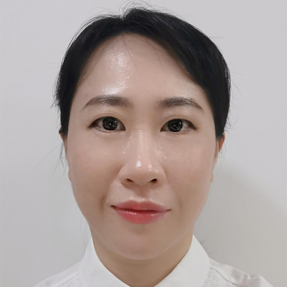

<!-- AUTO-GENERATED-BY: work/generate_obsidian_profiles.py -->

<!-- TEMPLATE: D:\workspace\信息收集整理\医生画像仓库\模板\医生画像模板.md -->

# 万学思

## 基础信息

| 字段 | 内容 |
|---|---|
| 姓名 | 万学思 |
| 医院 | 中山大学附属第一医院 |
| 科室 | 内分泌内科 |
| 职称/身份 | 副主任医师 |
| 来源链接 | [官网原文](https://www.fahsysu.org.cn/node/29101) |
| 采集日期 | 2026-08-13 |

## 简介/擅长

在糖尿病强化治疗、糖尿病并发症、特殊类型糖尿病分型、甲状腺疾病等有较好的临床经验。 2009年进入中山一院内分泌科工作至今，2014年曾于英国谢菲尔德大学学习糖尿病神经病变临床诊治。 2017-2019年于美国马里兰大学作为访问学者从事内分泌代谢疾病的机制及遗传分析研究。 一直从事糖尿病及其并发症治疗及机制研究，以及内分泌代谢遗传疾病分析相关研究，曾在JASN等国际高水平学术期刊发表多篇SCI论著，主持国自然青年基金及省自然面上项目、省卫生厅基金等多项科研课题，曾赴美国马里兰大学学习内分泌代谢疾病遗传分析。 研究方向：糖尿病及其并发症治疗，以及内分泌代谢遗传疾病分析 主要教育和工作经历：本硕博均于中山医就读。 2014年曾于英国谢菲尔德大学学习糖尿病神经病变临床诊治。 2017-2019年于美国马里兰大学作为访问学者从事内分泌代谢疾病的机制及遗传分析研究。 社会兼职： 代表论著： (1) Xuesi Wan; James Perry; Haichen Zhang; Feng Jin; Kathleen A Ryan; Cristopher Van Hout; Je ffrey Reid; John Overton; A...

## 教育与进修经历

- 2017-2019年于美国马里兰大学作为访问学者从事内分泌代谢疾病的机制及遗传分析研究。

## 科研项目与成果

- 一直从事糖尿病及其并发症治疗及机制研究，以及内分泌代谢遗传疾病分析相关研究，曾在JASN等国际高水平学术期刊发表多篇SCI论著，主持国自然青年基金及省自然面上项目、省卫生厅基金等多项科研课题，曾赴美国马里兰大学学习内分泌代谢疾病遗传分析。

## 论文与学术产出

- 一直从事糖尿病及其并发症治疗及机制研究，以及内分泌代谢遗传疾病分析相关研究，曾在JASN等国际高水平学术期刊发表多篇SCI论著，主持国自然青年基金及省自然面上项目、省卫生厅基金等多项科研课题，曾赴美国马里兰大学学习内分泌代谢疾病遗传分析。

## 可包装亮点

- 2009年进入中山一院内分泌科工作至今，2014年曾于英国谢菲尔德大学学习糖尿病神经病变临床诊治。
- 2017-2019年于美国马里兰大学作为访问学者从事内分泌代谢疾病的机制及遗传分析研究。
- 一直从事糖尿病及其并发症治疗及机制研究，以及内分泌代谢遗传疾病分析相关研究，曾在JASN等国际高水平学术期刊发表多篇SCI论著，主持国自然青年基金及省自然面上项目、省卫生厅基金等多项科研课题，曾赴美国马里兰大学学习内分泌代谢疾病遗传分析。

## 重点疾病/人群标签

- 慢性病：糖尿病、代谢、疑难
- 肿瘤：
- 生殖疾病：
- 免疫/风湿：
- 术后恢复/康复：
- 疑难重症：糖尿病、代谢、疑难

## 证据摘录

> 只摘录官网公开信息中的短句或关键字段，不复制大段原文。

- 官网身份字段：副主任医师
- 官网简介/擅长：在糖尿病强化治疗、糖尿病并发症、特殊类型糖尿病分型、甲状腺疾病等有较好的临床经验。 2009年进入中山一院内分泌科工作至今，2014年曾于英国谢菲尔德大学学习糖尿病神经病变临床诊治。 2017-2019年于美国马里兰大学作为访问学者从事内分泌代谢疾病的机制及遗传分析研究。 一直从事糖尿病及其并发症治疗及机制研究，以及内分泌代谢遗传疾病分析相关研究，曾在JASN等国际高水平学术期刊发表多篇SCI论著，主持国自然青年基金及省自然面上项目…
- 官网亮眼经历线索：2009年进入中山一院内分泌科工作至今，2014年曾于英国谢菲尔德大学学习糖尿病神经病变临床诊治。 2017-2019年于美国马里兰大学作为访问学者从事内分泌代谢疾病的机制及遗传分析研究。 一直从事糖尿病及其并发症治疗及机制研究，以及内分泌代谢遗传疾病分析相关研究，曾在JASN等国际高水平学术期刊发表多篇SCI论著，主持国自然青年基金及省自然面上项目、省卫生厅基金等多项科研课题，曾赴美国马里兰大学学习内分泌代谢疾病遗传分析。 2009…
- 来源链接：https://www.fahsysu.org.cn/node/29101

## BD 画像摘要

万学思医生可作为慢性病、疑难重症方向的基础画像候选。后续 BD 使用应继续以官网来源和人工复核为准，不添加疗效承诺或无来源包装。

## 合规边界

- 仅使用医院官网、官方公众号、官方小程序等公开渠道。
- 不采集私人电话、私人微信、家庭住址、患者隐私或非公开排班信息。
- 不写“保证治愈”“疗效第一”“包治疑难杂症”等无法由官网证明的表述。
