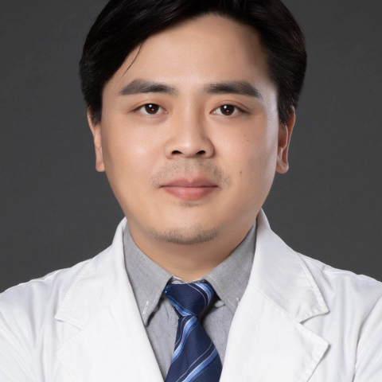

<!-- AUTO-GENERATED-BY: work/generate_obsidian_profiles.py -->

<!-- TEMPLATE: D:\workspace\信息收集整理\医生画像仓库\模板\医生画像模板.md -->

# 任玉峰

## 基础信息

| 字段 | 内容 |
|---|---|
| 姓名 | 任玉峰 |
| 医院 | 中山大学附属第一医院 |
| 科室 | 放射治疗科 |
| 职称/身份 | 主任医师 |
| 来源链接 | [官网原文](https://www.fahsysu.org.cn/node/5834) |
| 采集日期 | 2026-08-13 |

## 简介/擅长

## 科研项目与成果

- 在胸部肿瘤（肺癌，乳腺癌，食管癌），腹部肿瘤（胃癌，肠癌），头颈部癌等肿瘤综合治疗方面积累了丰富的临床经验和科研基础。
- 医疗特长（限400字内）： 在胸部肿瘤（肺癌，乳腺癌，食管癌），腹部肿瘤（胃癌，肠癌），头颈部癌等肿瘤综合治疗方面积累了丰富的临床经验和科研基础。
- 专著： 以第一（共一）、通信（共同通信）作者在国内外学术期刊发表论文19 篇，参与及主持多项国家自然科学基金、省科技计划、厅局级科研项目。
- 目前承担 \ 参加科研项目情况： 1. 吉西他滨（GEM）激活EB 病毒裂解性复制的分子机制研究、广东省医学科学技术研究基金项目 2. DNA-PKcs 基因敲除及其抑制剂影响DNA 双链断裂非同源重组末端连接修复的研究、国自然基金委 主要论著 ( 第一 / 共一 / 通讯 ) ： (1) YuFeng Ren , YuanHong Gao, XinPing Cao, et al ., 3D-CT implanted interstitial brachytherapy for T2b NPC. Radiatio…

## 论文与学术产出

- 专著： 以第一（共一）、通信（共同通信）作者在国内外学术期刊发表论文19 篇，参与及主持多项国家自然科学基金、省科技计划、厅局级科研项目。

## 可包装亮点

- 主要教育和工作经历： 2008.07~2011.07 中山大学肿瘤防治中心 放疗科 住院医师 2011.07 ~2017.12 中山大学附属第一医院 放疗科 主治医师 2017.12~至今 中山大学附属第一医院 放疗科 副主任医师 社会兼职： 广东省临床医学学会肿瘤学专业委员会常务委员， 广东省基层医药学会肿瘤多学科综合诊治专业委员会常务委员。
- 专著： 以第一（共一）、通信（共同通信）作者在国内外学术期刊发表论文19 篇，参与及主持多项国家自然科学基金、省科技计划、厅局级科研项目。

## 重点疾病/人群标签

- 慢性病：
- 肿瘤：肿瘤、癌、放疗、肺癌、胃癌、肠癌、乳腺癌、多学科
- 生殖疾病：
- 免疫/风湿：
- 术后恢复/康复：
- 疑难重症：肿瘤、癌、放疗、肺癌、胃癌、肠癌、乳腺癌、多学科

## 证据摘录

> 只摘录官网公开信息中的短句或关键字段，不复制大段原文。

- 官网身份字段：主任医师
- 官网亮眼经历线索：主要教育和工作经历： 2008.07~2011.07 中山大学肿瘤防治中心 放疗科 住院医师 2011.07 ~2017.12 中山大学附属第一医院 放疗科 主治医师 2017.12~至今 中山大学附属第一医院 放疗科 副主任医师 社会兼职： 广东省临床医学学会肿瘤学专业委员会常务委员， 广东省基层医药学会肿瘤多学科综合诊治专业委员会常务委员。 专著： 以第一（共一）、通信（共同通信）作者在国内外学术期刊发表论文19 篇，参与及主持多…
- 来源链接：https://www.fahsysu.org.cn/node/5834

## BD 画像摘要

任玉峰医生可作为肿瘤、疑难重症方向的基础画像候选。后续 BD 使用应继续以官网来源和人工复核为准，不添加疗效承诺或无来源包装。

## 合规边界

- 仅使用医院官网、官方公众号、官方小程序等公开渠道。
- 不采集私人电话、私人微信、家庭住址、患者隐私或非公开排班信息。
- 不写“保证治愈”“疗效第一”“包治疑难杂症”等无法由官网证明的表述。
