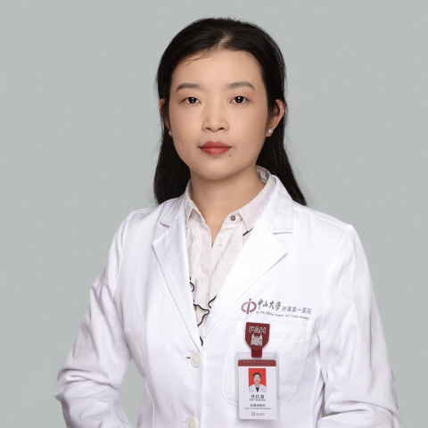

<!-- AUTO-GENERATED-BY: work/generate_obsidian_profiles.py -->

<!-- TEMPLATE: D:\workspace\信息收集整理\医生画像仓库\模板\医生画像模板.md -->

# 任红苗

## 基础信息

| 字段 | 内容 |
|---|---|
| 姓名 | 任红苗 |
| 医院 | 中山大学附属第一医院 |
| 科室 | 耳专科 |
| 职称/身份 | 副主任医师 |
| 来源链接 | [官网原文](https://www.fahsysu.org.cn/node/29050) |
| 采集日期 | 2026-08-13 |

## 简介/擅长

耳外科和耳内科常见病、多发病的规范诊治：擅长经耳内镜/显微镜中内耳微创手术（慢性化脓性中耳炎、粘连性中耳炎等、中耳胆脂瘤等）； 听觉重建手术（听骨链重建、人工耳蜗植入、骨导助听器植入等）； 面神经疾病； 耳聋等疾病的诊治具有较为丰富的临床经验。 主要教育和工作经历： 2025.8-2026.7，英国剑桥大学访问学者 2015年至今，中山大学附属第一医院耳鼻喉科从事临床医学、教育、科研工作； 2015年毕业于中南大学，获得医学博士学位 2012年毕业于第三军医大学，获得医学硕士学位； 2009年毕业于河北医科大学，获得医学学士学位； 研究方向： 耳内镜微创外科 耳显微镜外科 粘连性中耳炎、分泌性中耳炎的规范诊疗 耳聋等耳内科学疾病的诊治 老年性聋等神经性耳聋的治疗及咨询 主要教育和工作经历： 任红苗，女，学术型研究生导师、专业型研究生导师 社会兼职：广东省医学会耳鼻咽喉学分会耳科学组委员 论著：以第一作者和通讯作者在国内和国际知名期刊发表中、英文文章10余篇，内容涉及耳科临床和基础研究，尤其是神经性耳聋方面的研究：其一，关于毛细胞衰老在老年性聋发病中的作用及毛细胞再生在老年性聋听觉恢复中作用； 其二，主要涉及利用3D打印...

## 教育与进修经历

- 主要教育和工作经历： 2025.8-2026.7，英国剑桥大学访问学者 2015年至今，中山大学附属第一医院耳鼻喉科从事临床医学、教育、科研工作；
- 2015年毕业于中南大学，获得医学博士学位 2012年毕业于第三军医大学，获得医学硕士学位；
- 2009年毕业于河北医科大学，获得医学学士学位；

## 科研项目与成果

- 主要教育和工作经历： 2025.8-2026.7，英国剑桥大学访问学者 2015年至今，中山大学附属第一医院耳鼻喉科从事临床医学、教育、科研工作；
- 基金：主持国家自然科学基金，省级自然科学基金共4项 专利：获得国家专利3项。

## 论文与学术产出

- 研究方向： 耳内镜微创外科 耳显微镜外科 粘连性中耳炎、分泌性中耳炎的规范诊疗 耳聋等耳内科学疾病的诊治 老年性聋等神经性耳聋的治疗及咨询 主要教育和工作经历： 任红苗，女，学术型研究生导师、专业型研究生导师 社会兼职：广东省医学会耳鼻咽喉学分会耳科学组委员 论著：以第一作者和通讯作者在国内和国际知名期刊发表中、英文文章10余篇，内容涉及耳科临床和基础研究，尤其是神经性耳聋方面的研究：其一，关于毛细胞衰老在老年性聋发病中的作用及毛细胞再生在老年性聋听觉恢复中作用；

## 可包装亮点

- 主要教育和工作经历： 2025.8-2026.7，英国剑桥大学访问学者 2015年至今，中山大学附属第一医院耳鼻喉科从事临床医学、教育、科研工作；
- 研究方向： 耳内镜微创外科 耳显微镜外科 粘连性中耳炎、分泌性中耳炎的规范诊疗 耳聋等耳内科学疾病的诊治 老年性聋等神经性耳聋的治疗及咨询 主要教育和工作经历： 任红苗，女，学术型研究生导师、专业型研究生导师 社会兼职：广东省医学会耳鼻咽喉学分会耳科学组委员 论著：以第一作者和通讯作者在国内和国际知名期刊发表中、英文文章10余篇，内容涉及耳科临床和基础研究…
- 其二，主要涉及利用3D打印技术构建仿生耳蜗芯片，通过微电极阵列（MEA）和patch clamp技术实时监测神经电活动，并在植入临床人工耳蜗后模拟电刺激，观察分化神经元放电信号，旨在精准模拟听觉神经对人工耳蜗的响应，...

## 重点疾病/人群标签

- 慢性病：慢性、瘤、术后、恢复
- 肿瘤：慢性、瘤、术后、恢复
- 生殖疾病：
- 免疫/风湿：
- 术后恢复/康复：慢性、瘤、术后、恢复
- 疑难重症：

## 证据摘录

> 只摘录官网公开信息中的短句或关键字段，不复制大段原文。

- 官网身份字段：副主任医师
- 官网简介/擅长：耳外科和耳内科常见病、多发病的规范诊治：擅长经耳内镜/显微镜中内耳微创手术（慢性化脓性中耳炎、粘连性中耳炎等、中耳胆脂瘤等）； 听觉重建手术（听骨链重建、人工耳蜗植入、骨导助听器植入等）； 面神经疾病； 耳聋等疾病的诊治具有较为丰富的临床经验。 主要教育和工作经历： 2025.8-2026.7，英国剑桥大学访问学者 2015年至今，中山大学附属第一医院耳鼻喉科从事临床医学、教育、科研工作； 2015年毕业于中南大学，获得医学博士学位…
- 官网亮眼经历线索：主要教育和工作经历： 2025.8-2026.7，英国剑桥大学访问学者 2015年至今，中山大学附属第一医院耳鼻喉科从事临床医学、教育、科研工作； 研究方向： 耳内镜微创外科 耳显微镜外科 粘连性中耳炎、分泌性中耳炎的规范诊疗 耳聋等耳内科学疾病的诊治 老年性聋等神经性耳聋的治疗及咨询 主要教育和工作经历： 任红苗，女，学术型研究生导师、专业型研究生导师 社会兼职：广东省医学会耳鼻咽喉学分会耳科学组委员 论著：以第一作者和通讯作者在国…
- 来源链接：https://www.fahsysu.org.cn/node/29050

## BD 画像摘要

任红苗医生可作为慢性病、肿瘤、术后恢复/康复方向的基础画像候选。后续 BD 使用应继续以官网来源和人工复核为准，不添加疗效承诺或无来源包装。

## 合规边界

- 仅使用医院官网、官方公众号、官方小程序等公开渠道。
- 不采集私人电话、私人微信、家庭住址、患者隐私或非公开排班信息。
- 不写“保证治愈”“疗效第一”“包治疑难杂症”等无法由官网证明的表述。
