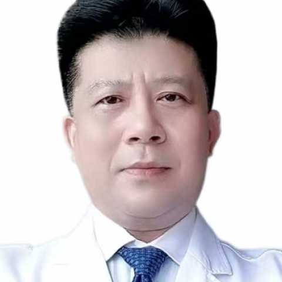

<!-- AUTO-GENERATED-BY: work/generate_obsidian_profiles.py -->

<!-- TEMPLATE: D:\workspace\信息收集整理\医生画像仓库\模板\医生画像模板.md -->

# 伍新林

## 基础信息

| 字段 | 内容 |
|---|---|
| 姓名 | 伍新林 |
| 医院 | 中山大学附属第一医院 |
| 科室 | 中医科 |
| 职称/身份 | 主任医师 |
| 来源链接 | [官网原文](https://www.fahsysu.org.cn/node/5719) |
| 采集日期 | 2026-08-13 |

## 简介/擅长

长期从事中医、中西医结合的医教研工作，对中医内科常见病、多发病及疑难病积累了丰富经验，擅长肾脏病、男科、肿瘤、泌尿、代谢病和亚健康的诊治，尤其擅长痛风、高尿酸血症、各种肾炎、肾功能不全、男科性功能障碍、遗精、男性不育、少弱畸精症、男性健康调理、前列腺炎或增生、泌尿感染或结石、肿瘤带瘤生存及术后放化疗后的恢复和减少复发、失眠、健忘、耳鸣耳聋、颈椎病、腰腿痛、慢性咳嗽、慢阻肺、各类结节、胃肠功能紊乱、多汗症、疲劳等的中医诊疗。 研究方向： 1.痛风、高尿酸血症、尿酸性肾病的中医药治疗； 2.男科疾病如男性性功能障碍、男性不育等的中医药治疗； 3.肾脏病和泌尿系疾病的中西医结合治疗； 4.肿瘤的中医药防治； 5 . 代谢性疾病、亚健康类疾病的中医药治疗。 工作经历： 1991.7-1997.12 中山大学附属第一医院中医科，住院医师 1998.1-2002.6 中山大学附属第一医院中医科，主治医师 2002.7-2004.12 中山大学附属第一医院中医科，副主任医师 2005.1-2019.12 中山大学附属第一医院中医科，副主任医师、副教授 2020.1-至今 中山大学附属第一医院中医科， 主任医师 社会兼职： 广东省中医...

## 教育与进修经历

- 中国博士后科学基金评审专家；

## 科研项目与成果

- 国家自然基金评审专家；
- 中国博士后科学基金评审专家；

## 论文与学术产出

- 中文核心期刊《中药材》杂志编委；

## 可包装亮点

- 长期从事中医、中西医结合的医教研工作，对中医内科常见病、多发病及疑难病积累了丰富经验，擅长肾脏病、男科、肿瘤、泌尿、代谢病和亚健康的诊治，尤其擅长痛风、高尿酸血症、各种肾炎、肾功能不全、男科性功能障碍、遗精、男性不育、少弱畸精症、男性健康调理、前列腺炎或增生、泌尿感染或结石、肿瘤带瘤生存及术后放化疗后的恢复和减少复发、失眠、健忘、耳鸣耳聋、颈椎病、腰腿痛…
- 医疗特长：长期从事中医、中西医结合的医教研工作，对中医内科常见病、多发病及疑难病积累了丰富经验，擅长肾脏病、男科、肿瘤、泌尿、代谢病和亚健康的诊治，尤其擅长痛风、高尿酸血症、各种肾炎、肾功能不全、男科性功能障碍、遗精、男性不育、少弱畸精症、男性健康调理、前列腺炎或增生、泌尿感染或结石、肿瘤带瘤生存及术后放化疗后的恢复和减少复发、失眠、健忘、耳鸣耳聋、颈椎病…

## 重点疾病/人群标签

- 慢性病：慢性、代谢、肿瘤、瘤、化疗、感染、术后、恢复、功能障碍、疑难
- 肿瘤：慢性、代谢、肿瘤、瘤、化疗、感染、术后、恢复、功能障碍、疑难
- 生殖疾病：
- 免疫/风湿：慢性、代谢、肿瘤、瘤、化疗、感染、术后、恢复、功能障碍、疑难
- 术后恢复/康复：慢性、代谢、肿瘤、瘤、化疗、感染、术后、恢复、功能障碍、疑难
- 疑难重症：慢性、代谢、肿瘤、瘤、化疗、感染、术后、恢复、功能障碍、疑难

## 证据摘录

> 只摘录官网公开信息中的短句或关键字段，不复制大段原文。

- 官网身份字段：主任医师
- 官网简介/擅长：长期从事中医、中西医结合的医教研工作，对中医内科常见病、多发病及疑难病积累了丰富经验，擅长肾脏病、男科、肿瘤、泌尿、代谢病和亚健康的诊治，尤其擅长痛风、高尿酸血症、各种肾炎、肾功能不全、男科性功能障碍、遗精、男性不育、少弱畸精症、男性健康调理、前列腺炎或增生、泌尿感染或结石、肿瘤带瘤生存及术后放化疗后的恢复和减少复发、失眠、健忘、耳鸣耳聋、颈椎病、腰腿痛、慢性咳嗽、慢阻肺、各类结节、胃肠功能紊乱、多汗症、疲劳等的中医诊疗。 研究方向：…
- 官网亮眼经历线索：长期从事中医、中西医结合的医教研工作，对中医内科常见病、多发病及疑难病积累了丰富经验，擅长肾脏病、男科、肿瘤、泌尿、代谢病和亚健康的诊治，尤其擅长痛风、高尿酸血症、各种肾炎、肾功能不全、男科性功能障碍、遗精、男性不育、少弱畸精症、男性健康调理、前列腺炎或增生、泌尿感染或结石、肿瘤带瘤生存及术后放化疗后的恢复和减少复发、失眠、健忘、耳鸣耳聋、颈椎病、腰腿痛、慢性咳嗽、慢阻肺、各类结节、胃肠功能紊乱、多汗症、疲劳等的中医诊疗。 医疗特长：…
- 来源链接：https://www.fahsysu.org.cn/node/5719

## BD 画像摘要

伍新林医生可作为慢性病、肿瘤、免疫/风湿/感染、术后恢复/康复、疑难重症方向的基础画像候选。后续 BD 使用应继续以官网来源和人工复核为准，不添加疗效承诺或无来源包装。

## 合规边界

- 仅使用医院官网、官方公众号、官方小程序等公开渠道。
- 不采集私人电话、私人微信、家庭住址、患者隐私或非公开排班信息。
- 不写“保证治愈”“疗效第一”“包治疑难杂症”等无法由官网证明的表述。
