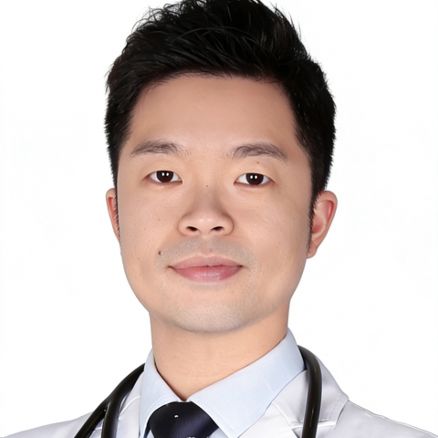

<!-- AUTO-GENERATED-BY: work/generate_obsidian_profiles.py -->

<!-- TEMPLATE: D:\workspace\信息收集整理\医生画像仓库\模板\医生画像模板.md -->

# 何江

## 基础信息

| 字段 | 内容 |
|---|---|
| 姓名 | 何江 |
| 医院 | 中山大学附属第一医院 |
| 科室 | 心内三科（高血压血管病） |
| 职称/身份 | 副主任医师 |
| 来源链接 | [官网原文](https://www.fahsysu.org.cn/node/38071) |
| 采集日期 | 2026-08-13 |

## 简介/擅长

冠心病、高血压、心脏瓣膜病、心律失常及心力衰竭等心血管内科疾病的规范化、个体化诊治。 尤其致力于心血管微创介入治疗，主要涵盖：高危复杂冠心病介入（慢性完全闭塞、严重钙化、左主干及分叉病变）、肾动脉介入（支架植入、球囊扩张及交感神经消融术治疗难治性高血压），以及心脏瓣膜病介入（经导管主动脉瓣置换、二尖瓣钳夹等），担任肾血管性高血压多学科团队核心成员。 医学博士，博士后，硕士研究生导师，中山大学附属第一医院“柯麟新星”人才计划，国家放射与治疗临床医学研究中心冠状动脉旋磨术独立术者，美敦力肾动脉交感神经消融术认证术者，AHA高级心血管生命支持认证专家，国家卫健委冠心病介入资质专家。 研究方向：（1）动脉粥样硬化性心血管病的基础与临床转化研究； （2）高血压和衰老血管内皮损伤的发病机制及干细胞修复； （3）血管内皮损伤及修复的生物力学调控机制 主要教育与工作经历： 2014/09-2019/06 中山大学附属第一医院心内科博士 2019/07-2021/07 中山大学博士后 2019/08-至今 中山大学附属第一医院心内科 科研情况： 主持国家自然科学基金、广东省基础与应用基础研究基金、中国博士后基金面上项目1项以及中山大学高...

## 教育与进修经历

- 医学博士，博士后，硕士研究生导师，中山大学附属第一医院“柯麟新星”人才计划，国家放射与治疗临床医学研究中心冠状动脉旋磨术独立术者，美敦力肾动脉交感神经消融术认证术者，AHA高级心血管生命支持认证专家，国家卫健委冠心病介入资质专家。
- （3）血管内皮损伤及修复的生物力学调控机制 主要教育与工作经历： 2014/09-2019/06 中山大学附属第一医院心内科博士 2019/07-2021/07 中山大学博士后 2019/08-至今 中山大学附属第一医院心内科 科研情况： 主持国家自然科学基金、广东省基础与应用基础研究基金、中国博士后基金面上项目1项以及中山大学高校青年教师培育项目等多项科研项目，参与国家自然科学基金重点项目及专项基金项目，近年来在ATVB、Cardiovascular Research、Advanced Science、Jour…

## 科研项目与成果

- （3）血管内皮损伤及修复的生物力学调控机制 主要教育与工作经历： 2014/09-2019/06 中山大学附属第一医院心内科博士 2019/07-2021/07 中山大学博士后 2019/08-至今 中山大学附属第一医院心内科 科研情况： 主持国家自然科学基金、广东省基础与应用基础研究基金、中国博士后基金面上项目1项以及中山大学高校青年教师培育项目等多项科研项目，参与国家自然科学基金重点项目及专项基金项目，近年来在ATVB、Cardiovascular Research、Advanced Science、Jour…

## 论文与学术产出

- （3）血管内皮损伤及修复的生物力学调控机制 主要教育与工作经历： 2014/09-2019/06 中山大学附属第一医院心内科博士 2019/07-2021/07 中山大学博士后 2019/08-至今 中山大学附属第一医院心内科 科研情况： 主持国家自然科学基金、广东省基础与应用基础研究基金、中国博士后基金面上项目1项以及中山大学高校青年教师培育项目等多项科研项目，参与国家自然科学基金重点项目及专项基金项目，近年来在ATVB、Cardiovascular Research、Advanced Science、Jour…
- Frontiers心血管病、JENR等SCI杂志客座编委；

## 可包装亮点

- 尤其致力于心血管微创介入治疗，主要涵盖：高危复杂冠心病介入（慢性完全闭塞、严重钙化、左主干及分叉病变）、肾动脉介入（支架植入、球囊扩张及交感神经消融术治疗难治性高血压），以及心脏瓣膜病介入（经导管主动脉瓣置换、二尖瓣钳夹等），担任肾血管性高血压多学科团队核心成员。
- 医学博士，博士后，硕士研究生导师，中山大学附属第一医院“柯麟新星”人才计划，国家放射与治疗临床医学研究中心冠状动脉旋磨术独立术者，美敦力肾动脉交感神经消融术认证术者，AHA高级心血管生命支持认证专家，国家卫健委冠心病介入资质专家。
- （3）血管内皮损伤及修复的生物力学调控机制 主要教育与工作经历： 20...

## 重点疾病/人群标签

- 慢性病：高血压、冠心病、心力衰竭、动脉粥样硬化、慢性、难治、复杂、多学科、高危
- 肿瘤：
- 生殖疾病：
- 免疫/风湿：
- 术后恢复/康复：
- 疑难重症：高血压、冠心病、心力衰竭、动脉粥样硬化、慢性、难治、复杂、多学科、高危

## 证据摘录

> 只摘录官网公开信息中的短句或关键字段，不复制大段原文。

- 官网身份字段：副主任医师
- 官网简介/擅长：冠心病、高血压、心脏瓣膜病、心律失常及心力衰竭等心血管内科疾病的规范化、个体化诊治。 尤其致力于心血管微创介入治疗，主要涵盖：高危复杂冠心病介入（慢性完全闭塞、严重钙化、左主干及分叉病变）、肾动脉介入（支架植入、球囊扩张及交感神经消融术治疗难治性高血压），以及心脏瓣膜病介入（经导管主动脉瓣置换、二尖瓣钳夹等），担任肾血管性高血压多学科团队核心成员。 医学博士，博士后，硕士研究生导师，中山大学附属第一医院“柯麟新星”人才计划，国家放射与…
- 官网亮眼经历线索：尤其致力于心血管微创介入治疗，主要涵盖：高危复杂冠心病介入（慢性完全闭塞、严重钙化、左主干及分叉病变）、肾动脉介入（支架植入、球囊扩张及交感神经消融术治疗难治性高血压），以及心脏瓣膜病介入（经导管主动脉瓣置换、二尖瓣钳夹等），担任肾血管性高血压多学科团队核心成员。 尤其致力于心血管微创介入治疗，主要涵盖：高危复杂冠心病介入（慢性完全闭塞、严重钙化、左主干及分叉病变）、肾动脉介入（支架植入、球囊扩张及交感神经消融术治疗难治性高血压），以…
- 来源链接：https://www.fahsysu.org.cn/node/38071

## BD 画像摘要

何江医生可作为慢性病、疑难重症方向的基础画像候选。后续 BD 使用应继续以官网来源和人工复核为准，不添加疗效承诺或无来源包装。

## 合规边界

- 仅使用医院官网、官方公众号、官方小程序等公开渠道。
- 不采集私人电话、私人微信、家庭住址、患者隐私或非公开排班信息。
- 不写“保证治愈”“疗效第一”“包治疑难杂症”等无法由官网证明的表述。
