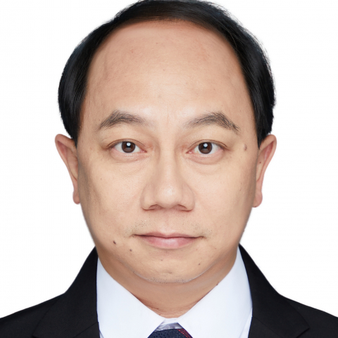

<!-- AUTO-GENERATED-BY: work/generate_obsidian_profiles.py -->

<!-- TEMPLATE: D:\workspace\信息收集整理\医生画像仓库\模板\医生画像模板.md -->

# 何沛恒

## 基础信息

| 字段 | 内容 |
|---|---|
| 姓名 | 何沛恒 |
| 医院 | 中山大学附属第一医院 |
| 科室 | 关节外科 |
| 职称/身份 | 副主任医师 |
| 来源链接 | [官网原文](https://www.fahsysu.org.cn/node/5624) |
| 采集日期 | 2026-08-13 |

## 简介/擅长

目前主要从事各种关节疾病诊断治疗，特别是骨性关节炎、类风湿关节炎、股骨头坏死、髋关节发育不良、化脓性关节炎后遗症、强直性脊柱炎关节病变的保守与手术治疗，擅长髋膝关节微创手术、骨关节矫形及各种人工关节置换术后翻修手术。 2016-2018年至加拿大、瑞士、意大利及泰国学习微创髋膝关节手术。 从事骨科、关节外科临床工作近20年，2019年获评广东省实力中青年医师。 目前担任中国医师协会骨与关节发育畸形委员会委员、广东省保健协会脊柱与关节健康分会副主任委员、广东省医师协会关节外科学分会膝关节学组委员、广东省力学学会生物力学分会委员。 发表多篇临床研究论文，主持及参与国家自然科学基金和广东省自然科学基金。

## 科研项目与成果

- 发表多篇临床研究论文，主持及参与国家自然科学基金和广东省自然科学基金。

## 论文与学术产出

- 发表多篇临床研究论文，主持及参与国家自然科学基金和广东省自然科学基金。

## 可包装亮点

- 目前担任中国医师协会骨与关节发育畸形委员会委员、广东省保健协会脊柱与关节健康分会副主任委员、广东省医师协会关节外科学分会膝关节学组委员、广东省力学学会生物力学分会委员。
- 发表多篇临床研究论文，主持及参与国家自然科学基金和广东省自然科学基金。

## 重点疾病/人群标签

- 慢性病：
- 肿瘤：
- 生殖疾病：
- 免疫/风湿：类风湿、强直性脊柱炎、术后
- 术后恢复/康复：类风湿、强直性脊柱炎、术后
- 疑难重症：

## 证据摘录

> 只摘录官网公开信息中的短句或关键字段，不复制大段原文。

- 官网身份字段：副主任医师
- 官网简介/擅长：目前主要从事各种关节疾病诊断治疗，特别是骨性关节炎、类风湿关节炎、股骨头坏死、髋关节发育不良、化脓性关节炎后遗症、强直性脊柱炎关节病变的保守与手术治疗，擅长髋膝关节微创手术、骨关节矫形及各种人工关节置换术后翻修手术。 2016-2018年至加拿大、瑞士、意大利及泰国学习微创髋膝关节手术。 从事骨科、关节外科临床工作近20年，2019年获评广东省实力中青年医师。 目前担任中国医师协会骨与关节发育畸形委员会委员、广东省保健协会脊柱与关节健…
- 官网亮眼经历线索：目前担任中国医师协会骨与关节发育畸形委员会委员、广东省保健协会脊柱与关节健康分会副主任委员、广东省医师协会关节外科学分会膝关节学组委员、广东省力学学会生物力学分会委员。 发表多篇临床研究论文，主持及参与国家自然科学基金和广东省自然科学基金。
- 来源链接：https://www.fahsysu.org.cn/node/5624

## BD 画像摘要

何沛恒医生可作为免疫/风湿/感染、术后恢复/康复方向的基础画像候选。后续 BD 使用应继续以官网来源和人工复核为准，不添加疗效承诺或无来源包装。

## 合规边界

- 仅使用医院官网、官方公众号、官方小程序等公开渠道。
- 不采集私人电话、私人微信、家庭住址、患者隐私或非公开排班信息。
- 不写“保证治愈”“疗效第一”“包治疑难杂症”等无法由官网证明的表述。
