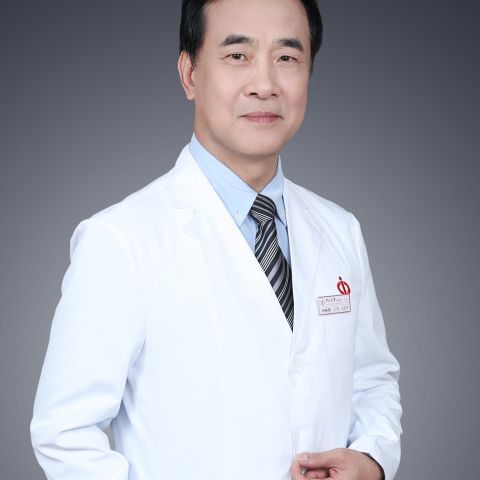

<!-- AUTO-GENERATED-BY: work/generate_obsidian_profiles.py -->

<!-- TEMPLATE: D:\workspace\信息收集整理\医生画像仓库\模板\医生画像模板.md -->

# 何裕隆

## 基础信息

| 字段 | 内容 |
|---|---|
| 姓名 | 何裕隆 |
| 医院 | 中山大学附属第一医院 |
| 科室 | 胃肠外科一科 |
| 职称/身份 | 主任医师/教授 |
| 来源链接 | [官网原文](https://www.fahsysu.org.cn/node/746) |
| 采集日期 | 2026-08-13 |

## 简介/擅长

## 教育与进修经历

- 主要教育和工作经历： 1984.7 毕业于中山医科大学留校工作 1996.6-1996.12 香港大学进修 2001.1-2002.12 美国Utah大学 博士后 1997.12-2003.12 中山医科大学附属第一医院外科副教授、副主任医师 2003.12-至今 中山大学附属第一医院外科教授、主任医师 2003.5-2005.8 中山大学附属第一医院院长办公室副主任 2005.9-2014.4 中山大学附属第一医院胃肠胰专科主任 2005.9-至今 中山大学附属第一医院外科主任 2008.7-至今 中山大学胃癌…

## 科研项目与成果

- 1. 从事普通外科专业30余年，长期致力于胃癌外科研究，率先在国内开展和推广胃癌标准D2和D2(+)淋巴结清扫、鞘内淋巴结清扫,进展期胃癌外科治疗后5年生存率超过60%,治疗效果达到国际先进水平;
- 医疗特长（限400字内）： 1. 从事普通外科专业30余年，长期致力于胃癌外科研究，率先在国内开展和推广胃癌标准D2和D2(+)淋巴结清扫、鞘内淋巴结清扫,进展期胃癌外科治疗后5年生存率超过60%,治疗效果达到国际先进水平;
- 2. 广东省医学会胃肠外科学分会主任委员，广东省健康管理学会胃肠病学专业委员会主任委员，广东省医疗行业协会消化外科管理分会主任委员，广东省医学会第七届理事会理事，广东省抗癌协会第三届理事会常务理事，广东省抗癌协会胃癌专业委员会副主委，广东省抗癌协会胰腺癌专业委员会副主任，广东省抗癌协会大肠癌专业委员会常委，广东省医学会外科学分会第八届委员会常委，国家和广东省自然科学基金评委，中华医学科技奖评委，广东省科技奖评委 3.《消化肿瘤杂志》(电子版)主编、《中华胃肠外科杂志》副主编、《中华普通外科文献》编辑部副主任、An…

## 论文与学术产出

- 2. 广东省医学会胃肠外科学分会主任委员，广东省健康管理学会胃肠病学专业委员会主任委员，广东省医疗行业协会消化外科管理分会主任委员，广东省医学会第七届理事会理事，广东省抗癌协会第三届理事会常务理事，广东省抗癌协会胃癌专业委员会副主委，广东省抗癌协会胰腺癌专业委员会副主任，广东省抗癌协会大肠癌专业委员会常委，广东省医学会外科学分会第八届委员会常委，国家和广东省自然科学基金评委，中华医学科技奖评委，广东省科技奖评委 3.《消化肿瘤杂志》(电子版)主编、《中华胃肠外科杂志》副主编、《中华普通外科文献》编辑部副主任、An…
- 论著：在Cancer Research, International Journal of Cancer, Cancer Letters, Annals Surgical Oncology等杂志发表论文350余篇。

## 可包装亮点

- 1. 从事普通外科专业30余年，长期致力于胃癌外科研究，率先在国内开展和推广胃癌标准D2和D2(+)淋巴结清扫、鞘内淋巴结清扫,进展期胃癌外科治疗后5年生存率超过60%,治疗效果达到国际先进水平;
- 医疗特长（限400字内）： 1. 从事普通外科专业30余年，长期致力于胃癌外科研究，率先在国内开展和推广胃癌标准D2和D2(+)淋巴结清扫、鞘内淋巴结清扫,进展期胃癌外科治疗后5年生存率超过60%,治疗效果达到国际先进水平;
- 主要教育和工作经历： 1984.7 毕业于中山医科大学留校工作 1996.6-1996.12 香港大学进修 2001.1-2002.12 美国Utah大学 博士后 1997.12-2003.12 中山医科大学附属第一医院外科副教授、副主任医师 2003.12-至今 中山大学附属第一医院外科教授、主任医师 2003.5-2005.8 中山大学附属第一医院院长…

## 重点疾病/人群标签

- 慢性病：
- 肿瘤：肿瘤、癌、瘤、胃癌、肠癌、康复、营养
- 生殖疾病：
- 免疫/风湿：
- 术后恢复/康复：肿瘤、癌、瘤、胃癌、肠癌、康复、营养
- 疑难重症：

## 证据摘录

> 只摘录官网公开信息中的短句或关键字段，不复制大段原文。

- 官网身份字段：主任医师/教授
- 官网亮眼经历线索：1. 从事普通外科专业30余年，长期致力于胃癌外科研究，率先在国内开展和推广胃癌标准D2和D2(+)淋巴结清扫、鞘内淋巴结清扫,进展期胃癌外科治疗后5年生存率超过60%,治疗效果达到国际先进水平; 医疗特长（限400字内）： 1. 从事普通外科专业30余年，长期致力于胃癌外科研究，率先在国内开展和推广胃癌标准D2和D2(+)淋巴结清扫、鞘内淋巴结清扫,进展期胃癌外科治疗后5年生存率超过60%,治疗效果达到国际先进水平; 主要教育和工作…
- 来源链接：https://www.fahsysu.org.cn/node/746

## BD 画像摘要

何裕隆医生可作为肿瘤、术后恢复/康复方向的基础画像候选。后续 BD 使用应继续以官网来源和人工复核为准，不添加疗效承诺或无来源包装。

## 合规边界

- 仅使用医院官网、官方公众号、官方小程序等公开渠道。
- 不采集私人电话、私人微信、家庭住址、患者隐私或非公开排班信息。
- 不写“保证治愈”“疗效第一”“包治疑难杂症”等无法由官网证明的表述。
