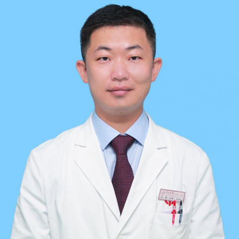

<!-- AUTO-GENERATED-BY: work/generate_obsidian_profiles.py -->

<!-- TEMPLATE: D:\workspace\信息收集整理\医生画像仓库\模板\医生画像模板.md -->

# 元刚

## 基础信息

| 字段 | 内容 |
|---|---|
| 姓名 | 元刚 |
| 医院 | 中山大学附属第一医院 |
| 科室 | 特需一科（老年病科） |
| 职称/身份 | 主任医师 |
| 来源链接 | [官网原文](https://www.fahsysu.org.cn/node/5541) |
| 采集日期 | 2026-08-13 |

## 简介/擅长

长期从事内科临床及高干保健工作，对消化系统疾病、老年病有着丰富的临床经验，对老年患者多重用药管理有丰富经验。 主要教 育和工作经历： 2006年毕业于中山大学获得硕士学位，2019年获得医学博士学位。 2006年毕业后在中山大学附属第一医院工作至今。 曾于2009-2010年赴德国慕尼黑工业大学Klinikum rechts der Isar医院消化内科做访问学者。 社会兼职： 中国老年学和老年医学学会消化病专家委员会委员 海峡两岸医药卫生交流协会国际医疗与特需服务专业委员会委员 广东省医学会骨质疏松分会青年委员 广东省医师学会全科医学分会委员 广东省健康管理学会老年医学与抗衰老专业委员会常务委员 广东省老年保健协会委员 在国内外杂志发表文章20余篇，近几年以第一/通讯发表SCI文章7篇。 WNT6 is anovel target gene of caveolin-1 promoting chemoresistance to epirubicin inhuman gastric cancer cells. Oncogene ，2013，32(3):375-87. The small-moleculecompound ...

## 教育与进修经历

- 主要教 育和工作经历： 2006年毕业于中山大学获得硕士学位，2019年获得医学博士学位。
- 2006年毕业后在中山大学附属第一医院工作至今。
- 曾于2009-2010年赴德国慕尼黑工业大学Klinikum rechts der Isar医院消化内科做访问学者。

## 论文与学术产出

- 社会兼职： 中国老年学和老年医学学会消化病专家委员会委员 海峡两岸医药卫生交流协会国际医疗与特需服务专业委员会委员 广东省医学会骨质疏松分会青年委员 广东省医师学会全科医学分会委员 广东省健康管理学会老年医学与抗衰老专业委员会常务委员 广东省老年保健协会委员 在国内外杂志发表文章20余篇，近几年以第一/通讯发表SCI文章7篇。

## 可包装亮点

- 曾于2009-2010年赴德国慕尼黑工业大学Klinikum rechts der Isar医院消化内科做访问学者。
- 社会兼职： 中国老年学和老年医学学会消化病专家委员会委员 海峡两岸医药卫生交流协会国际医疗与特需服务专业委员会委员 广东省医学会骨质疏松分会青年委员 广东省医师学会全科医学分会委员 广东省健康管理学会老年医学与抗衰老专业委员会常务委员 广东省老年保健协会委员 在国内外杂志发表文章20余篇，近几年以第一/通讯发表SCI文章7篇。

## 重点疾病/人群标签

- 慢性病：
- 肿瘤：
- 生殖疾病：
- 免疫/风湿：
- 术后恢复/康复：
- 疑难重症：

## 证据摘录

> 只摘录官网公开信息中的短句或关键字段，不复制大段原文。

- 官网身份字段：主任医师
- 官网简介/擅长：长期从事内科临床及高干保健工作，对消化系统疾病、老年病有着丰富的临床经验，对老年患者多重用药管理有丰富经验。 主要教 育和工作经历： 2006年毕业于中山大学获得硕士学位，2019年获得医学博士学位。 2006年毕业后在中山大学附属第一医院工作至今。 曾于2009-2010年赴德国慕尼黑工业大学Klinikum rechts der Isar医院消化内科做访问学者。 社会兼职： 中国老年学和老年医学学会消化病专家委员会委员 海峡两岸医…
- 官网亮眼经历线索：曾于2009-2010年赴德国慕尼黑工业大学Klinikum rechts der Isar医院消化内科做访问学者。 社会兼职： 中国老年学和老年医学学会消化病专家委员会委员 海峡两岸医药卫生交流协会国际医疗与特需服务专业委员会委员 广东省医学会骨质疏松分会青年委员 广东省医师学会全科医学分会委员 广东省健康管理学会老年医学与抗衰老专业委员会常务委员 广东省老年保健协会委员 在国内外杂志发表文章20余篇，近几年以第一/通讯发表SCI文…
- 来源链接：https://www.fahsysu.org.cn/node/5541

## BD 画像摘要

元刚医生可作为中山大学附属第一医院特需一科（老年病科）的基础医生资料入库。当前重点方向以总底表标签为准，官网未展示的信息保持空白。

## 合规边界

- 仅使用医院官网、官方公众号、官方小程序等公开渠道。
- 不采集私人电话、私人微信、家庭住址、患者隐私或非公开排班信息。
- 不写“保证治愈”“疗效第一”“包治疑难杂症”等无法由官网证明的表述。
