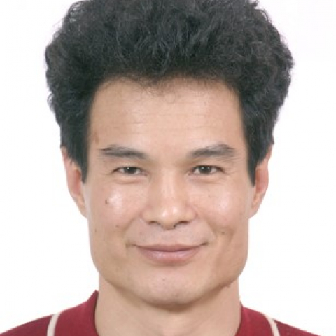

<!-- AUTO-GENERATED-BY: work/generate_obsidian_profiles.py -->

<!-- TEMPLATE: D:\workspace\信息收集整理\医生画像仓库\模板\医生画像模板.md -->

# 关开泮

## 基础信息

| 字段 | 内容 |
|---|---|
| 姓名 | 关开泮 |
| 医院 | 中山大学附属第一医院 |
| 科室 | 呼吸与危重症医学科 |
| 职称/身份 | 副主任医师 |
| 来源链接 | [官网原文](https://www.fahsysu.org.cn/node/804) |
| 采集日期 | 2026-08-13 |

## 简介/擅长

本人专注于临床诊治及临床医学教学工作，对内科全科医学、呼吸病学与内科危重病学有深刻的认识和见解，尤其对内科复杂重症的发生、发展、诊断与治疗干预，以及多器官功能不全的诊断与平衡治疗、免疫缺陷重症感染、抗生素应用、呼吸机应用技术，有较深造诣！ 研究方向：内科急危重症，抗生素应用 主要教育和工作经历：1981.09~1987.07，就读于原中山医科大学医疗系（学制六年），毕业后一直在中山一院从事临床一线工作，其中，1987.07~2003.06（共16年），中山一院急诊内科工作，2003.07~今（共15年），中山一院呼吸病科与内科重症医学科工作，期间，曾出任中山一院分院中大惠亚医院重症医学科主任三年。 社会兼职： 其他主要工作成绩（比如获奖情况）：中山一院优秀职工，中山一院优秀教师（两次），抗击非典英雄二等功。

## 教育与进修经历

- 研究方向：内科急危重症，抗生素应用 主要教育和工作经历：1981.09~1987.07，就读于原中山医科大学医疗系（学制六年），毕业后一直在中山一院从事临床一线工作，其中，1987.07~2003.06（共16年），中山一院急诊内科工作，2003.07~今（共15年），中山一院呼吸病科与内科重症医学科工作，期间，曾出任中山一院分院中大惠亚医院重症医学科主任三年。

## 可包装亮点

- 本人专注于临床诊治及临床医学教学工作，对内科全科医学、呼吸病学与内科危重病学有深刻的认识和见解，尤其对内科复杂重症的发生、发展、诊断与治疗干预，以及多器官功能不全的诊断与平衡治疗、免疫缺陷重症感染、抗生素应用、呼吸机应用技术，有较深造诣！
- 医疗特长：本人专注于临床诊治及临床医学教学工作，对内科全科医学、呼吸病学与内科危重病学有深刻的认识和见解，尤其对内科复杂重症的发生、发展、诊断与治疗干预，以及多器官功能不全的诊断与平衡治疗、免疫缺陷重症感染、抗生素应用、呼吸机应用技术，有较深造诣！
- 研究方向：内科急危重症，抗生素应用 主要教育和工作经历：1981.09~1987.07，就读于原中山医科大学医疗系（学制六年），毕业后一直在中山一院从事临床一线工作，其中，1987.07~2003.06（共16年），中山一院急诊内科工作，2003.07~今（共15年），中山一院呼吸病科与内科重症医学科工作，期间，曾出任中山一院分院中大惠亚医院...

## 重点疾病/人群标签

- 慢性病：
- 肿瘤：
- 生殖疾病：
- 免疫/风湿：免疫、感染、危重、重症、急危重、复杂
- 术后恢复/康复：
- 疑难重症：免疫、感染、危重、重症、急危重、复杂

## 证据摘录

> 只摘录官网公开信息中的短句或关键字段，不复制大段原文。

- 官网身份字段：副主任医师
- 官网简介/擅长：本人专注于临床诊治及临床医学教学工作，对内科全科医学、呼吸病学与内科危重病学有深刻的认识和见解，尤其对内科复杂重症的发生、发展、诊断与治疗干预，以及多器官功能不全的诊断与平衡治疗、免疫缺陷重症感染、抗生素应用、呼吸机应用技术，有较深造诣！ 研究方向：内科急危重症，抗生素应用 主要教育和工作经历：1981.09~1987.07，就读于原中山医科大学医疗系（学制六年），毕业后一直在中山一院从事临床一线工作，其中，1987.07~2003.…
- 官网亮眼经历线索：本人专注于临床诊治及临床医学教学工作，对内科全科医学、呼吸病学与内科危重病学有深刻的认识和见解，尤其对内科复杂重症的发生、发展、诊断与治疗干预，以及多器官功能不全的诊断与平衡治疗、免疫缺陷重症感染、抗生素应用、呼吸机应用技术，有较深造诣！ 医疗特长：本人专注于临床诊治及临床医学教学工作，对内科全科医学、呼吸病学与内科危重病学有深刻的认识和见解，尤其对内科复杂重症的发生、发展、诊断与治疗干预，以及多器官功能不全的诊断与平衡治疗、免疫缺陷…
- 来源链接：https://www.fahsysu.org.cn/node/804

## BD 画像摘要

关开泮医生可作为免疫/风湿/感染、疑难重症方向的基础画像候选。后续 BD 使用应继续以官网来源和人工复核为准，不添加疗效承诺或无来源包装。

## 合规边界

- 仅使用医院官网、官方公众号、官方小程序等公开渠道。
- 不采集私人电话、私人微信、家庭住址、患者隐私或非公开排班信息。
- 不写“保证治愈”“疗效第一”“包治疑难杂症”等无法由官网证明的表述。
