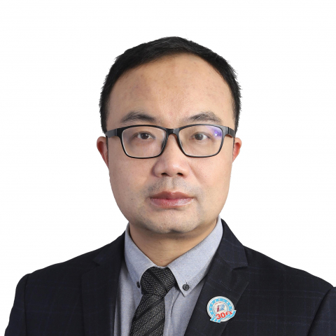

<!-- AUTO-GENERATED-BY: work/generate_obsidian_profiles.py -->

<!-- TEMPLATE: D:\workspace\信息收集整理\医生画像仓库\模板\医生画像模板.md -->

# 关键

## 基础信息

| 字段 | 内容 |
|---|---|
| 姓名 | 关键 |
| 医院 | 中山大学附属第一医院 |
| 科室 | 放射诊断专科 |
| 职称/身份 | 主任医师 |
| 来源链接 | [官网原文](https://www.fahsysu.org.cn/node/31701) |
| 采集日期 | 2026-08-13 |

## 简介/擅长

## 教育与进修经历

- 毕业于华中科技大学同济医学院（原同济医科大学），获影像医学与核医学专业医学博士学位后入职中山大学附属第一医院医学影像科，现为副教授、副主任医师，硕士生导师，八年制全程导师。
- 任职期间前往德国杜伊斯堡-埃森大学（Duisburg- Essen university）附属医院做访问学者。

## 科研项目与成果

- 主持和参与多项国家级和广东省科研基金项目；
- 研究成果十余次入选北美放射学大会（RSNA），荣获RSNA教育展板银奖和铜奖。

## 论文与学术产出

- 以第一作者或通讯作者发表影像专业SCI论文25篇（包括《Nature communications》，《European Radiology》、《Journal of Magnetic Resonance Imaging》等）；
- 双核心期刊论文四十余篇（《中华放射学杂志》论著5篇）。

## 可包装亮点

- 毕业于华中科技大学同济医学院（原同济医科大学），获影像医学与核医学专业医学博士学位后入职中山大学附属第一医院医学影像科，现为副教授、副主任医师，硕士生导师，八年制全程导师。
- 任职期间前往德国杜伊斯堡-埃森大学（Duisburg- Essen university）附属医院做访问学者。
- 主要社会兼职包括：广东省医学会放射学分会对比剂学组副组长，广东省医学会放射医学分会专委会委员，广东省健康管理学会放射学专委会秘书长，广东省肿瘤性疾病医疗质量控制中心专家委员会委员，中国医疗保健国际交流促进会放射学分会青年委员，《影像诊断与介入放射学》杂志编辑部主任、编委。
- 以第一作者或通讯作者发表影像专业SCI论文25篇（包括《Nature communications》，《European Radiology》、《Journal of Magnetic Resonance Imaging》等）；

## 重点疾病/人群标签

- 慢性病：
- 肿瘤：肿瘤、生殖
- 生殖疾病：肿瘤、生殖
- 免疫/风湿：
- 术后恢复/康复：
- 疑难重症：

## 证据摘录

> 只摘录官网公开信息中的短句或关键字段，不复制大段原文。

- 官网身份字段：主任医师
- 官网亮眼经历线索：毕业于华中科技大学同济医学院（原同济医科大学），获影像医学与核医学专业医学博士学位后入职中山大学附属第一医院医学影像科，现为副教授、副主任医师，硕士生导师，八年制全程导师。 任职期间前往德国杜伊斯堡-埃森大学（Duisburg- Essen university）附属医院做访问学者。 主要社会兼职包括：广东省医学会放射学分会对比剂学组副组长，广东省医学会放射医学分会专委会委员，广东省健康管理学会放射学专委会秘书长，广东省肿瘤性疾病医疗…
- 来源链接：https://www.fahsysu.org.cn/node/31701

## BD 画像摘要

关键医生可作为肿瘤、生殖疾病方向的基础画像候选。后续 BD 使用应继续以官网来源和人工复核为准，不添加疗效承诺或无来源包装。

## 合规边界

- 仅使用医院官网、官方公众号、官方小程序等公开渠道。
- 不采集私人电话、私人微信、家庭住址、患者隐私或非公开排班信息。
- 不写“保证治愈”“疗效第一”“包治疑难杂症”等无法由官网证明的表述。
