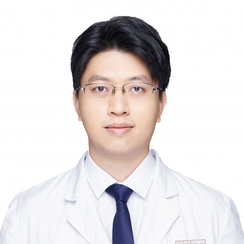

<!-- AUTO-GENERATED-BY: work/generate_obsidian_profiles.py -->

<!-- TEMPLATE: D:\workspace\信息收集整理\医生画像仓库\模板\医生画像模板.md -->

# 冼文彪

## 基础信息

| 字段 | 内容 |
|---|---|
| 姓名 | 冼文彪 |
| 医院 | 中山大学附属第一医院 |
| 科室 | 神经一科 |
| 职称/身份 | 副主任医师 |
| 来源链接 | [官网原文](https://www.fahsysu.org.cn/node/33114) |
| 采集日期 | 2026-08-13 |

## 简介/擅长

## 科研项目与成果

- 社会兼职： 1. 广东省健康管理学会干细胞与再生医学专委会常委兼神经专业秘书 2. 广东省精准医学会帕金森病分会常委 科研情况： 以第一作者/通讯作者在《Parkinsonism Related Disorders》等帕金森病和神经内科领域的国际知名期刊发表多篇SCI论著。
- 主持和参与多项国家级和省级科研基金。

## 论文与学术产出

- 社会兼职： 1. 广东省健康管理学会干细胞与再生医学专委会常委兼神经专业秘书 2. 广东省精准医学会帕金森病分会常委 科研情况： 以第一作者/通讯作者在《Parkinsonism Related Disorders》等帕金森病和神经内科领域的国际知名期刊发表多篇SCI论著。

## 可包装亮点

- 教育背景： 2001-09至2006-06，中山大学中山医学院，临床医学学士 2011-09至2014-06，中山大学附属第一医院，神经病学硕士 2018-09至2021-06，中山大学附属第一医院，神经病学博士 工作经验： 2006年7月至今，中山大学附属第一医院，历任住院医师、主治医师和副主任医师（硕士生导师）。
- 社会兼职： 1. 广东省健康管理学会干细胞与再生医学专委会常委兼神经专业秘书 2. 广东省精准医学会帕金森病分会常委 科研情况： 以第一作者/通讯作者在《Parkinsonism Related Disorders》等帕金森病和神经内科领域的国际知名期刊发表多篇SCI论著。

## 重点疾病/人群标签

- 慢性病：
- 肿瘤：
- 生殖疾病：
- 免疫/风湿：
- 术后恢复/康复：术后
- 疑难重症：

## 证据摘录

> 只摘录官网公开信息中的短句或关键字段，不复制大段原文。

- 官网身份字段：副主任医师
- 官网亮眼经历线索：教育背景： 2001-09至2006-06，中山大学中山医学院，临床医学学士 2011-09至2014-06，中山大学附属第一医院，神经病学硕士 2018-09至2021-06，中山大学附属第一医院，神经病学博士 工作经验： 2006年7月至今，中山大学附属第一医院，历任住院医师、主治医师和副主任医师（硕士生导师）。 社会兼职： 1. 广东省健康管理学会干细胞与再生医学专委会常委兼神经专业秘书 2. 广东省精准医学会帕金森病分会常委…
- 来源链接：https://www.fahsysu.org.cn/node/33114

## BD 画像摘要

冼文彪医生可作为术后恢复/康复方向的基础画像候选。后续 BD 使用应继续以官网来源和人工复核为准，不添加疗效承诺或无来源包装。

## 合规边界

- 仅使用医院官网、官方公众号、官方小程序等公开渠道。
- 不采集私人电话、私人微信、家庭住址、患者隐私或非公开排班信息。
- 不写“保证治愈”“疗效第一”“包治疑难杂症”等无法由官网证明的表述。
