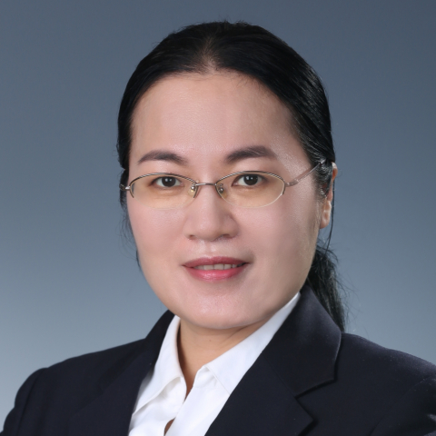

<!-- AUTO-GENERATED-BY: work/generate_obsidian_profiles.py -->

<!-- TEMPLATE: D:\workspace\信息收集整理\医生画像仓库\模板\医生画像模板.md -->

# 刘丽

## 基础信息

| 字段 | 内容 |
|---|---|
| 姓名 | 刘丽 |
| 医院 | 中山大学附属第一医院 |
| 科室 | 超声医学科 |
| 职称/身份 | 副主任医师 |
| 来源链接 | [官网原文](https://www.fahsysu.org.cn/node/5591) |
| 采集日期 | 2026-08-13 |

## 简介/擅长

甲状腺肿瘤、乳腺肿瘤等疑难疾病的超声诊断，对肝胆胰脾、肾输尿管膀胱前列腺、眼晴、眼眶、浅表肿物等疾病亦积累了30年丰富的超声诊断经验。 教育及工作经历 1992年中山医科大学医学系本科毕业，学士学位 2002年中山大学影像医学系研究生毕业，硕士学位 1992年～1995年中山大学附属第一医院内科工作 1995年至今在中山大学附属第一医院超声科工作 科研情况 在国内外专业期刊杂志发表论文三十余篇

## 教育与进修经历

- 教育及工作经历 1992年中山医科大学医学系本科毕业，学士学位 2002年中山大学影像医学系研究生毕业，硕士学位 1992年～1995年中山大学附属第一医院内科工作 1995年至今在中山大学附属第一医院超声科工作 科研情况 在国内外专业期刊杂志发表论文三十余篇

## 科研项目与成果

- 教育及工作经历 1992年中山医科大学医学系本科毕业，学士学位 2002年中山大学影像医学系研究生毕业，硕士学位 1992年～1995年中山大学附属第一医院内科工作 1995年至今在中山大学附属第一医院超声科工作 科研情况 在国内外专业期刊杂志发表论文三十余篇

## 论文与学术产出

- 教育及工作经历 1992年中山医科大学医学系本科毕业，学士学位 2002年中山大学影像医学系研究生毕业，硕士学位 1992年～1995年中山大学附属第一医院内科工作 1995年至今在中山大学附属第一医院超声科工作 科研情况 在国内外专业期刊杂志发表论文三十余篇

## 可包装亮点

- 擅长甲状腺肿瘤、乳腺肿瘤等疑难疾病的超声诊断，对肝胆胰脾、肾输尿管膀胱前列腺、眼晴、眼眶、浅表肿物等疾病亦积累了30年丰富的超声诊断经验。
- 医疗特长： 擅长甲状腺肿瘤、乳腺肿瘤等疑难疾病的超声诊断，对肝胆胰脾、肾输尿管膀胱前列腺、眼晴、眼眶、浅表肿物等疾病亦积累了30年丰富的超声诊断经验。
- 教育及工作经历 1992年中山医科大学医学系本科毕业，学士学位 2002年中山大学影像医学系研究生毕业，硕士学位 1992年～1995年中山大学附属第一医院内科工作 1995年至今在中山大学附属第一医院超声科工作 科研情况 在国内外专业期刊杂志发表论文三十余篇

## 重点疾病/人群标签

- 慢性病：
- 肿瘤：肿瘤、疑难
- 生殖疾病：
- 免疫/风湿：
- 术后恢复/康复：
- 疑难重症：肿瘤、疑难

## 证据摘录

> 只摘录官网公开信息中的短句或关键字段，不复制大段原文。

- 官网身份字段：副主任医师
- 官网简介/擅长：甲状腺肿瘤、乳腺肿瘤等疑难疾病的超声诊断，对肝胆胰脾、肾输尿管膀胱前列腺、眼晴、眼眶、浅表肿物等疾病亦积累了30年丰富的超声诊断经验。 教育及工作经历 1992年中山医科大学医学系本科毕业，学士学位 2002年中山大学影像医学系研究生毕业，硕士学位 1992年～1995年中山大学附属第一医院内科工作 1995年至今在中山大学附属第一医院超声科工作 科研情况 在国内外专业期刊杂志发表论文三十余篇
- 官网亮眼经历线索：擅长甲状腺肿瘤、乳腺肿瘤等疑难疾病的超声诊断，对肝胆胰脾、肾输尿管膀胱前列腺、眼晴、眼眶、浅表肿物等疾病亦积累了30年丰富的超声诊断经验。 医疗特长： 擅长甲状腺肿瘤、乳腺肿瘤等疑难疾病的超声诊断，对肝胆胰脾、肾输尿管膀胱前列腺、眼晴、眼眶、浅表肿物等疾病亦积累了30年丰富的超声诊断经验。 教育及工作经历 1992年中山医科大学医学系本科毕业，学士学位 2002年中山大学影像医学系研究生毕业，硕士学位 1992年～1995年中山大学附…
- 来源链接：https://www.fahsysu.org.cn/node/5591

## BD 画像摘要

刘丽医生可作为肿瘤、疑难重症方向的基础画像候选。后续 BD 使用应继续以官网来源和人工复核为准，不添加疗效承诺或无来源包装。

## 合规边界

- 仅使用医院官网、官方公众号、官方小程序等公开渠道。
- 不采集私人电话、私人微信、家庭住址、患者隐私或非公开排班信息。
- 不写“保证治愈”“疗效第一”“包治疑难杂症”等无法由官网证明的表述。
